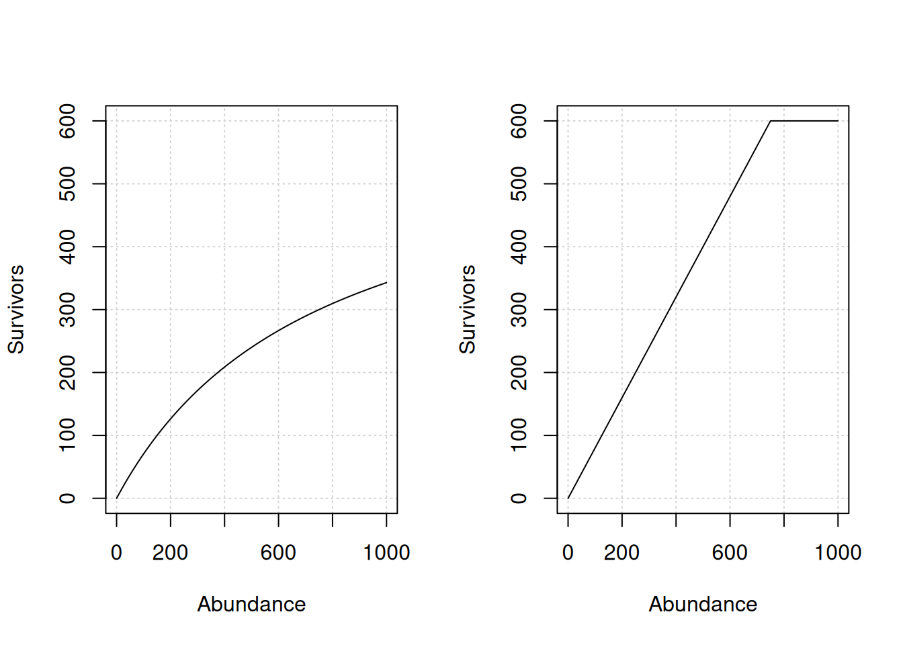

# Dynamics equations

salmonMSE utilizes an age-structured model in the projections. The
population is tracked by age and year but various dynamics correspond to
the salmon life stages as described below.

The model is also stochastic, for example, biological parameters
representing uncertainty in the state of nature can be drawn from a
probability distribution. For simplicity, the equations here describe
the dynamics in a single simulation run. Potential stochastic parameters
are noted in the package documentation.

## 1 Variable definitions

*Definition of variable names and the corresponding slots in either the
input (SOM) or output (SMSE) objects in salmonMSE.*

### 1.1 Natural production

| Name | Definition | Type | Class | Slot |
|:---|:---|:---|:---|:---|
| \\\textrm{NOS}\\ | Natural origin spawners | Natural production | SMSE | NOS |
| \\\textrm{Fry}^\textrm{NOS}\\ | Fry production by natural origin spawners | Natural production | SMSE | Fry_NOS |
| \\\textrm{Smolt}^\textrm{NOS}\\ | Smolt production by natural origin spawners | Natural production | SMSE | Smolt_NOS |
| \\C\_\textrm{egg-smolt}\\ | Carrying capacity of smolts (Beverton-Holt stock-recruit parameter) | Natural production | SOM, Bio | capacity |
| \\S\_\textrm{max}\\ | Spawner abundance that maximizes smolt production (Ricker stock-recruit parameter) | Natural production | SOM, Bio | Smax |
| \\\kappa\\ | Productivity (maximum recruitment production rate), units of recruit per spawner | Natural production | SOM, Bio | kappa |
| \\\phi\\ | Unfished per capita egg production rate, units of egg per smolt | Natural production | SOM, Bio | phi |
| \\\tau\\ | Unfished per capita spawners, units of spawner per smolt | Natural production | SOM, Bio | tau |
| \\r\\ | Maturity at age, i.e., recruitment rate | Natural production | SOM, Bio | p_mature |
| \\\textrm{Fec}\\ | Fecundity of spawners (eggs per female) | Natural production | SOM, Bio | fec |
| \\p^\textrm{female}\\ | Proportion of female spawners in the natural environment | Natural production | SOM, Bio | p_female |
| \\\textrm{SAR}\\ | Smolt-to-adult recruit survival | Natural production | \- | \- |
| \\M\\ | Juvenile instantaneous natural mortality (marine environment) by origin | Natural production + Hatchery | SOM, Bio | Mjuv_NOS, Mjuv_HOS |
| \\s\_\textrm{enroute}\\ | Survival of escapement to spawning grounds and hatchery | Natural production | SOM, Bio | s_enroute |
| \\\textrm{NOR}\\ | Natural origin return | Natural production | SMSE | Return_NOS |

### 1.2 Harvest

| Name | Definition | Type | Class | Slot |
|:---|:---|:---|:---|:---|
| \\u^\textrm{PT}\\ | Pre-terminal fishery harvest rate (adjusted for adult equivalents) | Harvest | SOM | u_preterminal |
| \\u^\textrm{T}\\ | Terminal fishery harvest rate | Harvest | SOM | u_terminal |
| \\\delta\\ | Mortality from catch and release (proportion) | Harvest | SOM | release_mort |
| \\v\\ | Relative vulnerability by age to the fishery | Harvest | SOM | vulPT, vulT |

### 1.3 Hatchery

| Name | Definition | Type | Class | Slot |
|:---|:---|:---|:---|:---|
| \\\textrm{HOS}\\ | Hatchery origin spawners | Hatchery | SMSE | HOS |
| \\\textrm{HOS}\_\textrm{eff}\\ | Effective number of HOS, spawning output discounted by \\\gamma\\ | Hatchery | SMSE | HOSeff |
| \\\textrm{Fry}^\textrm{HOS}\\ | Fry production by hatchery origin spawners | Hatchery | SMSE | Fry_HOS |
| \\\textrm{Smolt}^\textrm{HOS}\\ | Smolt production by hatchery origin spawners | Hatchery | SMSE | Smolt_HOS |
| \\\textrm{Fec}^\textrm{brood}\\ | Fecundity of broodtake (eggs per female) | Hatchery | SOM, Hatchery | fec_brood |
| \\M\\ | Juvenile instantaneous natural mortality (marine environment) by origin | Natural production + Hatchery | SOM, Bio | Mjuv_NOS, Mjuv_HOS |
| \\\textrm{NOB}\\ | Natural origin broodtake | Hatchery | SMSE | NOB |
| \\\textrm{HOB}\\ | Hatchery origin broodtake | Hatchery | SMSE | HOB |
| \\\textrm{Stray}\\ | External strays of hatchery origin fish | Hatchery | SOM | stray_external |
| \\\textrm{HOB}\_\textrm{stray}\\ | Broodtake from strays | Hatchery | SMSE | HOB_stray |
| \\\textrm{Brood}^\textrm{avail,import}\\ | Available imported brood (considered 100% marked) | Hatchery | SOM | brood_import |
| \\\textrm{Brood}^\textrm{import}\\ | Realized imported fish used for brood (considered 100% marked) | Hatchery | SMSE | HOB_import |
| \\s\_\textrm{yearling}\\ | Survival of hatchery eggs to yearling life stage | Hatchery | SOM | s_egg_smolt |
| \\s\_\textrm{subyearling}\\ | Survival of hatchery eggs to subyearling life stage | Hatchery | SOM | s_egg_subyearling |
| \\p\_\textrm{yearling}\\ | Proportion of hatchery releases as yearling (vs. subyearling) | Hatchery | Internal state variable | \- |
| \\s\_\textrm{prespawn}\\ | Survival of adult broodtake in hatchery | Hatchery | SOM | s_prespawn |
| \\n\_\textrm{yearling}\\ | Target number of hatchery releases as yearlings | Hatchery | SOM | n_yearling |
| \\n\_\textrm{subyearling}\\ | Target number of hatchery releases as subyearlings | Hatchery | SOM | n_subyearling |
| \\m\\ | Mark rate of hatchery-origin fish | Hatchery | SOM | m |
| \\p^\textrm{esc}\_\textrm{max}\\ | Maximum proportion of total escapement (after en-route mortality) to use as broodtake | Hatchery | SOM | pmax_esc |
| \\p^\textrm{NOB}\_\textrm{target}\\ | Target proportion of the natural origin broodtake from the escapement (after en-route mortality), i.e., NOB/NOS ratio | Hatchery | SOM | ptarget_NOB |
| \\p^\textrm{NOB}\_\textrm{max}\\ | Maximum proportion of the natural origin broodtake from the escapement (after en-route mortality), i.e., NOB/NOS ratio | Hatchery | SOM | pmax_NOB |
| \\p\_\textrm{NOB}\\ | Realized proportion of the total broodtake of hatchery origin (vs. natural origin) | Hatchery | SMSE | pNOB |
| \\\textrm{HOR}\\ | Hatchery origin return | Hatchery | SMSE | Return_HOS |
| \\p^\textrm{hatchery}\\ | Proportion of hatchery origin escapement returning to hatchery, available for broodtake | Hatchery | SOM | phatchery |
| \\p^\textrm{HOS}\_\textrm{removal}\\ | Proportion of hatchery origin fish removed from spawning grounds, not available for broodtake | Hatchery | SOM | premove_HOS |
| \\p^\textrm{NOS}\_\textrm{removal}\\ | Proportion of natural origin fish removed from spawning grounds, not available for broodtake | Hatchery | SOM | premove_NOS |
| \\\gamma\\ | Reduced reproductive success of HOS | Hatchery | SOM | gamma |
| \\\bar{z}\\ | Mean phenotypic value of cohort in natural and hatchery environments | Fitness | Internal state variable and SOM | zbar_start |
| \\\theta\\ | Optimal phenotypic value for natural and hatchery environments | Fitness | SOM | theta |
| \\\sigma^2\\ | Variance of phenotypic traits in population | Fitness | SOM | phenotype_variance |
| \\\omega^2\\ | Variance of fitness function | Fitness | SOM | fitness_variance |
| \\h^2\\ | Heritability of phenotypic traits | Fitness | SOM | heritability |
| \\\bar{W}\\ | Population fitness in the natural and hatchery environments | Fitness | SMSE | fitness |
| \\\ell_i\\ | Relative fitness loss at the life stage i (egg, fry, smolt) | Fitness | SOM | rel_loss |
| \\\textrm{PNI}\\ | Proportionate natural influence | Fitness | SMSE | PNI |
| \\p\_\textrm{HOSeff}\\ | Proportion of effective hatchery origin spawners (vs. NOS) | Hatchery | SMSE | pHOS_effective |
| \\p\_\textrm{HOScensus}\\ | Proportion of hatchery origin spawners (vs. NOS) | Hatchery | SMSE | pHOS_census |
| \\p^\textrm{WILD}\\ | Proportion of wild spawners | Hatchery | SMSE | p_wild |

### 1.4 Habitat

| Name | Definition | Type | Class | Slot |
|:---|:---|:---|:---|:---|
| \\P^\textrm{ps}\\ | Productivity for density-dependent survival: pre-spawn mortality | Habitat | SOM | prespawn_prod |
| \\C^\textrm{ps}\\ | Capacity for density-dependent survival: pre-spawn mortality | Habitat | SOM | prespawn_capacity |
| \\P^\textrm{inc}\\ | Productivity for density-dependent survival: egg incubation from spawning output | Habitat | SOM | egg_prod |
| \\C^\textrm{inc}\\ | Capacity for density-dependent survival: egg incubation from spawning output | Habitat | SOM | egg_capacity |
| \\P^\textrm{egg-fry}\\ | Productivity for density-dependent survival: egg emergence to fry life stage | Habitat | SOM | fry_prod |
| \\C^\textrm{egg-fry}\\ | Capacity for density-dependent survival: egg emergence to fry life stage | Habitat | SOM | fry_capacity |
| \\\varepsilon^\textrm{egg-fry}\_y\\ | Deviations in density-dependent survival: egg to fry life stage | Habitat | SOM | fry_sdev |
| \\P^\textrm{fry-smolt}\\ | Productivity for density-dependent survival: fry to smolt life stage | Habitat | SOM | smolt_prod |
| \\C^\textrm{fry-smolt}\\ | Capacity for density-dependent survival: fry to smolt life stage | Habitat | SOM | smolt_capacity |
| \\\varepsilon^\textrm{fry-smolt}\_y\\ | Deviations in density-dependent survival: fry to smolt life stage | Habitat | SOM | smolt_sdev |

## 2 Juvenile natural production

First, we consider natural production in the absence of fitness effects
arising from hatchery production.

The outmigrating juveniles of the next generation is predicted from the
spawners from the previous year. Two parameterizations are possible:

1.  No habitat modeling: juvenile production is predicted from the egg
    production with a single density-dependent function
2.  With habitat modeling: juvenile production is predicted from a
    series of density-dependent functions that represent survival at
    intermittent freshwater life stages

### 2.1 No habitat modeling

From the spawners (NOS and HOS) of age \\a\\ in year \\y\\, the
corresponding spawning output (units of eggs) of the subsequent
generation is calculated as:

\\\begin{align} \textrm{Egg}^\textrm{NOS}\_y &=
\sum_a\textrm{NOS}\_{y,a} \times p^\textrm{female}\_a \times
\textrm{Fec}\_a\\ \textrm{Egg}^\textrm{HOS}\_y &=
\sum_a\textrm{HOS}\_{\textrm{eff}y,a} \times p^\textrm{female}\_a \times
\textrm{Fec}\_a \end{align}\\

where \\\textrm{HOS}\_{\textrm{eff}} = \gamma \times \textrm{HOS}\\ and
the superscript denotes the parentage of the progeny.

> In the output, fry production is assumed to be equal to spawning
> output, i.e., \\\textrm{Fry}^\textrm{NOS}\_{y+1} =
> \textrm{Egg}^\textrm{NOS}\_y\\ and \\\textrm{Fry}^\textrm{HOS}\_{y+1}
> = \textrm{Egg}^\textrm{HOS}\_y\\.

If the smolt production is calculated from the Ricker stock-recruit
relationship, effectively over the entire freshwater life stage:

\\\begin{align} \textrm{Smolt}^\textrm{NOS}\_{y+1} &= \alpha \times
\textrm{Egg}^\textrm{NOS}\_y\times\exp(-\beta\[\textrm{Egg}^\textrm{NOS}\_y +
\textrm{Egg}^\textrm{HOS}\_y\])\\ \textrm{Smolt}^\textrm{HOS}\_{y+1} &=
\alpha \times
\textrm{Egg}^\textrm{HOS}\_y\times\exp(-\beta\[\textrm{Egg}^\textrm{NOS}\_y +
\textrm{Egg}^\textrm{HOS}\_y\]) \end{align}\\

where:

\\\begin{align} \alpha &= \kappa/\phi\\ \beta &= 1/{E\_\textrm{max}}\\
E\_\textrm{max} &= S\_\textrm{max} \times \phi/\tau\\ \phi &=
\sum_a\left(\prod\_{i=1}^{a-1}\exp(-M^\textrm{NOS}\_i)(1-r_i)\right)\times
r_a \times p^\textrm{female}\_a \times \textrm{Fec}\_a\\ \tau &=
\sum_a\left(\prod\_{i=1}^{a-1}\exp(-M^\textrm{NOS}\_i)(1-r_i)\right)\times
r_a \times p^\textrm{female}\_a \end{align}\\

\\\kappa\\ is the productivity, \\\phi\\ is the egg production per smolt
at replacement, and \\\tau\\ is the female spawner per smolt at
replacement.

> With the Beverton-Holt stock-recruit relationship, the age-1 smolt
> production is
>
> \\\begin{align} \textrm{Smolt}^\textrm{NOS}\_{y+1} &= \frac{\alpha
> \times \textrm{Egg}^\textrm{NOS}\_y}{1 +
> \beta(\textrm{Egg}^\textrm{NOS}\_y +
> \>\textrm{Egg}^\textrm{HOS}\_y)}\\ \textrm{Smolt}^\textrm{HOS}\_{y+1}
> &= \frac{\alpha \times \textrm{Egg}^\textrm{HOS}\_y}{1 +
> \beta(\textrm{Egg}^\textrm{NOS}\_y + \>\textrm{Egg}^\textrm{HOS}\_y)}
> \end{align}\\
>
> where \\\alpha = \kappa/\phi\\, \\\beta =
> \alpha/{C\_\textrm{egg-smolt}}\\ (\\C\\ is the capacity/asymptote).

The density-independent component of the survival equation is controlled
by \\\alpha\\ and the density-dependent component of survival is
controlled by \\\beta\\ and scaled by the total egg production (see
[Hatchery](#hatchery-production) section).

### 2.2 With habitat modeling

Freshwater life stages can also be modeled as a series of
density-dependent functions by life stage, following the general
approach of [Jorgensen et
al. 2021](https://doi.org/10.1371/journal.pone.0256792). Four
relationships are modeled:

1.  Pre-spawn mortality
2.  Egg incubation mortality
3.  Egg emergence to fry mortality
4.  Fry to smolt mortality

Survival is modeled through either a Beverton-Holt or hockey-stick
function that predicts survivors from the abundance at the beginning of
the life stage.

*Example life stage density-dependent relationships. Left panel:
Beverton-Holt function. Right panel: Hockey-stick function. For both
panels, the productivity is 0.8 and capacity is 600.*

> Set the capacity to infinite to model density-independence. The
> productivity parameter is then the survival to the next life stage.

First, pre-spawn (ps) mortality can occur, where the surviving spawners
\\\widetilde{\textrm{NOS}}\_y\\ and \\\widetilde{\textrm{HOS}}\_y\\ are:

\\\begin{align} \widetilde{\textrm{NOS}}\_y &= \frac{P^\textrm{ps}
\times \textrm{NOS}\_y}{1 +
\frac{P^\textrm{ps}}{C^\textrm{ps}}(\textrm{NOS}\_y +
\textrm{HOS}\_y)}\\ \widetilde{\textrm{HOS}}\_y &= \frac{P^\textrm{ps}
\times \textrm{HOS}\_y}{1 +
\frac{P^\textrm{ps}}{C^\textrm{ps}}(\textrm{NOS}\_y +
\textrm{HOS}\_y)}\\ \end{align}\\

where productivity \\P\\ is the maximum survival as spawner numbers
approaches zero and \\C\\ is the asymptotic number of spawners, i.e.,
spawner capacity.

> The hockey-stick equation is
>
> \\\begin{align} \widetilde{\textrm{NOS}}\_y &=
> \textrm{min}(P^\textrm{ps} \times \textrm{NOS}\_y,
> (\frac{\textrm{NOS}\_y}{\textrm{NOS}\_y + \textrm{HOS}\_y})
> C^\textrm{ps})\\ \widetilde{\textrm{HOS}}\_y &=
> \textrm{min}(P^\textrm{ps} \times \textrm{HOS}\_y,
> (\frac{\textrm{HOS}\_y}{\textrm{NOS}\_y + \textrm{HOS}\_y})
> C^\textrm{ps}) \end{align}\\
>
> with similar parameterizations for subsequent life stages (not further
> described below).

The initial egg production is calculated after pre-spawn mortality:

\\\begin{align} \textrm{Egg}^\textrm{NOS}\_y &=
\sum_a\widetilde{\textrm{NOS}}\_{y,a} \times p^\textrm{female}\_a \times
\textrm{Fec}\_a\\ \textrm{Egg}^\textrm{HOS}\_y &=
\sum_a\widetilde{\textrm{HOS}}\_{\textrm{eff}y,a} \times
p^\textrm{female}\_a \times \textrm{Fec}\_a \end{align}\\

Second, the surviving egg production (\\\widetilde{\textrm{Egg}}\_y\\)
can be reduced from the initial spawning output (\\\textrm{Egg}\_y\\)
due to incubation mortality. With a Beverton-Holt function:

\\\begin{align} \widetilde{\textrm{Egg}}^\textrm{NOS}\_y &=
\frac{P^\textrm{inc} \times \textrm{Egg}^\textrm{NOS}\_y}{1 +
\frac{P^\textrm{inc}}{C^\textrm{inc}}(\textrm{Egg}^\textrm{NOS}\_y +
\textrm{Egg}^\textrm{HOS}\_y)}\\
\widetilde{\textrm{Egg}}^\textrm{HOS}\_y &= \frac{P^\textrm{inc} \times
\textrm{Egg}^\textrm{HOS}\_y}{1 +
\frac{P^\textrm{inc}}{C^\textrm{inc}}(\textrm{Egg}^\textrm{NOS}\_y +
\textrm{Egg}^\textrm{HOS}\_y)} \end{align}\\

where productivity \\P\\ is the maximum survival as spawning output
approaches zero and \\C\\ is the asymptotic production (egg capacity).

Third, fry production is modeled as:

\\\begin{align} \textrm{Fry}^\textrm{NOS}\_{y+1} &=
\frac{P^\textrm{egg-fry} \times
\widetilde{\textrm{Egg}}^\textrm{NOS}\_y}{1 +
\frac{P^\textrm{egg-fry}}{C^\textrm{egg-fry}}(\widetilde{\textrm{Egg}}^\textrm{NOS}\_y +
\widetilde{\textrm{Egg}}^\textrm{HOS}\_y)} \times
\varepsilon^\textrm{egg-fry}\_y\\ \textrm{Fry}^\textrm{HOS}\_{y+1} &=
\frac{P^\textrm{egg-fry} \times
\widetilde{\textrm{Egg}}^\textrm{HOS}\_y}{1 +
\frac{P^\textrm{egg-fry}}{C^\textrm{egg-fry}}(\widetilde{\textrm{Egg}}^\textrm{NOS}\_y +
\widetilde{\textrm{Egg}}^\textrm{HOS}\_y)} \times
\varepsilon^\textrm{egg-fry}\_y \end{align}\\

where \\\varepsilon^\textrm{egg-fry}\_y\\ is a year-specific deviation
in survival. They can be modeled as a function of a proposed time series
of environmental variables \\\eta\\, for example,
\\\varepsilon^\textrm{egg-fry}\_y = \prod_j f(\eta\_{y,j})\\ or
\\\varepsilon^\textrm{egg-fry}\_y = \sum_j f(\eta\_{y,j})\\.

The last freshwater life stage with smolt production is modeled as:

\\\begin{align} \textrm{Smolt}^\textrm{NOS}\_y &=
\frac{P^\textrm{fry-smolt} \times \textrm{Fry}^\textrm{NOS}\_y}{1 +
\frac{P^\textrm{fry-smolt}}{C^\textrm{fry-smolt}}(\textrm{Fry}^\textrm{NOS}\_y +
\textrm{Fry}^\textrm{HOS}\_y)} \times
\varepsilon^\textrm{fry-smolt}\_y\\ \textrm{Smolt}^\textrm{HOS}\_y &=
\frac{P^\textrm{fry-smolt} \times \textrm{Fry}^\textrm{HOS}\_y}{1 +
\frac{P^\textrm{fry-smolt}}{C^\textrm{fry-smolt}}(\textrm{Fry}^\textrm{NOS}\_y +
\textrm{Fry}^\textrm{HOS}\_y)} \times \varepsilon^\textrm{fry-smolt}\_y
\end{align}\\

Alternative scenarios with changes in productivity or capacity
parameters can be used to evaluate changes in life stage survival from
habitat improvement or mitigation measures as part of a management
strategy, or from climate regimes (low productivity vs. high
productivity, or low capacity vs. high capacity). An increase in
capacity can arise from restoration which increases the area of suitable
habitat. An increase in productivity can arise from improvement in
habitat, e.g., sediment quality. Year-specific deviations can be used to
simulate stochasticity in survival.

Approaches such as
[HARP](https://www.fisheries.noaa.gov/resource/tool-app/habitat-assessment-and-restoration-planning-harp-model)
and
[CEMPRA](https://www.essa.com/explore-essa/projects/cumulative-effects-model-for-priority-of-recovery-actions-cempra/)
can inform productivity and capacity parameters across these life stages
as quantitative relationships between habitat variables.

### 2.3 Competition with hatchery releases

Competition between natural-origin fish and hatchery releases can be
incorporated into the density-dependent survival equation by adjusting
the denominator of the Beverton-Holt equation:

\\\begin{align} \textrm{Smolt}^\textrm{NOS}\_y &=
\frac{P^\textrm{fry-smolt} \times \textrm{Fry}^\textrm{NOS}\_y}{1 +
\frac{P^\textrm{fry-smolt}}{C^\textrm{fry-smolt}}(\textrm{Fry}^\textrm{NOS}\_y +
\textrm{Fry}^\textrm{HOS}\_y + n^\textrm{subyearling}\_y +
n^\textrm{yearling}\_y)} \times \varepsilon^\textrm{fry-smolt}\_y\\
\textrm{Smolt}^\textrm{HOS}\_y &= \frac{P^\textrm{fry-smolt} \times
\textrm{Fry}^\textrm{HOS}\_y}{1 +
\frac{P^\textrm{fry-smolt}}{C^\textrm{fry-smolt}}(\textrm{Fry}^\textrm{NOS}\_y +
\textrm{Fry}^\textrm{HOS}\_y + n^\textrm{subyearling}\_y +
n^\textrm{yearling}\_y)} \times \varepsilon^\textrm{fry-smolt}\_y
\end{align}\\

where \\n^\textrm{subyearling}\_y\\ and \\n^\textrm{yearling}\_y\\ are
subyearling and yearling releases from the hatchery, respectively.

> salmonMSE can be modified so that either subyearling, yearling, or
> both types of releases are included in the density-dependence term.
> This competition could be modeled for stream-type life histories.

## 3 Hatchery juvenile production

Hatchery production is controlled by several parameters specified by the
analyst, roughly following the
[AHA](https://www.streamnet.org/home/data-maps/hatchery-reform/hsrg-tools/)
approach. The three main parameters are to:

1.  Specify target releases
2.  Specify target proportion natural-origin fish in the brood
3.  Specify limit proportion of natural-origin return to use as brood

The first parameter specifies the target number of annual releases of
sub-yearlings \\n^\textrm{subyearling}\_\textrm{target}\\ and yearlings
\\n^\textrm{yearling}\_\textrm{target}\\. For the purposes of hatchery
releases, yearlings and subyearlings are only differentiated by egg to
release survival in the hatchery, for example, yearlings have lower
egg-release survival if they are released later.

Going backwards, the corresponding number of eggs needed to reach the
target number depends on the egg survival to those life stages in the
hatchery. The corresponding number of broodtake is calculated from
target egg production based on the brood fecundity and hatchery survival
of broodtake, which is non-selective with respect to age.

The second parameter is the target proportion of natural-origin fish in
the broodstock \\p^\textrm{NOB}\_\textrm{target}\\. To minimize genetic
drift of the population due to hatchery production, it may be desirable
to maintain a high proportion of natural-origin broodtake.

This target is possible if the mark rate is one (one can identify all
hatchery-origin fish in the in-river return). If the mark rate is not 1,
then \\p^\textrm{NOB}\_\textrm{target}\\ is the target proportion of
unmarked fish in the broodtake. Consequently, the realized
\\p^\textrm{NOB}\\ is reduced as some of the unmarked fish are
hatchery-origin.

The target also may not be met in cases with low returns and brood is
continually taken to meet the release target.

The third parameter is \\p^\textrm{NOB}\_\textrm{max}\\, the maximum
allowable proportion of the natural-origin return to be used as
broodtake. This value is never exceeded.

> To set up a segregated hatchery program, set
> \\p^\textrm{NOB}\_\textrm{max} = 0\\. Otherwise, these equations set
> up an integrated hatchery.

The following equations generate the annual broodtake and hatchery
production from the state variables given constraints from these
parameters.

### 3.1 Broodtake

The annual target egg production for the hatchery is calculated from the
target releases as

\\ \textrm{Egg}\_\textrm{target,broodtake} =
\dfrac{n^\textrm{yearling}\_\textrm{target}}{s^\textrm{yearling}} +
\dfrac{n^\textrm{subyearling}\_\textrm{target}}{s^\textrm{subyearling}}
\\

where \\s\\ is survival from the egg to the corresponding life stage in
the hatchery.

The broodtake is back-calculated from the target egg production. From
annual escapement from marine fisheries
(\\\textrm{NOR}^\textrm{escapement}\\ and
\\\textrm{HOR}^\textrm{escapement}\\), some proportion
\\p^\textrm{broodtake}\\ is used as brood.

Natural-origin brood is taken from fish in passage to spawning grounds:

\\ \textrm{NOB}\_{y,a} = p^\textrm{broodtake,unmarked}\_y \times
\textrm{NOR}^\textrm{avail,brood}\_{y,a} \\

where \\\textrm{NOR}^\textrm{avail,brood}\_{y,a} =
\textrm{NOR}^\textrm{escapement} \times s\_\textrm{enroute} \times
p^\textrm{esc}\_\textrm{max}\\ is the available fish for brood, reduced
by en-route mortality (with survival \\s\_\textrm{enroute}\\), and
limited some proportion denoted by the \\p^\textrm{esc}\_\textrm{max}\\
parameter.

Hatchery-origin brood could be taken in two ways:

1.  From fish “returning to the hatchery”, e.g., through swim-in
    facilities or removal from spawning grounds:

\\\begin{align} \textrm{HOB}^\textrm{unmarked}\_{y,a} &=
p^\textrm{broodtake,unmarked}\_y \times (1-m) \times
\textrm{HOR}^\textrm{avail,brood}\_{y,a}\\
\textrm{HOB}^\textrm{marked}\_{y,a} &= p^\textrm{broodtake,marked}\_y
\times m \times \textrm{HOR}^\textrm{avail,brood}\_{y,a} \end{align}\\

where \\\textrm{HOR}^\textrm{avail,brood}\_{y,a} = p^\textrm{hatchery}
\times \textrm{HOR}^\textrm{escapement}\_{y,a} \times
s\_\textrm{enroute} \times p^\textrm{esc}\_\textrm{max}\\ and
\\p^\textrm{hatchery}\\ is the proportion returning to the hatchery.

2.  From fish in passage to spawning grounds, same as case \#1 but with
    \\\textrm{HOR}^\textrm{avail,brood}\_{y,a} =
    \textrm{HOR}^\textrm{escapement}\_{y,a} \times s\_\textrm{enroute}
    \times p^\textrm{esc}\_\textrm{max}\\

Imported brood and strays may also be used:

\\\begin{align} \textrm{Brood}^\textrm{import}\_{y,a} &=
p^\textrm{broodtake,marked}\_y \sum_a
\textrm{Brood}^\textrm{avail,import}\_a\\
\textrm{HOB}^\textrm{stray}\_{y,a} &= p^\textrm{broodtake,unmarked}\_y
\times \textrm{Stray}\_{y,a} \times s\_\textrm{enroute} \times
p^\textrm{esc}\_\textrm{max} \end{align}\\

> To exclusively use imported brood, set \\p^\textrm{esc}\_\textrm{max}
> = 0\\.

The realized hatchery egg production is

\\\begin{align} \textrm{Egg}\_\textrm{y}^\textrm{NOB} &= \sum_a
\textrm{NOB}\_{y,a} \times s^\textrm{prespawn} \times
p^\textrm{female,brood}\_a \times \textrm{Fec}^\textrm{brood}\_a\\
\textrm{Egg}\_\textrm{y}^\textrm{HOB} &= \sum_a
(\textrm{HOB}^\textrm{marked}\_{y,a} +
\textrm{HOB}^\textrm{unmarked}\_{y,a}) \times s^\textrm{prespawn} \times
p^\textrm{female,brood}\_a \times \textrm{Fec}^\textrm{brood}\_a\\
\textrm{Egg}\_\textrm{y}^\textrm{import} &= \sum_a
\textrm{Brood}^\textrm{import}\_{y,a} \times s^\textrm{prespawn} \times
p^\textrm{female,brood}\_a \times \textrm{Fec}^\textrm{brood}\_a\\
\textrm{Egg}\_\textrm{y}^\textrm{stray} &= \sum_a
\textrm{HOB}^\textrm{stray}\_{y,a} \times s^\textrm{prespawn} \times
p^\textrm{female,brood}\_a \times \textrm{Fec}^\textrm{brood}\_a
\end{align}\\

where broodstock is subject to a survival term \\s^\textrm{prespawn}\\
prior to egg production.

The proportion \\p^\textrm{broodtake}\_y\\ is solved annually to satisfy
the following conditions:

\\\dfrac{\sum_a(\textrm{NOB}\_{y,a} +
\textrm{HOB}^\textrm{unmarked}\_{y,a} +
\textrm{HOB}^\textrm{stray}\_{y,a})}{\sum_a(\textrm{NOB}\_{y,a} +
\textrm{HOB}^\textrm{unmarked}\_{y,a} +
\textrm{HOB}^\textrm{marked}\_{y,a} +
\textrm{HOB}^\textrm{stray}\_{y,a} +
\textrm{Brood}^\textrm{import}\_{y,a})} =
p^\textrm{NOB}\_\textrm{target}\\

\\0 \< p^\textrm{broodtake,marked}\_y \le 1\\

\\0 \< p^\textrm{broodtake,unmarked}\_y \le
p^\textrm{NOB}\_\textrm{max}\\

\\\textrm{Egg}\_\textrm{y}^\textrm{NOB} +
\textrm{Egg}\_\textrm{y}^\textrm{HOB} +
\textrm{Egg}\_\textrm{y}^\textrm{import} +
\textrm{Egg}^\textrm{stray}\_y = \textrm{Egg}\_\textrm{broodtake}\\

Total egg production in a given year can fail to reach the target if
there is insufficient unmarked escapement and
\\p^\textrm{broodtake,unmarked}\_y = p^\textrm{NOB}\_\textrm{max}\\. In
this case, the remaining deficit in egg production is met by increasing
HOB (the realized \\p^\textrm{NOB}\\ can be lower than the target).

#### 3.1.1 Custom brood rule

A custom brood rule \\f\\ is possible where the user specifies the brood
taken from the available in-river return:

\\ \begin{pmatrix} \textrm{NOB}\_{y,a}\\
\textrm{HOB}^\textrm{unmarked}\_{y,a}\\
\textrm{HOB}^\textrm{marked}\_{y,a}\\ \textrm{HOB}^\textrm{stray}\_{y,a}
\end{pmatrix} = f\\\left( \begin{matrix}
\textrm{NOR}^\textrm{avail,brood}\_{y,a}\\
\textrm{HOR}^\textrm{avail,brood}\_{y,a}\\ \textrm{Stray}\_{y,a}\\ m
\end{matrix} \right) \\

### 3.2 Releases

After the total hatchery egg production is calculated, the production of
yearlings and subyearlings is calculated to ensure the annual ratio is
equal to the target ratio. To do so, the parameter
\\p^\textrm{egg,yearling}\_y\\ is solved subject to the following
conditions:

\\\textrm{Egg}\_\textrm{brood,y} =
\textrm{Egg}\_\textrm{y}^\textrm{NOB} +
\textrm{Egg}\_\textrm{y}^\textrm{HOB} +
\textrm{Egg}^\textrm{import}\_y + \textrm{Egg}^\textrm{stray}\_y\\

\\n^\textrm{yearling}\_{y+1} = p^\textrm{egg,yearling}\_y \times
\textrm{Egg}\_\textrm{brood,y} \times s^\textrm{yearling}\\

\\n^\textrm{subyearling}\_{y+1} = (1 - p^\textrm{egg,yearling}\_y)
\times \textrm{Egg}\_\textrm{brood,y} \times s^\textrm{subyearling}\\

\\\frac{n^\textrm{yearling}\_y}{n^\textrm{subyearling}\_y +
n^\textrm{yearling}\_y} =
\frac{n^\textrm{yearling}\_\textrm{target}}{n^\textrm{subyearling}\_\textrm{target} +
n^\textrm{yearling}\_\textrm{target}}\\

With no density-dependent competition with natural-origin juveniles, the
outmigrating releases (“smolt releases”) is calculated as

\\ \textrm{Smolt}^\textrm{Rel}\_{y+1} = n^\textrm{subyearling}\_{y+1} +
n^\textrm{yearling}\_{y+1} \\

With competition, the outmigrating abundance is:

\\ \textrm{Smolt}^\textrm{Rel}\_{y+1} = \alpha \times
(n^\textrm{subyearling}\_{y+1} + n^\textrm{yearling}\_{y+1}) \times
\exp(-\beta(\textrm{Fry}^\textrm{NOS}\_{y+1} +
\textrm{Fry}^\textrm{HOS}\_{y+1} + n^\textrm{subyearling}\_{y+1} +
n^\textrm{yearling}\_{y+1})) \\

or

\\ \textrm{Smolt}^\textrm{Rel}\_{y+1} = \frac{\alpha \times
(n^\textrm{subyearling}\_{y+1} + n^\textrm{yearling}\_{y+1})}{1 +
\beta(\textrm{Fry}^\textrm{NOS}\_{y+1} +
\textrm{Fry}^\textrm{HOS}\_{y+1} + n^\textrm{subyearling}\_{y+1} +
n^\textrm{yearling}\_{y+1})} \\

## 4 Juvenile marine abundance

Let \\N^\textrm{juv}\_{y,a}\\ be the juvenile abundance in the
population at the beginning of the year, with
\\N^\textrm{juv,NOS}\_{y,a=1} = \textrm{Smolt}^\textrm{NOS}\_y +
\textrm{Smolt}^\textrm{HOS}\_y\\ and \\N^\textrm{juv,HOS}\_{y,a=1} =
\textrm{Smolt}^\textrm{Rel}\\. The superscript for the smolt variable
corresponds to the parentage while the superscript for \\N\\ denotes the
origin of the current cohort.

### 4.1 Pre-terminal fishery

Harvest \\u^\textrm{PT}\\ in the pre-terminal (\\\textrm{PT}\\) fishery,
ostensibly of juveniles, occurs in the first half of the year.

Assuming no mark-selective fishing, the kept catch \\K\\ is

\\\begin{align} K^\textrm{NOS,PT}\_{y,a} &= \left(1 -
\exp(-v^\textrm{PT}\_a
F^\textrm{PT}\_y)\right)N^\textrm{juv,NOS}\_{y,a}\\
K^\textrm{HOS,PT}\_{y,a} &= \left(1 - \exp(-v^\textrm{PT}\_a
F^\textrm{PT}\_y)\right)N^\textrm{juv,HOS}\_{y,a}\\ \end{align}\\

If management is by target harvest rate, then the specified harvest rate
\\u^\textrm{PT}\\ in the pre-terminal (\\\textrm{PT}\\) fishery is used
to calculate \\F^\textrm{PT}\_y\\ such that:

\\ u^\textrm{PT}\_y = \frac{\sum_a(K^\textrm{NOS,PT}\_{y,a} +
K^\textrm{HOS,PT}\_{y,a})\times
\textrm{AEQ}\_a}{\sum_a\left((K^\textrm{NOS,PT}\_{y,a} +
K^\textrm{HOS,PT}\_{y,a}) \times \textrm{AEQ}\_a +
(N^\textrm{juv,NOS}\_{y,a} +
N^\textrm{juv,HOS}\_{y,a})\exp(-v^\textrm{PT}\_a F^\textrm{PT}\_y)\times
r_a)\right)} \\

To facilitate comparison of juvenile catch to adult catch, adult
equivalents (AEQ) discount the juvenile catch by how many would have
survived to adulthood had it not been caught (through maturity and
natural mortality):

\\ \textrm{AEQ}\_a = \begin{cases} 1 &, a = A\\ r_a + (1 -
r_a)\exp(-M_a) \times \textrm{AEQ}\_{a+1} &, a = 1, \ldots, A-1
\end{cases} \\

If management is by target catch \\K^\textrm{PT,target}\\, then
\\F^\textrm{PT}\_y\\ is solved such that \\K^\textrm{PT,target} = \sum_a
K^\textrm{NOS,PT}\_{y,a} + \sum_a K^\textrm{HOS,PT}\_{y,a}\\.

Alternative equations are used if [mark-selective
fishing](#mark-selective-fishing) is implemented.

## 5 Recruitment and maturity

The recruitment is calculated from the survival of juvenile fish after
pre-terminal harvest and maturation:

\\\begin{align} \textrm{NOR}\_{y,a} &=
N^\textrm{juv,NOS}\_{y,a}\exp(-v_aF^\textrm{PT}\_y)r\_{y,a}\\
\textrm{HOR}\_{y,a} &=
N^\textrm{juv,HOS}\_{y,a}\exp(-v_aF^\textrm{PT}\_y)r\_{y,a}
\end{align}\\

### 5.1 Advance age classes

The juvenile abundance in the following year consists of fish that did
not mature and subsequently survived natural mortality \\M\\:

\\\begin{align} N^\textrm{juv,NOS}\_{y+1,a+1} &=
N^\textrm{juv,NOS}\_{y,a}\exp\left(-\[v_aF^\textrm{PT}\_y +
M^\textrm{NOS}\_{y,a}\]\right)(1 - r\_{y,a})\\
N^\textrm{juv,HOS}\_{y+1,a+1} &=
N^\textrm{juv,HOS}\_{y,a}\exp\left(-\[v_aF^\textrm{PT}\_y +
M^\textrm{HOS}\_{y,a}\]\right)(1 - r\_{y,a}) \end{align}\\

### 5.2 Terminal fishery

Assuming no mark-selective fishing, the kept catch of the terminal
(\\\textrm{T}\\) fishery is calculated similarly as with the
pre-terminal fishery:

\\\begin{align} K^\textrm{NOS,T}\_{y,a} &= \left(1 -
\exp(-v^\textrm{T}\_a F^\textrm{T}\_y)\right)\textrm{NOR}\_{y,a}\\
K^\textrm{HOS,T}\_{y,a} &= \left(1 - \exp(-v^\textrm{T}\_a
F^\textrm{T}\_y)\right)\textrm{HOR}\_{y,a}\\ \end{align}\\

If management is by target harvest rate, then the specified harvest rate
\\u^\textrm{T}\\ is used to calculate \\F^\textrm{T}\\ such that

\\ u^\textrm{T}\_y = \frac{\sum_a(K^\textrm{NOS,T}\_{y,a} +
K^\textrm{HOS,T}\_{y,a})}{\sum_a(\textrm{NOR}\_{y,a} +
\textrm{HOR}\_{y,a})} \\

If management is by target catch \\K^\textrm{T,target}\\, then the
fishing mortality is solved such that \\K^\textrm{T,target} = \sum_a
K^\textrm{NOS,T}\_{y,a} + \sum_a K^\textrm{HOS,T}\_{y,a}\\.

Alternative equations are used if [mark-selective
fishing](#mark-selective-fishing) is implemented.

## 6 Escapement and spawners

The escapement consists of the survivors of the terminal fishery:

\\\begin{align} \textrm{NOR}^\textrm{escapement}\_{y,a} &=
\textrm{NOR}\_{y,a}\exp(-v_aF^\textrm{T}\_y)\\
\textrm{HOR}^\textrm{escapement}\_{y,a} &=
\textrm{HOR}\_{y,a}\exp(-v_aF^\textrm{T}\_y) \end{align}\\

Natural-origin spawners is the escapement that survive return migration,
are not used for brood, and are not removed from the spawning ground
(e.g., as part of in-river fishery):

\\ \textrm{NOS}\_{y,a} = (1 -
p^\textrm{NOS}\_\textrm{removal}\times(1-m))\left(\textrm{NOR}^\textrm{escapement}\_{y,a}
\times s\_\textrm{enroute} - \textrm{NOB}\_{y,a}\right) \\

If HOB are collected from fish returning to the hatchery, then the
hatchery-origin spawners is:

\\\begin{align} \textrm{HOS}\_{y,a} &=
\textrm{HOS}^\textrm{local}\_{y,a} +
\textrm{HOS}^\textrm{stray}\_{y,a}\\ &= (1 - p^\textrm{hatchery}) (1 -
p^\textrm{HOS}\_\textrm{removal} \times m)
\textrm{HOR}^\textrm{escapement}\_{y,a} \times s\_\textrm{enroute} +
(\textrm{Stray}\_{y,a} \times s\_\textrm{enroute} -
\textrm{HOB}^\textrm{stray}\_{y,a}) \end{align}\\

If HOB are collected from fish on the way to spawning grounds, then:

\\\begin{align} \textrm{HOS}\_{y,a} &=
\textrm{HOS}^\textrm{local}\_{y,a} +
\textrm{HOS}^\textrm{stray}\_{y,a}\\ &= (1 -
p^\textrm{HOS}\_\textrm{removal} \times m)
(\textrm{HOR}^\textrm{escapement}\_{y,a} \times s\_\textrm{enroute} -
\textrm{HOB}\_{y,a}) + (\textrm{Stray}\_{y,a} \times
s\_\textrm{enroute} - \textrm{HOB}^\textrm{stray}\_{y,a}) \end{align}\\

Hatchery-origin spawners is the escapement of local origin and strays
that survive return migration, do not return to the hatchery (either by
swim-in facilities or in-river collection), and are not removed from the
spawning ground (through proportion \\p^\textrm{HOS}\_\textrm{removal}\\
and discounted by the mark rate, these animals are not available for
brood). Strays not used for brood are also included as hatchery
spawners.

## 7 Fitness effects on juvenile survival

Reproductive success of first generation hatchery fish has been observed
to be lower than their natural counterparts, and is accounted for in the
\\\gamma\\ parameter (see review in [Withler et
al. 2018](https://www.dfo-mpo.gc.ca/csas-sccs/Publications/ResDocs-DocRech/2018/2018_019-eng.html)).

Through genetic and epigenetic factors, survival of hatchery juveniles
in the hatchery environment selects for fish with a phenotype best
adapted for that environment, and likewise for juveniles spawned in the
natural environment. Since these traits are heritable, the fitness of
the natural population can shift away from the optimum for the natural
environment towards that of the hatchery environment on an evolutionary
time scale, i.e., over a number of generations, when hatchery fish are
allowed to spawn.

As described in [Ford
2002](https://doi.org/10.1046/j.1523-1739.2002.00257.x) and derived in
[Lande 1976](https://doi.org/10.1111/j.1558-5646.1976.tb00911.x), the
fitness loss function \\W\\ for an individual with phenotypic trait
value \\z\\ in a given environment is

\\ W(z) = \exp\left(\dfrac{-(z-\theta)^2}{2\omega^2}\right) \\

where \\\theta\\ is the optimum for that environment and \\\omega^2\\ is
the fitness variance.

If the phenotypic trait value \\z\\ in the population is a random normal
variable with mean \\\bar{z}\\ and variance \\\sigma^2\\, then the mean
fitness of the population in generation \\g\\ is \\\bar{W}(z) = \int
W(z) f(z) dz\\, where \\f(z)\\ is the Gaussian probability density
function. The solution is proportional to

\\ \bar{W}(z) \propto
\exp\left(\dfrac{-(\bar{z}-\theta)^2}{2(\omega^2+\sigma^2)}\right) \\

The mean phenotype \\\bar{z}\\ is calculated iteratively, where the
change \\\Delta\bar{z}\\ from generation \\g-1\\ to \\g\\ is

\\\begin{align} \Delta\bar{z} &= \bar{z}\_g - \bar{z}\_{g-1} =
(\bar{z}^\prime\_{g-1} - \bar{z}\_{g-1})h^2\\ \bar{z}\_g &=
\bar{z}\_{g-1} + (\bar{z}^\prime\_{g-1} - \bar{z}\_{g-1})h^2\\
\end{align}\\

where \\h^2\\ is the heritability of \\z\\ and \\\bar{z}^\prime\_{g-1}\\
is the trait value after applying the fitness function, defined as:

\\\begin{align} \bar{z}^\prime\_{g-1} &= \dfrac{1}{\bar{W}\_{g-1}}\int
W\_{g-1}(z)\times zf(z)dz\\ &= \dfrac{\bar{z}\_{g-1}\omega^2 + \theta
\sigma^2}{\omega^2 + \sigma^2} \end{align}\\

Let \\\bar{z}^\prime\_{g-1}(\theta)\\ be a function that returns the
mean trait value after selection in an environment with optimum value
\\\theta\\. With a hatchery program, the mean trait value of the progeny
in the natural environment is a weighted average of the mean trait value
in natural and hatchery origin spawners, with selection in the natural
environment, i.e., with optimum trait value \\\theta^\textrm{natural}\\:

\\\begin{align} \bar{z}^\textrm{natural}\_g = & (1 -
p^\textrm{HOSeff}\_{g-1}) \times \left(\bar{z}^\textrm{natural}\_{g-1} +
\[\bar{z}^{\prime\textrm{natural}}\_{g-1}(\theta^\textrm{natural}) -
\bar{z}^\textrm{natural}\_{g-1}\] h^2\right) +\\ &
p^\textrm{HOSeff}\_{g-1} \times \left(\bar{z}^\textrm{hatchery}\_{g-1} +
\[\bar{z}^{\prime\textrm{hatchery}}\_{g-1}(\theta^\textrm{natural}) -
\bar{z}^\textrm{hatchery}\_{g-1}\] h^2\right) \end{align}\\

where \\p^\textrm{HOSeff} = \gamma\times\textrm{HOS}/(\textrm{NOS} +
\gamma\times\textrm{HOS})\\.

Similarly, the mean trait value in the hatchery environment
\\\bar{z}^\textrm{hatchery}\_g\\ is a weighted average of the mean trait
value of the natural and hatchery broodtake, with selection in the
hatchery environment, i.e., with optimum trait value
\\\theta^\textrm{hatchery}\\:

\\\begin{align} \bar{z}^\textrm{hatchery}\_g = & p^\textrm{NOB}\_{g-1}
\times \left(\bar{z}^\textrm{natural}\_{g-1} +
\[\bar{z}^{\prime\textrm{natural}}\_{g-1}(\theta^\textrm{hatchery}) -
\bar{z}^\textrm{natural}\_{g-1}\] h^2\right) +\\ & (1 -
p^\textrm{NOB}\_{g-1}) \times \left(\bar{z}^\textrm{hatchery}\_{g-1} +
\[\bar{z}^{\prime\textrm{hatchery}}\_{g-1}(\theta^\textrm{hatchery}) -
\bar{z}^\textrm{hatchery}\_{g-1}\] h^2\right) \end{align}\\

where \\p^\textrm{NOB} = \textrm{NOB}/(\textrm{NOB} + \textrm{HOB})\\.

The fitness variance \\\omega^2\\ and phenotype variance \\\sigma^2\\
are identical in the two environments.

The mean fitness of generation \\g\\ in the natural environment is then:

\\ \bar{W}^\textrm{natural}\_g =
\exp\left(\dfrac{-(\bar{z}^\textrm{natural}\_g-\theta^\textrm{natural})^2}{2(\omega^2+\sigma^2)}\right)
\\

### 7.1 Mixed brood-year return

If a mixed-brood year return in year \\y\\ across several ages \\a\\
produces the smolt cohort in year \\y+1\\, then the mean trait value in
the progeny is calculated from a weighted average by brood year and age
class fecundity:

\\\begin{align} \bar{z}^\textrm{natural}\_{y+1} = & \sum_a
p^\textrm{NOS}\_{y,a} \times \left(\bar{z}^\textrm{natural}\_{y-a+1} +
\[\bar{z}^{\prime\textrm{natural}}\_{y-a+1}(\theta^\textrm{natural}) -
\bar{z}^\textrm{natural}\_{y-a+1}\] h^2\right) +\\ & \sum_a
p^\textrm{HOSeff}\_{y,a} \times
\left(\bar{z}^\textrm{hatchery}\_{y-a+1} +
\[\bar{z}^{\prime\textrm{hatchery}}\_{y-a+1}(\theta^\textrm{natural}) -
\bar{z}^\textrm{hatchery}\_{y-a+1}\] h^2\right) \end{align}\\

\\\begin{align} \bar{z}^\textrm{hatchery}\_{y+1} = & \sum_a
p^\textrm{NOB}\_{y,a} \times \left(\bar{z}^\textrm{natural}\_{y-a+1} +
\[\bar{z}^{\prime\textrm{natural}}\_{y-a+1}(\theta^\textrm{hatchery}) -
\bar{z}^\textrm{natural}\_{y-a+1}\] h^2\right) +\\ & \sum_a
p^\textrm{HOB}\_{y,a} \times \left(\bar{z}^\textrm{hatchery}\_{y-a+1} +
\[\bar{z}^{\prime\textrm{hatchery}}\_{y-a+1}(\theta^\textrm{hatchery}) -
\bar{z}^\textrm{hatchery}\_{y-a+1}\] h^2\right) \end{align}\\

where

\\p^\textrm{NOS}\_{y,a} = \dfrac{\textrm{Fec}\_a \times
\textrm{NOS}\_{y,a}}{\sum_a\textrm{Fec}\_a(\textrm{NOS}\_{y,a} + \gamma
\times \textrm{HOS}\_{y,a})}\\

\\p^\textrm{HOSeff}\_{y,a} = \dfrac{\textrm{Fec}\_a \times \gamma \times
\textrm{HOS}\_{y,a}}{\sum_a\textrm{Fec}\_a(\textrm{NOS}\_{y,a} + \gamma
\times \textrm{HOS}\_{y,a})}\\

\\p^\textrm{NOB}\_{y,a} = \dfrac{\textrm{Fec}^\textrm{brood}\_a \times
\textrm{NOB}\_{y,a}}{\sum_a\textrm{Fec}^\textrm{brood}\_a(\textrm{NOB}\_{y,a} +
\textrm{HOB}\_{y,a} + \textrm{Brood}^\textrm{import}\_{y,a})}\\

\\p^\textrm{HOB}\_{y,a} = \dfrac{\textrm{Fec}^\textrm{brood}\_a \times
(\textrm{HOB}\_{y,a} +
\textrm{Brood}^\textrm{import}\_{y,a})}{\sum_a\textrm{Fec}^\textrm{brood}\_a(\textrm{NOB}\_{y,a} +
\textrm{HOB}\_{y,a} + \textrm{Brood}^\textrm{import}\_{y,a})}\\

Effective proportions, i.e., weighting by age-class fecundity, accounts
for older age classes that are more fecund and more likely to contribute
to the production of next cohort.

### 7.2 Fitness loss

Fitness can reduce survival in the egg, fry, and immature life stages.

If no habitat model is used, then the egg-fry survival is reduced by the
fitness loss function:

\\\begin{align} \textrm{Fry}^\textrm{NOS}\_{y+1} &=
\textrm{Egg}^\textrm{NOS}\_y \times
(W^\textrm{nat.}\_y)^{\ell\_\textrm{egg}}\\
\textrm{Fry}^\textrm{HOS}\_{y+1} &= \textrm{Egg}^\textrm{HOS}\_y \times
(W^\textrm{nat.}\_y)^{\ell\_\textrm{egg}} \end{align}\\

and the smolt production function is adjusted by loss in productivity
and capacity, with \\\alpha\\ and \\\beta\\ adjusted accordingly as:

\\\begin{align} \textrm{Smolt}^\textrm{NOS}\_{y+1} &=
\frac{\alpha'\_{y+1} \times \textrm{Fry}^\textrm{NOS}\_{y+1}}{1 +
\beta'\_{y+1}(\textrm{Fry}^\textrm{NOS}\_{y+1} +
\textrm{Fry}^\textrm{HOS}\_{y+1} + n^\textrm{sub}\_{y+1})}\\
\textrm{Smolt}^\textrm{HOS}\_{y+1} &= \frac{\alpha'\_{y+1} \times
\textrm{Fry}^\textrm{HOS}\_{y+1}}{1 +
\beta'\_{y+1}(\textrm{Fry}^\textrm{NOS}\_{y+1} +
\textrm{Fry}^\textrm{HOS}\_{y+1} + n^\textrm{sub}\_{y+1})} \end{align}\\

with \\\alpha'\_{y+1} =
(W^\textrm{nat.}\_y)^{\ell\_\textrm{fry}}\times\kappa/\phi\\ and
\\\beta'\_{y+1} = \alpha/(C\_\textrm{egg-smolt} \times
(W^\textrm{nat.}\_y)^{\ell\_\textrm{fry}})\\.

> With the Ricker density-dependent survival, the beta parameter is
> adjusted with \\\beta^\*\_y = 1/\[E\_\textrm{max} \times
> (W^\textrm{nat.}\_y)^{\ell\_\textrm{fry}}\]\\.

In the marine life stage, the increase in natural mortality is:

\\ M^\textrm{NOS}\_{y,a} = -\log(\exp(-M^\textrm{base,NOS}\_{y,a})
\times (W^\textrm{nat.}\_{y-a})^{\ell\_\textrm{juv}}) \\

In the marine environment, age-specific natural survival is reduced
proportional to the fitness loss term and modeled as a cohort effect.

Parameter \\\ell_i\\ is the proportion of the fitness loss apportioned
to life stage \\i\\ (either egg, fry, or juvenile-marine), with \\\sum_i
\ell_i = 1\\.

If habitat variables are modeled, then the egg and fry fitness losses
adjust the productivity and capacity of the corresponding life stage:

\\\begin{align} P^\textrm{egg-fry}\_y &= P^\textrm{egg-fry} \times
(W^\textrm{nat.}\_y)^{\ell\_\textrm{egg}}\\ P^\textrm{fry-smolt}\_y &=
P^\textrm{fry-smolt} \times (W^\textrm{nat.}\_y)^{\ell\_\textrm{fry}}
\end{align}\\

### 7.3 PNI

PNI (proportionate natural influence) is an approximation of the rate of
gene flow from the hatchery to the natural environment, calculated for
the progeny in year \\y+1\\ from the parental composition of year \\y\\:

\\ \textrm{PNI}\_{y+1} = \dfrac{\sum_a p^{\textrm{NOB}}\_{y,a}}{\sum_a
p^{\textrm{NOB}}\_{y,a} + \sum_a p^{\textrm{HOSeff}}\_{y,a}} \\

Generally, a combination of minimizing hatchery releases, increasing
natural broodtake, and reducing the number hatchery origin spawners
maintains high PNI, i.e., low rate of gene flow from the hatchery to
natural environment.

> If there is no natural origin broodtake, e.g., brood is imported or
> there are only strays, then PNI is calculated with equation 6 of
> [Withler et
> al. 2018](https://www.dfo-mpo.gc.ca/csas-sccs/Publications/ResDocs-DocRech/2018/2018_019-eng.html):
>
> \\ \textrm{PNI}\_{y+1} = \dfrac{h^2}{h^2 + (1 - h^2 + \omega^2) \sum_a
> p^{\textrm{HOSeff}}\_{y,a}} \\

### 7.4 Wild salmon

With single brood-year returns, the proportion of wild salmon, natural
origin spawners whose parents were also natural spawners, can be
calculated as

\\ p^\textrm{WILD}\_g = (1 - p^\textrm{HOScensus}\_g) \times \dfrac{(1 -
p^\textrm{HOScensus}\_{g-1})^2} {(1 - p^\textrm{HOScensus}\_{g-1})^2 + 2
\gamma \times p^\textrm{HOScensus}\_{g-1}(1 -
p^\textrm{HOScensus}\_{g-1}) + \gamma^2 (p^\textrm{HOScensus}\_{g-1})^2}
\\

where \\p^\textrm{HOScensus} = \textrm{HOS}/(\textrm{HOS} +
\textrm{NOS})\\.

The first term is the proportion of natural spawners in the current
generation \\g\\.

The ratio comprising the second term discounts the proportion of the
current generation to include natural spawners whose parents were both
natural spawners. Assuming non-assortative mating, the three terms in
the denominator gives the composition of generation \\g\\ whose parents
who are both natural origin, mixed origin (one parent in natural origin
and the other is hatchery origin), and both hatchery origin.

To generalize for mixed-brood year return, we calculate the probability
weighted across brood-years and age class fecundity:

\\ p^\textrm{WILD}\_y = \sum_a
\dfrac{\textrm{NOS}\_{y,a}}{\sum\_{a'}(\textrm{NOS}\_{y,a'} +
\textrm{HOS}\_{y,a'})} \times \dfrac{(\sum\_{a'}
p^\textrm{NOScensus}\_{y-a,a'})^2} {(\sum\_{a'}
p^\textrm{NOScensus}\_{y-a,a'})^2 + 2 \gamma \times
(\sum\_{a'}p^\textrm{NOScensus}\_{y-a,a'})(\sum\_{a'}p^\textrm{HOScensus}\_{y-a,a'}) +
\gamma^2 (\sum\_{a'}p^\textrm{HOScensus}\_{y-a,a'})^2} \\

where

\\p^\textrm{NOScensus}\_{y,a} = \dfrac{\textrm{Fec}\_a \times
\textrm{NOS}\_{y,a}}{\sum_a{\textrm{Fec}\_a (\textrm{NOS}\_{y,a}} +
\textrm{HOS}\_{y,a})}\\

\\p^\textrm{HOScensus}\_{y,a} = \dfrac{\textrm{Fec}\_a \times
\textrm{HOS}\_{y,a}}{\sum_a{\textrm{Fec}\_a (\textrm{NOS}\_{y,a}} +
\textrm{HOS}\_{y,a})}\\

The probability of finding a wild salmon in year \\y\\ is the sum of
probabilities of finding a wild salmon over all ages. For each age
\\a\\, the first ratio is the probability of finding a natural spawner
in year \\y\\. The second ratio is the probability of mating success
from two parental natural spawners in year \\y-a\\ using a Punnett
square, assuming non-assortative mating across age and origin. The
summation across dummy age variable \\a'\\ calculates the total
proportion of spawners in a given year.

Effective proportions, i.e., weighting by age-class fecundity, in the
parental composition accounts for older age classes that are more fecund
and more likely to contribute to the production of offspring.

## 8 Mark-selective fishing

If the mark rate \\m\\ of hatchery fish is greater than zero, then
mark-selective fishing can be implemented for either the pre-terminal
fishery, terminal fishery, or both with no retention on natural-origin
fish. The mark rate is a proxy for retention and the harvest rate
\\u^\textrm{harvest}\\ corresponds to the kept catch of hatchery-origin
fish. The exploitation rate \\u^\textrm{exploit}\\ is calculated from
kept catch of hatchery-origin fish and dead releases of natural-origin
fish. Exploitation rates differ between hatchery-origin and
natural-origin fish because there is no retention of the latter.

Fishing mortality on hatchery origin fish is partitioned into two parts,
for kept and released catch:

\\\begin{align} F^\textrm{kept,HO} &= mE\\ F^\textrm{rel,HO} &= (1 -
m)\delta E \end{align}\\

where \\\delta\\ is the proportion of released fish that die, i.e.,
release mortality.

\\E\\ is an index of fishing effort, also referred to as the encounter
rate by the fishery, that links together \\F^\textrm{kept,HO}\\ and
\\F^\textrm{rel,NO}\\.

Natural-origin fish experience exclusively fishing mortality due to
deaths from release:

\\ F^\textrm{rel,NO} = \delta E \\

Intuitively, fishing effort can increase in a mark-selective fishery
compared to a non-selective fishery. For example, if the mark rate is 20
percent, then the fishing effort could be 500 percent higher than in a
non-selective fishery in order to attain the kept quota or bag limit.
Additional catch and release mortality then occurs for un-marked fish,
according to \\\delta\\.

The kept catch \\K\\ are

\\\begin{align} K^\textrm{HOS,PT}\_{y,a} &=
\dfrac{F^\textrm{kept,HO,PT}\_y}{F^\textrm{kept,HO,PT}\_y +
F^\textrm{rel,HO,PT}\_y}\left(1 -
\exp(-v^\textrm{PT}\_a\[F^\textrm{kept,HO,PT}\_y +
F^\textrm{rel,HO,PT}\_y\])\right)N^\textrm{juv,HOS}\_{y,a}\\
K^\textrm{HOS,T}\_{y,a} &=
\dfrac{F^\textrm{kept,HO,T}\_y}{F^\textrm{kept,HO,T}\_y +
F^\textrm{rel,HO,T}\_y}\left(1 -
\exp(-v^\textrm{T}\_a\[F^\textrm{kept,HO,T}\_y +
F^\textrm{rel,HO,T}\_y\])\right)\textrm{HOR}\_{y,a} \end{align}\\

If management is by target harvest rate for either fishery, the
corresponding \\E\\ is solved to satisfy:

\\\begin{align} u^\textrm{PT} &=
\frac{\sum_aK^\textrm{HOS,PT}\_{y,a}\times
\textrm{AEQ}\_a}{\sum_a(K^\textrm{HOS,PT}\_{y,a} \times
\textrm{AEQ}\_a + N^\textrm{juv,HOS}\_{y,a}\exp(-v^\textrm{PT}\_a
\[F^\textrm{kept,HO,PT}\_y + F^\textrm{rel,HO,PT}\_y\])\times r_a)}\\
u^\textrm{T} &=
\frac{\sum_aK^\textrm{HOS,T}\_{y,a}}{\textrm{HOR}\_{y,a}} \end{align}\\

If management is by target catch, the corresponding \\E\\ is solved to
satisfy:

\\\begin{align} K^\textrm{PT,target} &= \sum_a
K^\textrm{HOS,PT}\_{y,a}\\ K^\textrm{T,target} &= \sum_a
K^\textrm{HOS,T}\_{y,a} \end{align}\\

The exploitation rate for natural-origin fish is calculated from dead
discards. The exploitation rate for hatchery origin fish is calculated
from kept catch and dead discards:

\\\begin{align} u^\textrm{exploit,NOS,PT}\_{y,a} &=
\frac{\sum_aD^\textrm{NO,PT}\_{y,a}\times
\textrm{AEQ}\_a}{\sum_a(D^\textrm{NO,PT}\_{y,a} \times \textrm{AEQ}\_a +
N^\textrm{juv,NOS}\_{y,a}\exp(-v^\textrm{PT}\_a
F^\textrm{rel,NO,PT}\_y)\times r_a)}\\ u^\textrm{exploit,HOS,PT}\_{y,a}
&= \frac{\sum_a(D^\textrm{HO,PT}\_{y,a} + K^\textrm{HO,PT}\_{y,a})\times
\textrm{AEQ}\_a}{\sum_a((D^\textrm{HO,PT}\_{y,a} +
K^\textrm{HO,PT}\_{y,a}) \times \textrm{AEQ}\_a +
N^\textrm{juv,HOS}\_{y,a}\exp(-v^\textrm{PT}\_a
\[F^\textrm{kept,HO,PT} + F^\textrm{rel,HO,PT}\]\_y)\times r_a)}\\
u^\textrm{exploit,NOS,T}\_{y,a} &=
\frac{\sum_aD^\textrm{NO,T}\_{y,a}}{\sum_a\textrm{NOR}\_{y,a}}\\
u^\textrm{exploit,HOS,T}\_{y,a} &= \frac{\sum_a(D^\textrm{HO,T}\_{y,a} +
K^\textrm{HO,T}\_{y,a})}{\sum_a\textrm{HOR}\_{y,a}} \end{align}\\

where \\D\\ is dead discards:

\\\begin{align} D^\textrm{NO,PT}\_{y,a} &= (1 - \exp(-v_a
F^\textrm{rel,NO,PT}\_y))N^\textrm{juv,NOS}\_{y,a}\\
D^\textrm{HO,PT}\_{y,a} &=
\frac{F^\textrm{rel,HO,PT}\_y}{F^\textrm{kept,HO,PT}\_y +
F^\textrm{rel,HO,PT}\_y}(1 - \exp(-v_a \[F^\textrm{kept,HO,PT}\_y +
F^\textrm{rel,HO,PT}\_y\]))N^\textrm{juv,HOS}\_{y,a}\\
D^\textrm{NO,T}\_{y,a} &= (1 - \exp(-v_a
F^\textrm{rel,NO,T}\_y))\textrm{NOR}\_{y,a}\\ D^\textrm{HO,T}\_{y,a} &=
\frac{F^\textrm{rel,HO,T}\_y}{F^\textrm{kept,HO,T}\_y +
F^\textrm{rel,HO,T}\_y}(1 - \exp(-v_a \[F^\textrm{kept,HO,T}\_y +
F^\textrm{rel,HO,T}\_y\]))\textrm{HOR}\_{y,a} \end{align}\\

## 9 R functions

The R functions that perform the various calculations are provided
below.

| Description | Function |
|:---|:---|
| Entire projection | [`ProjectSOM()`](https://docs.salmonmse.com/reference/salmonMSE.md) |
| Juvenile natural production (no habitat modeling) | [`nextgen_SRR_func()`](https://docs.salmonmse.com/reference/nextgen_SRR_func.md) |
| Juvenile natural production (with habitat modeling) | [`nextgen_habitat_func()`](https://docs.salmonmse.com/reference/nextgen_SRR_func.md) |
| Hatchery production | [`brood_func()`](https://docs.salmonmse.com/reference/brood_func.md) |
| Preterminal fishery | [`catch_func()`](https://docs.salmonmse.com/reference/catch_func.md) |
| Terminal fishery | [`catch_func()`](https://docs.salmonmse.com/reference/catch_func.md) |
| Spawners | [`calc_spawners()`](https://docs.salmonmse.com/reference/calc_spawners.md) |
| Fitness | [`fitness_func()`](https://docs.salmonmse.com/reference/fitness_func.md) |
