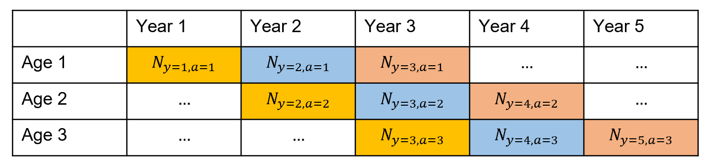
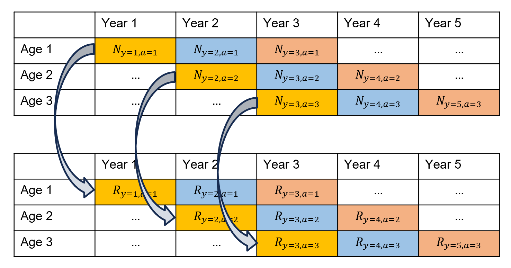
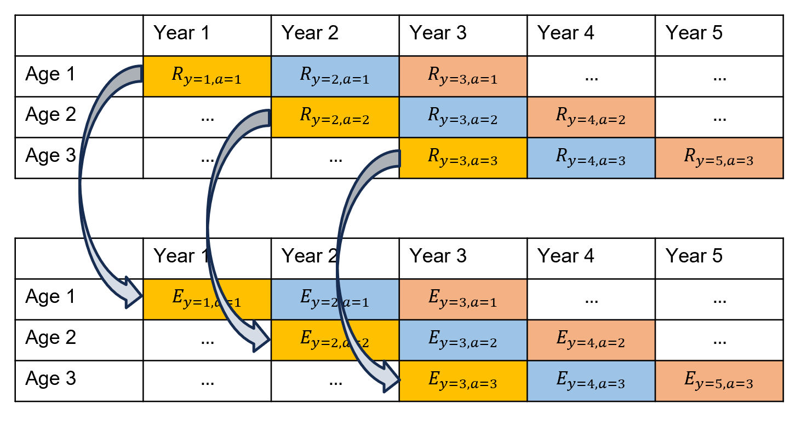
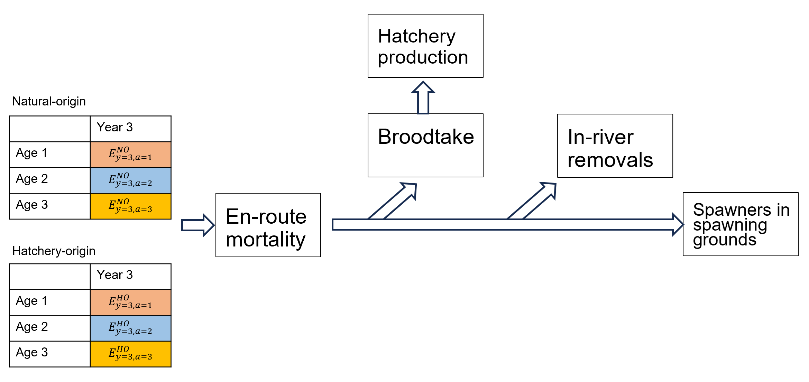
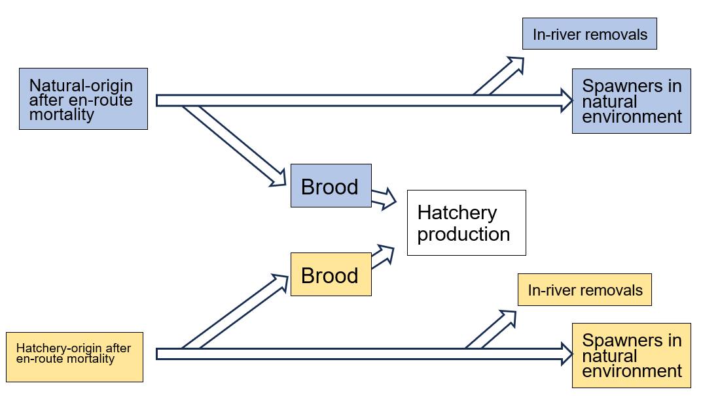
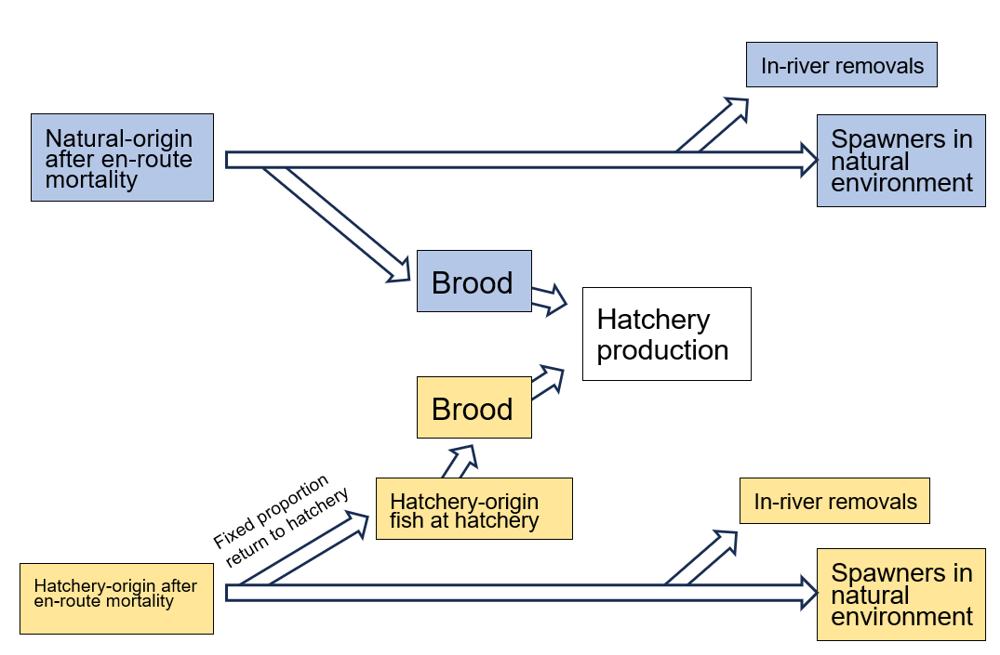
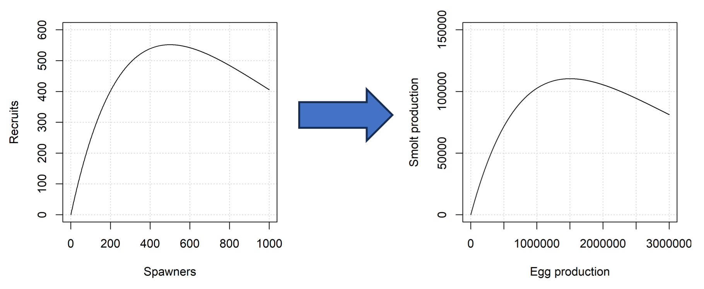
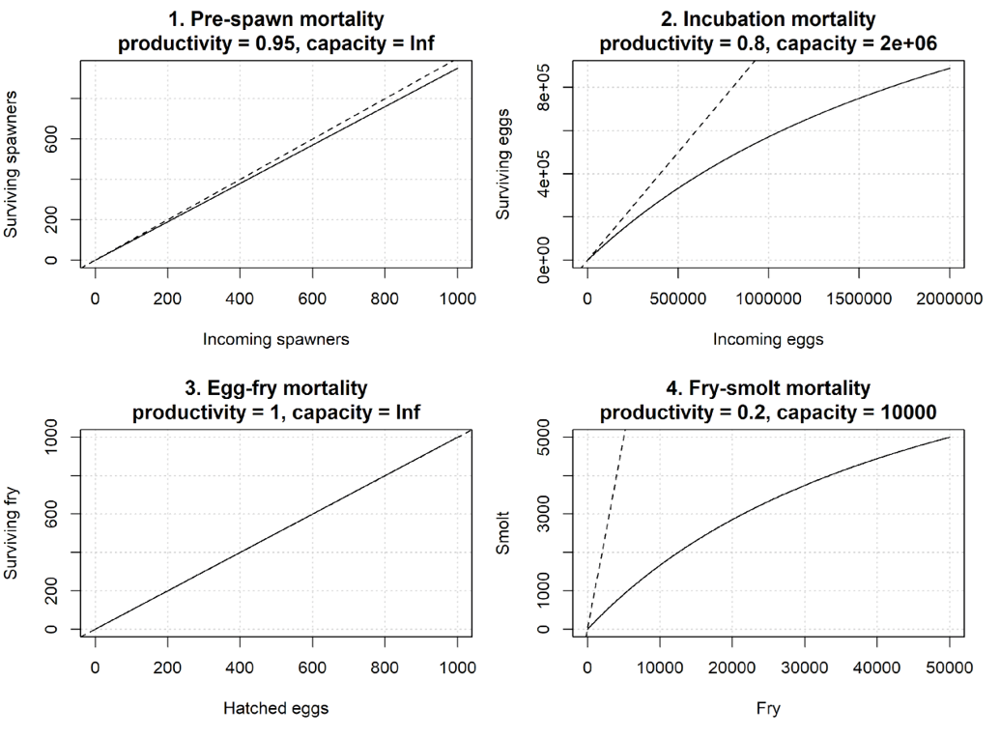

# Introduction

## Background

[**salmonMSE**](https://salmonmse.com/) is a quantitative and stochastic
decision-support tool for Pacific salmon focusing on strategic
trade-offs among harvest, hatchery and habitat management levers.
salmonMSE can be used for risk-based analyses to evaluate the
performance of and prioritize management actions and identify trade-offs
towards achieving biological and harvest objectives.

salmonMSE is a generalizable tool applicable across salmon species and
populations, and expands upon previous simulation tools such as
[samSim](https://publications.gc.ca/collections/collection_2020/mpo-dfo/Fs97-6-3402-eng.pdf),
[AHA](https://www.streamnet.org/wp-content/uploads/2021/01/3.-All-H-Analyzer-Guide-and-Documentation-051120.pdf),
and [openMSE](https://openmse.com). Mechanistically, such tools project
a simulated population over successive generations to obtain the
long-term equilibrium properties of the state dynamics.

To accommodate more complex life histories, salmonMSE is age-structured
which is useful for species that have returns comprising multiple
brood-years. Age-structured dynamics also explicitly model juvenile
mortality in the marine life stage. Multi-population models are
supported to evaluate outcomes across stock complexes, e.g., managing a
mixed fishery that catches several populations simultaneously.
Importantly, salmonMSE was developed to comprehensively support
evaluation of harvest policies, hatchery enhancement programs, and
changes in early freshwater survival simultaneously. Finally,
stochasticity can be incorporated in the model to evaluate outcomes
across uncertain parameters. In general, its flexibility is intended to
encapsulate a gradient of simple to more complex models as data
availability to inform parameters allows.

salmonMSE can be used to address questions such as:

- How do mark-selective fisheries impact harvest and conservation
  objectives?
- How does a change in hatchery release strategy impact harvest and
  conservation objectives?
- How does a candidate broodtake rule impact the ability to achieve PNI
  and conservation objectives?
- How do changes in environmental drivers impact ability to rebuild?
- What combination of fishery exploitation rates and hatchery production
  targets allow us to meet spawner objectives?

This website is intended to be a comprehensive documentation of the
functionality of salmonMSE. Source code is available on
[Github](https://github.com/Blue-Matter/salmonMSE) and the package is
also distributed on
[CRAN](https://doi.org/10.32614/CRAN.package.salmonMSE).

## Getting started

A salmon operating model contains the parameters for the population
dynamics and the management levers to be implemented. In salmonMSE, an
object of class `SOM` can be created from constituent objects of class
`Bio`, `Habitat`, `Hatchery`, and `Harvest` as follows:

- The `Bio` object specifies the natural production, for example,
  maturity, fecundity, stock-recruit relationship, and marine survival.
- The `Habitat` object (optional) specifies freshwater survival from
  egg, fry, and smolt life stages as a series of density-dependent
  functions, with options for time-varying survival, for example, as a
  function of environmental or habitat mitigation/restoration actions.
- The `Hatchery` object specifies the parameters surrounding hatchery
  production, such as the number of target releases, in-river removals
  of hatchery-origin spawners, and the population fitness parameters
  arising from interbreeding of hatchery-origin and natural-origin
  spawners.
- The `Harvest` object specifies the exploitation rate and harvest
  control rules for marine fisheries, with options for mark-selective
  fishing.
- The `Historical` object specifies the starting conditions for the
  projections.

Additional slots in the `SOM` class control the settings of the
projections, for example, the number of years and simulation replicates.

Details on the slots of the various S4 classes can be obtained by typing
[`class?SOM`](https://docs.salmonmse.com/reference/SOM-class.md) in the
R console.

The simulation can then run with the
[`salmonMSE()`](https://docs.salmonmse.com/reference/salmonMSE.md)
function:

The output is a class `SMSE` object containing the state variables and
some performance metrics pertaining to hatchery dynamics (fitness, PNI,
etc.) as arrays typically indexed by simulation, stock, age, and year.
For example, `SMSE@NOS` reports the natural origin spawners.

For convenience and comparison purposes, salmonMSE distributes an
implementation of AHA in R as well:

The resulting output is a named list following the format of the `SMSE`
object, but indexed by generation instead of year.

More details are also provided in the
[example](https://docs.salmonmse.com/articles/example.md) article.
Additional [tutorials](https://docs.salmonmse.com/articles/index.md) are
provided on this website to demonstrate various settings of the
operating model, and provide R code to implement analyses to compare
management options across different states of nature (in separate model
runs) with plotting functions to facilitate comparison.

## Overview of life cycle

This section is intended to provide a visual overview of the life cycle
model. The mathematical equations are provided in a separate
[article](https://docs.salmonmse.com/articles/equations.md).

### Juvenile marine life stage, returns, and escapement

The juvenile life stage during the projection can be envisioned through
a series of age-structured matrices that keeps accounting of abundance
\\N\\ by year \\y\\ and age \\a\\, with separate accounting for
natural-origin and hatchery-origin fish.

Diagonals of the below matrix correspond to brood-years (individual
cohorts by colour). Brood-years advance age classes after accounting for
pre-terminal fishing, maturity, and natural survival.

The return \\R\\ conceptually appear at the midpoint of the year,
calculated from after pre-terminal exploitation and maturity, and are
accounted in a separate matrix:

Similarly, the escapement is calculated from the return after marine
terminal exploitation.

### In-river return

The columns of the escapement matrix comprise the return to river in a
calendar year. Below, we show the natural-origin and hatchery-origin
calendar-year return migration to the spawning ground.

In summary, the return can experience en-route mortality, e.g., in large
river systems. Afterwards, the return may be used as brood for hatchery
production, further in-river removals (not used for brood), before
arrival to spawning grounds:

#### Brood

Brood can be modeled in two ways, with slightly different accounting for
hatchery-origin brood.

First, brood is taken en-route to spawning grounds, where the brood is
taken from the in-river return:

Alternatively, some fraction of the hatchery-origin fish return to the
hatchery, and hatchery-origin brood is taken from this fraction. This
scenario may occur when fish return through swim-in facilities:

Hatchery production uses similar levers and assumptions as in the All-H
Analyzer (AHA). Users specify target releases and the model
back-calculates target egg production and broodtake from hatchery
survival and brood fecundity.

Of course, failure to achieve target releases can occur with
insufficient return, and other constraints placed by the analyst, e.g.,
limiting natural-origin brood to ensure sufficient spawning in the
natural environment.

Extended flexibility for brood rules is supported through [custom R
functions](https://docs.salmonmse.com/articles/custom-function.md).

### Next generation

Once spawners reach the spawning round, egg production is calculated
from spawner abundance and fecundity.

There are two methods to map survival from egg production to
outmigrating juveniles in the next year:

1.  A single density-dependent function can be modeled (egg-juvenile
    survival), or 2: A series of stage-specific density-dependent
    functions, representing habitat processes, is modeled

#### Single stock-recruit relationship

A Ricker or Beverton-Holt stock-recruit relationship (SRR) can be used
to calculate juveniles (of age 1) of the next generation from the
parental egg production.

For the Ricker model, salmon populations are typically modeled by a
spawner to return SRR. salmonMSE provides the capability to create
equivalent egg-juvenile SRRs from parameters of a spawner-return SRR.

#### Stage-specific survival

Survival at up to four life stages can be modeled:

1.  **Pre-spawn mortality**: some proportion of adults that return to
    spawning ground die. The egg production is calculated from survivors
2.  **Egg incubation mortality**: the egg production can exhibit
    mortality from scouring and erosion of bottom substrate
3.  **Egg-fry mortality**: after egg emergence, fry mortality can occur
4.  **Fry-smolt mortality**: another life stage to model mortality from
    egg to smolt life stage

At each stage, a Beverton-Holt density-dependent function is used to
describe the survival function. These functions can be configured to be
density-independent, as shown below:

### Out-migration

After the smolt life stage, the cohort is considered as age 1 and may be
treated as having entered the marine life stage (see [*Juvenile marine
life stage*](#juvenile-marine-life-stage-returns-and-escapement) above).

## Development

salmonMSE is actively developed, and issues can be posted on
[Github](https://github.com/Blue-Matter/salmonMSE/issues).
