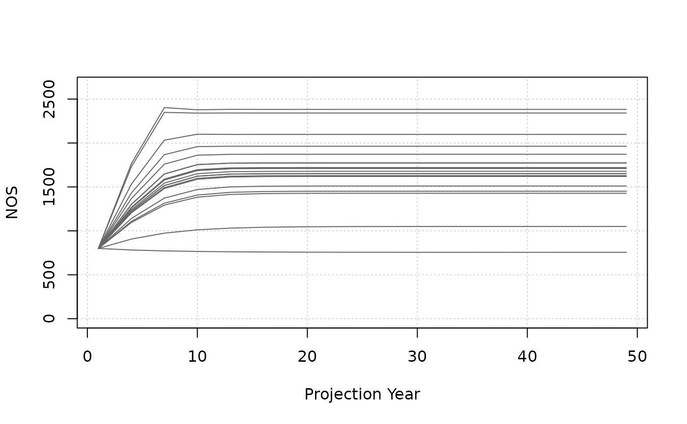
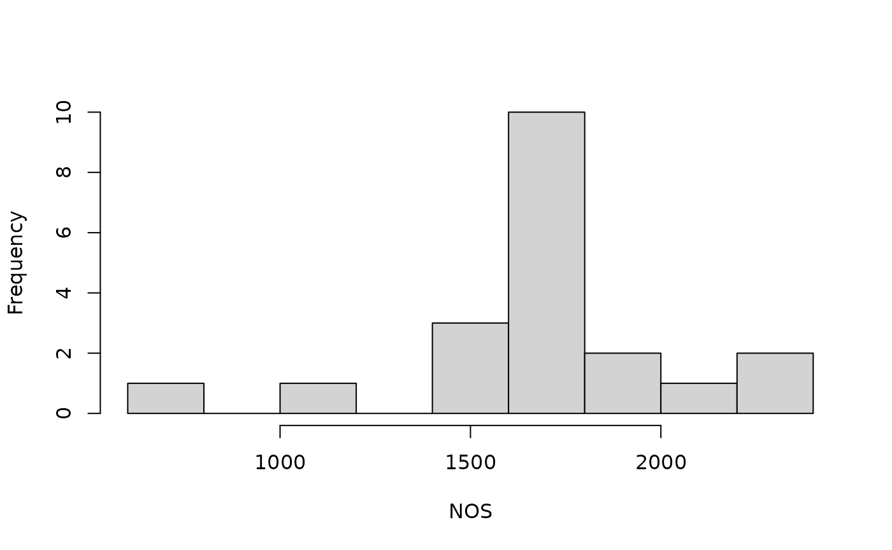

# Tutorial 1 - Harvest projection

## Operating model basics

This tutorial is an introduction to the basic mechanics of working with
the salmonMSE projection model.

The operating model is an object where we put parameters describing the
life history of our case study and the management strategy to be
evaluated.

In R, the operating model is an S4 object of class `SOM`. We can view
the documentation with:

``` r

library(salmonMSE)
class?SOM
```

The `SOM` object is built out of constituent objects that organizes the
inputs and different management levers. Creating a full `SOM` looks
something like this:

``` r

# Note: demonstration only, this code chunk will not work
SOM <- new(
  "SOM",
  Bio = Bio,
  Habitat = Habitat,
  Hatchery = Hatchery,
  Harvest = Harvest,
  Historical = Historical
)
```

We’ll work with 5 smaller objects (`Bio`, `Habitat`, `Hatchery`,
`Harvest`, and `Historical`), each of which are S4 objects with
pre-defined input slots. Each also has its own documentation page with
the necessary description and dimensions of the input object (arrays,
matrices, etc). For example, access the documentation for the `Bio`
object with:

``` r

class?Bio
```

While we need to create all five objects, we may carefully work with as
few as 1-2 objects depending on the case study, but others may not be
relevant, for example, we are not evaluating hatchery production.

Let’s start simple with a model that implements a fishery harvest rate.

## Simple case study

### Bio object

The `Bio` object component of the operating model describes the basic
biology (maturity, lifespan) of the population. In general, we need to
describe what happens in each age class.

Here’s the first example, where we will fill in the slots in
line-by-line:

``` r

nsim <- 20
SAR <- 0.01

set.seed(4389)
kappa_mean <- 3
kappa_sd <- 0.5

kappa <- EnvStats::rnormTrunc(nsim, kappa_mean, kappa_sd, min = 1, max = Inf)

Bio <- new("Bio")
Bio@Name <- "Prototype"
Bio@maxage <- 3
Bio@p_mature <- c(0, 0, 1)
Bio@SRrel <- "Ricker"
Bio@kappa <- kappa
Bio@Smax <- 1000
Bio@Mjuv_NOS <- c(0, -log(SAR))
Bio@fec <- c(0, 0, 5000)
Bio@p_female <- 0.5
```

Alternatively, the `Bio` object can be filled in one call:

``` r

nsim <- 20
SAR <- 0.01

set.seed(4389)
kappa_mean <- 3
kappa_sd <- 0.5

kappa <- EnvStats::rnormTrunc(nsim, kappa_mean, kappa_sd, min = 1, max = Inf)

Bio <- new(
  Class = "Bio",
  maxage = 3,
  p_mature = c(0, 0, 1),
  SRrel = "Ricker",
  kappa = kappa,
  Smax = 1000,
  Mjuv_NOS = c(0, -log(SAR)),
  fec = c(0, 0, 5000),
  p_female = 0.5
)
```

The information contained in this object:

- The lifespan is 3 years
- All fish mature at age 3
- Natural-origin juvenile marine survival is 0.01, occurring between age
  2 to 3
- 50% of spawners are female, each with fecundity of 5 thousand eggs
- The density-dependence of the population is described with a Ricker
  stock-recruit function. The productivity parameter (kappa) is
  stochastic over 20 simulations with an average of 3 adults/spawner.
  The Smax parameter is 1,000 spawners.

There’s also some other default parameters that we are not discussing
(for example, en-route survival to spawning grounds is 1, see
[`class?Bio`](https://docs.salmonmse.com/reference/Bio-class.md)).

### Harvest object

In the `Bio` object, we have egg-juvenile survival described in the
Ricker stock recruit relationship, and juvenile marine survival is 0.01.

Next, we describe the exploitation rate in the fishery in the `Harvest`
object:

``` r

Harvest <- new(
  "Harvest",
  u_preterminal = 0,
  u_terminal = 0.2,
  vulT = c(1, 1, 1)
)
```

The information in this object:

- There is no preterminal marine fishery exploitation, i.e., fishing on
  juveniles
- The terminal exploitation rate is 0.2
- The terminal fishery selects all ages equally (vulnerability is
  identical for all ages, but note that only age-3 fish return and are
  available to the fishery in the first place).

### Other objects

We have to specify the `Hatchery`, `Habitat`, and `Historical` objects.
However, we don’t have a hatchery and we don’t model individual
freshwater life stages. Thus, our `Hatchery`, `Habitat` objects are
quite simple:

``` r

# Set releases to zero to turn off hatchery
Hatchery <- new(
  "Hatchery",
  n_yearling = 0,
  n_subyearling = 0
)

# Use flag to be explicit about assumptions
Habitat <- new(
  "Habitat",
  use_habitat = FALSE
)
```

We will simulate with 1,000 juveniles at the start of the projection:

``` r

# Set number of juveniles at beginning of simulation
Historical <- new(
  "Historical",
  InitNjuv_NOS = 1000,
  InitNjuv_HOS = 0
)
```

### Run projection

We create the `SOM` object now that we have individual objects
completed:

``` r

proyears <- 50 # Specify the number of projection years
SOM <- new(
  "SOM",
  nsim = nsim,
  proyears = proyears,
  Bio = Bio,
  Habitat = Habitat,
  Hatchery = Hatchery,
  Harvest = Harvest,
  Historical = Historical
)
```

Then, we run the projection with a call to
[`salmonMSE()`](https://docs.salmonmse.com/reference/salmonMSE.md).

Generally, it’s a good idea to save the output, especially for larger
models and extensive analyses.

``` r

SMSE <- salmonMSE(SOM)
#saveRDS(SMSE, "1-simple.rds")
```

## Reporting

We then generate a markdown report of the projection with
[`report()`](https://docs.salmonmse.com/reference/report.md):

``` r

report(SMSE)
```

### Exploring output

The output (class `SMSE`) from the projection contains various arrays of
the state variables during the projection. For example, this slot
contains the projected natural-origin spawners (NOS) in an array by
simulation, stock, age, and year:

``` r

SMSE@NOS
```

All other slots can be found with:

``` r

slotNames(SMSE)
```

The corresponding documentation is found with:

``` r

class?SMSE
```

### Figures

There are plotting functions to help us explore the output.

[`plot_statevar_ts()`](https://docs.salmonmse.com/reference/plot_statevar_ts.md)
generates a time series figure with base graphics. By default, it
generates line plots for each stochastic simulation in the projection:

``` r

plot_statevar_ts(SMSE, "NOS")
```



Adding an additional argument gives us a summary quantile by year:

``` r

plot_statevar_ts(SMSE, "NOS", quant = TRUE)
```


We can also explore the distribution of outcomes within an individual
year.
[`plot_statevar_hist()`](https://docs.salmonmse.com/reference/plot_statevar_ts.md)
returns a histogram. By default, it plots the values in the last year of
the projection:

``` r

plot_statevar_hist(SMSE, "NOS")
```



And again, an additional argument gives us control to plot distributions
in other projection years:

``` r

plot_statevar_hist(SMSE, "NOS", y = 1)
```


All these figures return results from a single model run. We will
explore how to compare model runs in Tutorial 3.
