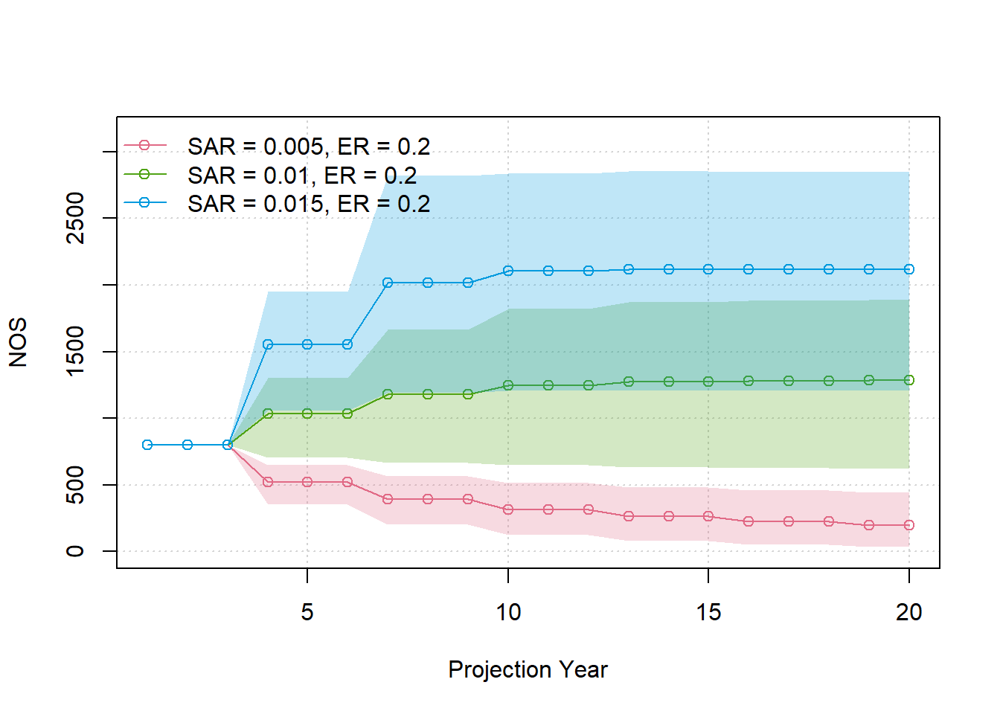
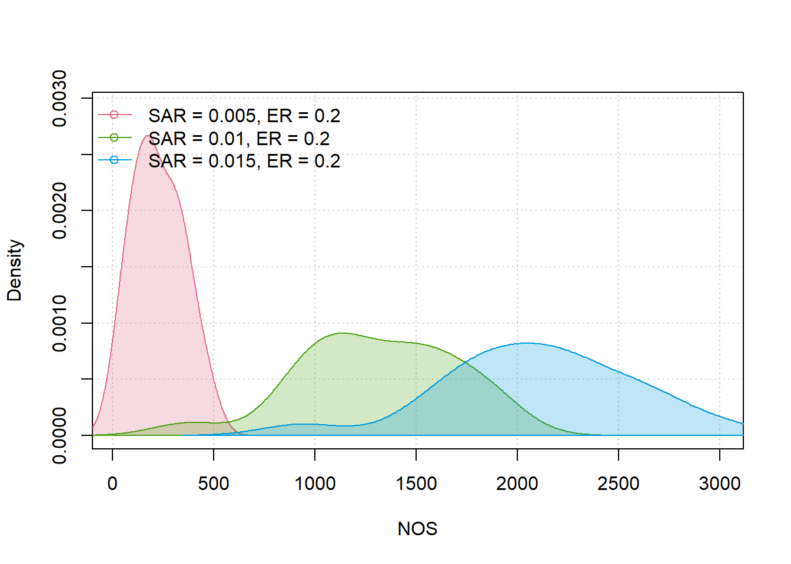
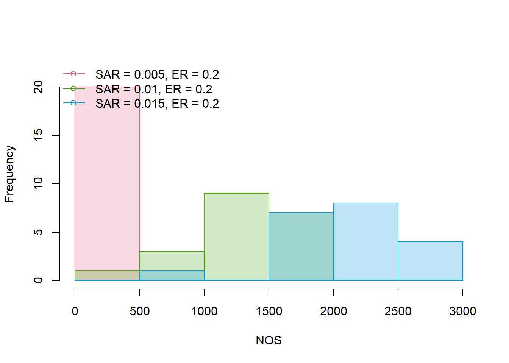
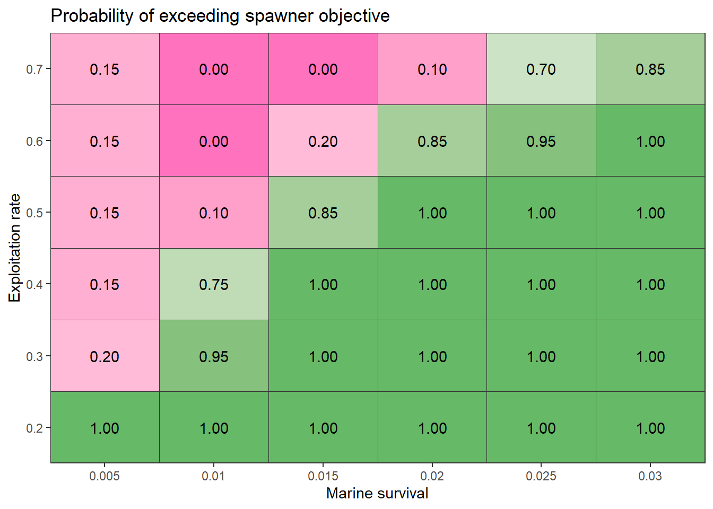
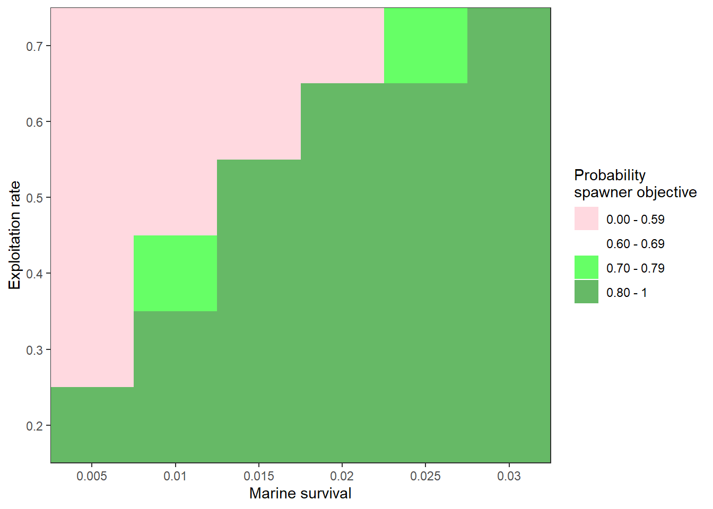
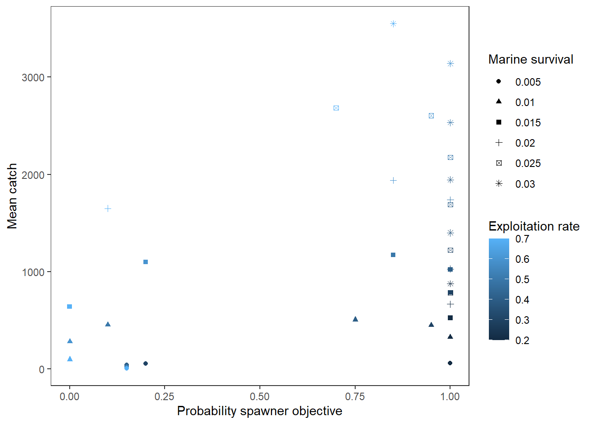
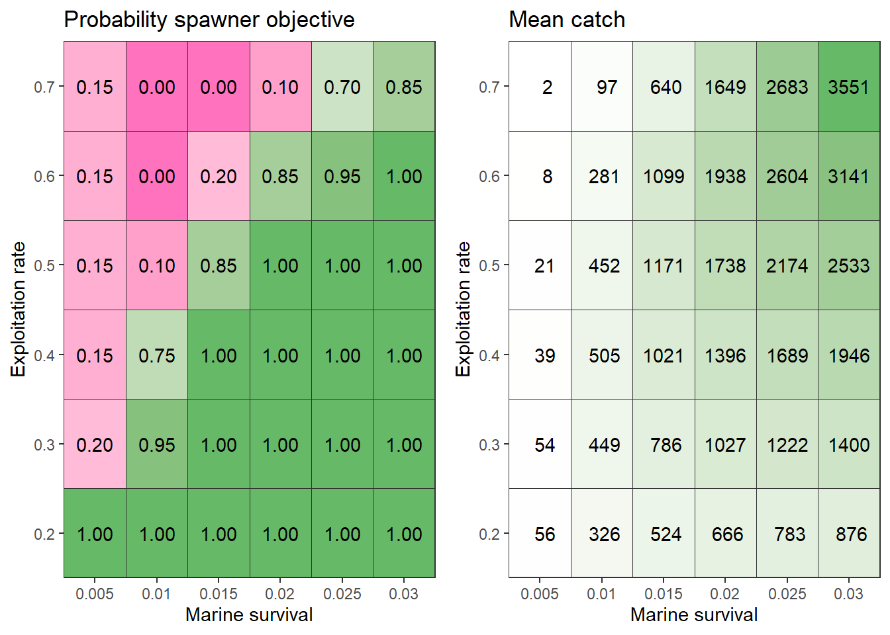

# Tutorial 3 - Running multiple scenarios (harvest projection)

## Multiple model runs

Here, we demonstrate how to organize an analysis that evaluates
alternative management strategies across uncertain biological
parameters.

The management strategy to be evaluated is the terminal exploitation
rate (ER), which is evaluated in separate simulation runs.

The two uncertain parameters for which we want to evaluate robustness is
marine survival (SAR) and the stock-recruit (SR) Ricker parameters. We
incorporate uncertainty in Ricker parameters within operating model,
while marine survival is specified in separate operating models.

Each operating model is a unique description of the system dynamics.
Thus, individual operating models contain separate combinations of ER
and marine survival.

The recommended simulation approach is as follows:

1.  Write the R code that executes a single model run
2.  Place that code in a wrapper function that will be used to repeat
    the simulation for various combination of parameters
3.  Create a grid that identifies all parameter values that will
    adjusted in the full simulation
4.  Repeat the simulation over all parameter values. Take advantage of
    the parallel processing capabilities and vectorization capabilities
    of R, e.g., the [`lapply()`](https://rdrr.io/r/base/lapply.html)
    function.

Once we have completed the simulation, we will have to aggregate the
results to compare the outcomes in the grid.

## Step 1: Single model run

Below is a single code chunk for a single model projection, using a
similar life cycle modeling approach as in Tutorial 1:

``` r

library(salmonMSE)
nsim <- 20
set.seed(234)

SAR <- 0.01
ER <- 0.1

# We are sampling Ricker alpha values which represent maximum egg-smolt survival
# While salmonMSE expects productivity values (recruits/spawner) in the kappa slot, 
# we can set the phi conversion term to 1 to directly enter alpha
alpha_mean <- 0.1
alpha_sd <- 0.15
alpha <- rlnorm(nsim, log(alpha_mean) - 0.5 * alpha_sd^2, alpha_sd)

# We are sampling Ricker Emax = 1/beta (egg production that maximizes the stock-recruit function)
# represent maximum egg-smolt survival
# While salmonMSE expects Smax, 
# we can set both phi and tau conversions term to 1 to directly enter Emax
# Here mean Emax is the egg production from 1000 spawners (fecundity = 5,000 eggs)
Emax_mean <- 1000 * 5000
Emax_sd <- 0.2
Emax <- rlnorm(nsim, log(Emax_mean) - 0.5 * Emax_sd^2, Emax_sd)

Bio <- new(
  Class = "Bio",
  maxage = 3,
  p_mature = c(0, 0, 1),
  SRrel = "Ricker",
  kappa = alpha,
  Smax = Emax,
  phi = 1,
  tau = 1,
  Mjuv_NOS = c(0, -log(SAR)),
  fec = c(0, 0, 5000),
  p_female = 0.5
)

Harvest <- new(
  "Harvest",
  u_preterminal = 0,
  u_terminal = ER,
  vulT = c(1, 1, 1)
)

Hatchery <- new(
  "Hatchery",
  n_yearling = 0,
  n_subyearling = 0
)

# Use flag to be explicit about assumptions
Habitat <- new(
  "Habitat",
  use_habitat = FALSE
)

# Set number of juveniles at beginning of simulation
InitNjuv_NOS <- array(1000, c(nsim, Bio@maxage, 1))
InitNjuv_NOS[, 1:2, ] <- 1000 / SAR
Historical <- new(
  "Historical",
  InitNjuv_NOS = InitNjuv_NOS,
  InitNjuv_HOS = 0
)

proyears <- 40
SOM <- new(
  "SOM",
  nsim = nsim,
  proyears = proyears,
  Bio = Bio,
  Habitat = Habitat,
  Hatchery = Hatchery,
  Harvest = Harvest,
  Historical = Historical
)
SMSE <- salmonMSE(SOM)
```

## Step 2: Wrapper function

Now let’s put the above code chunk into a function. We’ll call it
`wrapper()`.

This function has three arguments:

- `SAR_vector` that contains a vector of marine survival values
- `ER_vector` that contains a vector of exploitation rate values, same
  length as `SAR_vector`
- `i` which is an integer that indexes both `SAR_vector` and
  `ER_vector`. When `wrapper()` is called, you supply a value for `i`
  and the function will grab the `i`-th value in `SAR_vector` and
  `ER_vector` for the model run.

The rest of the function should be the same as the previous chunk. The
wrapper function re-creates the same operating model each time the
function is called, except for the SAR and ER value, runs the
projection, and returns the output to the user:

``` r

wrapper <- function(i, SAR_vector, ER_vector) {

  require(salmonMSE)
  
  SAR <- SAR_vector[i]
  ER <- ER_vector[i]

  nsim <- 20
  set.seed(234)

  # We are sampling Ricker alpha values which represent maximum egg-smolt survival
  # While salmonMSE expects productivity values (recruits/spawner) in the kappa slot, 
  # we can set the phi conversion term to 1 to directly enter alpha
  alpha_mean <- 0.1
  alpha_sd <- 0.15
  alpha <- rlnorm(nsim, log(alpha_mean) - 0.5 * alpha_sd^2, alpha_sd)
  
  # We are sampling Ricker Emax = 1/beta (egg production that maximizes the stock-recruit function)
  # represent maximum egg-smolt survival
  # While salmonMSE expects Smax, 
  # we can set both phi and tau conversions term to 1 to directly enter Emax
  # Here mean Emax is the egg production from 1000 spawners (fecundity = 5,000 eggs)
  Emax_mean <- 1000 * 5000
  Emax_sd <- 0.2
  Emax <- rlnorm(nsim, log(Emax_mean) - 0.5 * Emax_sd^2, Emax_sd)

  Bio <- new(
    Class = "Bio",
    maxage = 3,
    p_mature = c(0, 0, 1),
    SRrel = "Ricker",
    kappa = alpha,
    Smax = Emax,
    phi = 1,
    tau = 1,
    Mjuv_NOS = c(0, -log(SAR)),
    fec = c(0, 0, 5000),
    p_female = 0.5
  )

  Harvest <- new(
    "Harvest",
    u_preterminal = 0,
    u_terminal = ER,
    vulT = c(1, 1, 1)
  )

  Hatchery <- new(
    "Hatchery",
    n_yearling = 0,
    n_subyearling = 0
  )

  # Use flag to be explicit about assumptions
  Habitat <- new(
    "Habitat",
    use_habitat = FALSE
  )

  # Set number of juveniles at beginning of simulation
  InitNjuv_NOS <- array(1000, c(nsim, Bio@maxage, 1))
  InitNjuv_NOS[, 1:2, ] <- 1000 / SAR
  Historical <- new(
    "Historical",
    InitNjuv_NOS = InitNjuv_NOS,
    InitNjuv_HOS = 0
  )

  proyears <- 20
  SOM <- new(
    "SOM",
    nsim = nsim,
    proyears = proyears,
    Bio = Bio,
    Habitat = Habitat,
    Hatchery = Hatchery,
    Harvest = Harvest,
    Historical = Historical
  )
  
  SMSE <- salmonMSE(SOM)

  return(SMSE)
}
```

## Step 3 - Create parameter grid

Before we can use the wrapper function, we create the simulation design,
i.e., which ERs and marine survival values we will use.

One way to create a grid of values is with
[`expand.grid()`](https://rdrr.io/r/base/expand.grid.html) from separate
vectors of marine survival and ERs. Each row identifies a unique set of
values in the grid:

``` r

simulation_design <- expand.grid(
  SAR_vector = seq(0.005, 0.03, 0.005),
  ER_vector = seq(0.2, 0.7, 0.1)
)
```

## Step 4: Repeat simulation

Once we have our wrapper function and simulation design, we can now run
the simulation.

There’s various ways to run the projections depending on our computation
capabilities, e.g., old laptop, new desktop, computing cluster, etc.

### Non-parallel computation

We can run a loop over each row of our `simulation_design` data frame:

``` r

SMSE_list <- list()
for (i in 1:nrow(simulation_design)) {
  SMSE_list[[i]] <- wrapper(
    i, 
    SAR_vector = simulation_design$SAR_vector,
    ER_vector = simulation_design$ER_vector
  )
}
```

The [`lapply()`](https://rdrr.io/r/base/lapply.html) function has a
similar functionality that repeats calculations down the rows of the
simulation grid:

``` r

SMSE_list <- lapply(
  1:nrow(simulation_design), 
  wrapper, 
  SAR_vector = simulation_design$SAR_vector,
  ER_vector = simulation_design$ER_vector
)
```

### Parallel computation

Loops are computationally slower compared to parallel processing. We use
the `parallel` package to run simulations over 10 CPUs, then save the
results:

``` r

library(parallel)
cpus <- 10

cl <- makeCluster(cpus)

SMSE_list <- parLapply(
  cl,
  X = 1:nrow(simulation_design), 
  wrapper,
  SAR_vector = simulation_design$SAR_vector, 
  ER_vector = simulation_design$ER_vector
)

stopCluster(cl)
```

> It is also possible to run parallel simulations within a single
> operating model, for example, with
> `SMSE <- salmonMSE(SOM, ncores = 10)`. This feature is probably best
> suited for individual model runs with many simulation replicates.

## Results

Now we have a list of `SMSE` objects in `SMSE_list`.

### Compare time series

In Tutorials 1 & 2, we saw that
[`report()`](https://docs.salmonmse.com/reference/report.md) generates a
Markdown report from a single model run. Here, we want to compare
several model runs simultaneously in a figure.

We have the
[`compare()`](https://docs.salmonmse.com/reference/compare.md) function
which generates another markdown report that plots state variables from
separate model runs.

We have 36 scenarios, so we may not be able to neatly all into
individual figures. Here’s how to compare just the first 3 model runs:

``` r

# Create names for each model run by pasting the SAR and ER values
SMSE_names <- paste0("SAR = ", simulation_design$SAR_vector, ", ER = ", simulation_design$ER_vector)

compare(SMSE_list = SMSE_list[1:3], names = SMSE_names[1:3])
```

[`compare_statevar_ts()`](https://docs.salmonmse.com/reference/compare_statevar_ts.md)
generates a time series figure with base graphics. While the default
settings generate a line plot for each stochastic simulation, it can
quickly get messy.

Let’s directly proceed to quantile figures:

``` r

compare_statevar_ts(SMSE_list[1:3], var = "NOS", quant = TRUE, names = SMSE_names[1:3])
```



We can visualize the distribution of outcomes within scenarios with
[`compare_statevar_hist()`](https://docs.salmonmse.com/reference/compare_statevar_ts.md),
which has choices to plot with either the
[`density()`](https://rdrr.io/r/stats/density.html) or
[`hist()`](https://rdrr.io/r/graphics/hist.html) functions:

``` r

compare_statevar_hist(SMSE_list[1:3], var = "NOS", names = SMSE_names[1:3], type = "density")
```



``` r

compare_statevar_hist(SMSE_list[1:3], var = "NOS", names = SMSE_names[1:3], type = "hist")
```



### Performance measures and decision tables

Risk evaluation typically entails calculating a summary metric that
describes the frequency that an objective was met in the simulation.

For example, we can calculate the probability that spawner abundance
exceeded 0.85 SMSY (spawners at MSY). We have a function
[`SMSY85()`](https://docs.salmonmse.com/reference/Deprecated.md) that
does the calculation for us:

Using the vectorization capabilities in R, we use
[`sapply()`](https://rdrr.io/r/base/lapply.html) to call
[`SMSY85()`](https://docs.salmonmse.com/reference/Deprecated.md) for
each of the objects in `SMSE_list`. We add an extra argument
`Yrs = c(20, 20)` that specify the year range (the probability is
calculated at the end of the projection in year 20):

``` r

sim_results <- simulation_design
sim_results$spawner_objective <- sapply(SMSE_list, SMSY85, Yrs = c(20, 20))
```

We want to explore the decision space: at what exploitation rates are we
likely to reach our objective across plausible values of marine
survival?

[`plot_decision_table()`](https://docs.salmonmse.com/reference/plot_decision_table.md)
helps us plot a grid of values using ggplot. The colour scheme maps 0-1
with red to green (0.5 is white).

We can see a nice frontier line that delineates our decision-making
space: we can meet our spawner objective with higher exploitation rates
only if marine survival increases as well. Exploitation rates of 0.2
would be most robust to the marine survival scenarios that we simulated.

We can envision running a larger grid to map out the full decision
space.

``` r

plot_decision_table(
  x = sim_results$SAR_vector,
  y = sim_results$ER_vector,
  z = sim_results$spawner_objective,
  xlab = "Marine survival",
  ylab = "Exploitation rate",
  title = "Probability of exceeding spawner objective"
)
```



Alternatively,
[`plot_decision_table2()`](https://docs.salmonmse.com/reference/plot_decision_table.md)
gives us more flexibility in the colour scheme by binning the summary
metric into separate colour bins. With the same layout as the previous
figure, we refine the decision table based on the outcomes:

``` r

plot_decision_table2(
  x = sim_results$SAR_vector,
  y = sim_results$ER_vector,
  z = sim_results$spawner_objective,
  xlab = "Marine survival",
  ylab = "Exploitation rate",
  zlab = "Probability\nspawner objective",
  bin = c(0, 0.6, 0.7, 0.8),
  bin_labels = c("0.00 - 0.59", "0.60 - 0.69", "0.70 - 0.79", "0.80 - 1"),
  bin_col = c("pink", "white", "green", "green4")
)
```



### Tradeoffs

Frequently, objectives are conflicting. For example, lower exploitation
rates in the long-run can allow for more escapement at the cost of
catch. Tradeoff figures allow us to compare two summary metrics
simultaneously.

First, let’s calculate our second metric, average catch in year 20, with
a custom function:

``` r

Catch_fn <- function(SMSE) mean(rowSums(SMSE@KT_NOS[, 1, , 20])) # Kept catch of natural-origin fish
sim_results$Mean_catch <- sapply(SMSE_list, Catch_fn)
```

Next, we can use
[`plot_tradeoff()`](https://docs.salmonmse.com/reference/plot_tradeoff.md)
to plot the two metrics (average catch and spawner probability) against
each other.

Typically, we want a nice frontier line that allows us to see the impact
of our management options as in the decision tables above, but the
tradeoff figure is quite messy:

``` r

plot_tradeoff(
  pm1 = sim_results$spawner_objective,
  pm2 = sim_results$Mean_catch,
  x1 = sim_results$ER_vector,
  x2 = sim_results$SAR_vector,
  xlab = "Probability spawner objective",
  ylab = "Mean catch",
  x1lab = "Exploitation rate",
  x2lab = "Marine survival"
)
```



Tutorial 4 has an example with a more defined frontier in the tradeoff
plot.

A sufficient alternative would be to plot the decision tables next to
each other:

``` r

g1 <- plot_decision_table(
  x = sim_results$SAR_vector,
  y = sim_results$ER_vector,
  z = sim_results$spawner_objective,
  xlab = "Marine survival",
  ylab = "Exploitation rate",
  title = "Probability spawner objective"
)

g2 <- plot_decision_table(
  x = sim_results$SAR_vector,
  y = sim_results$ER_vector,
  z = round(sim_results$Mean_catch),
  xlab = "Marine survival",
  ylab = "Exploitation rate",
  title = "Mean catch"
)

cowplot::plot_grid(g1, g2)
```


