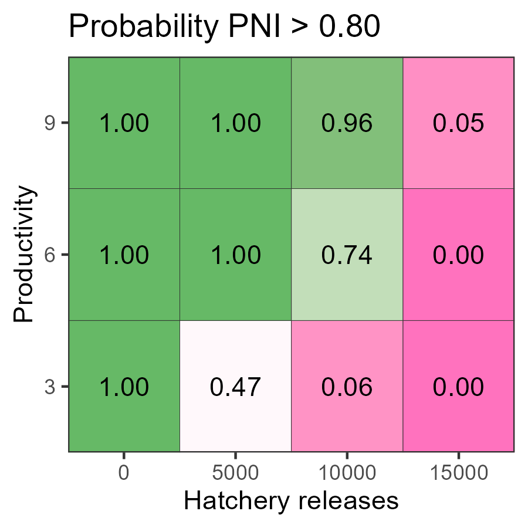
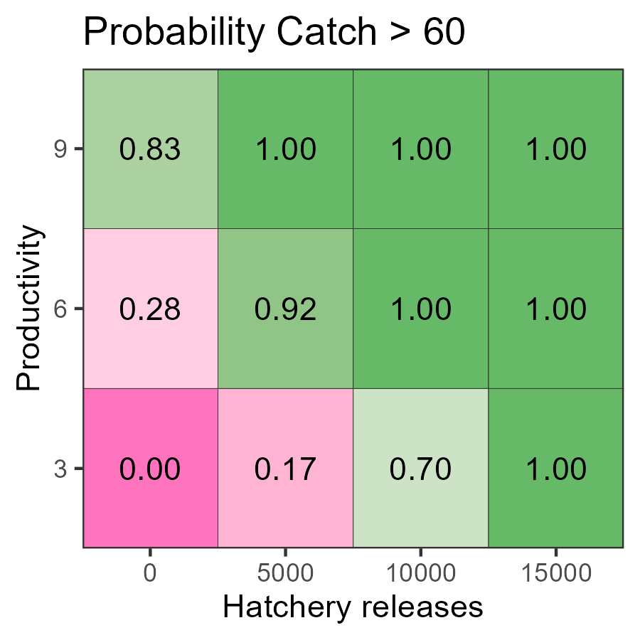
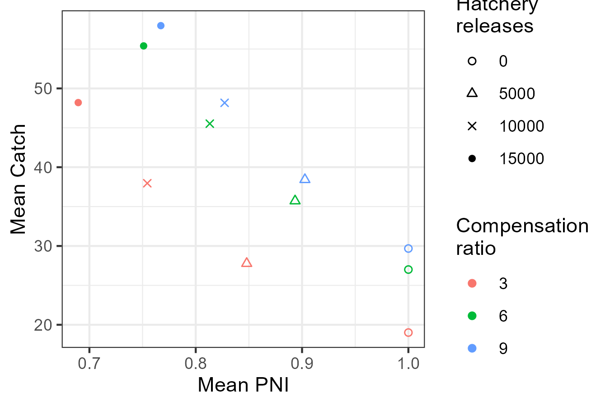
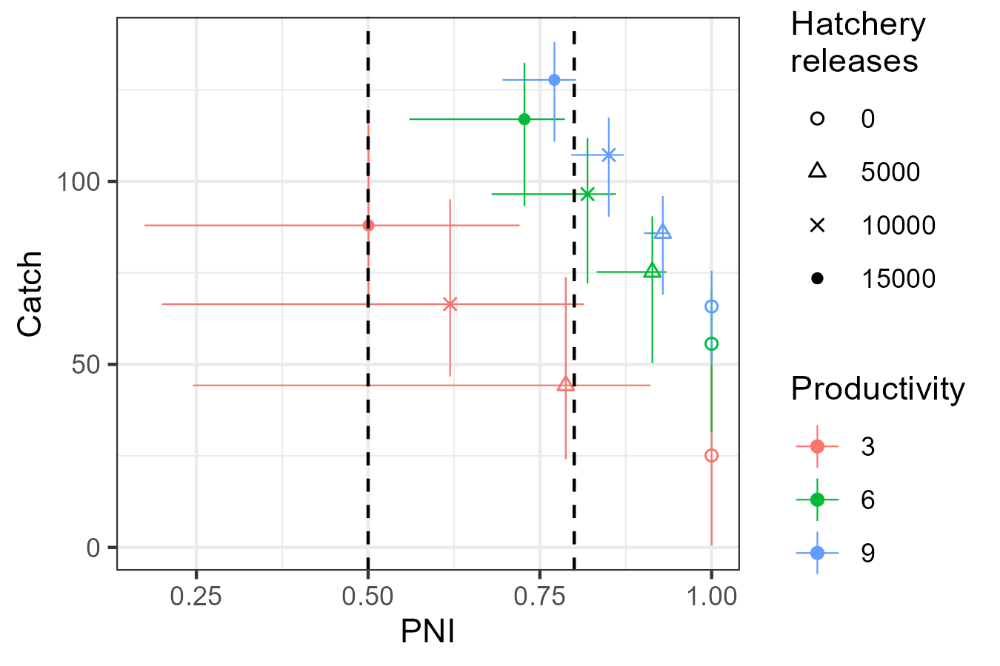
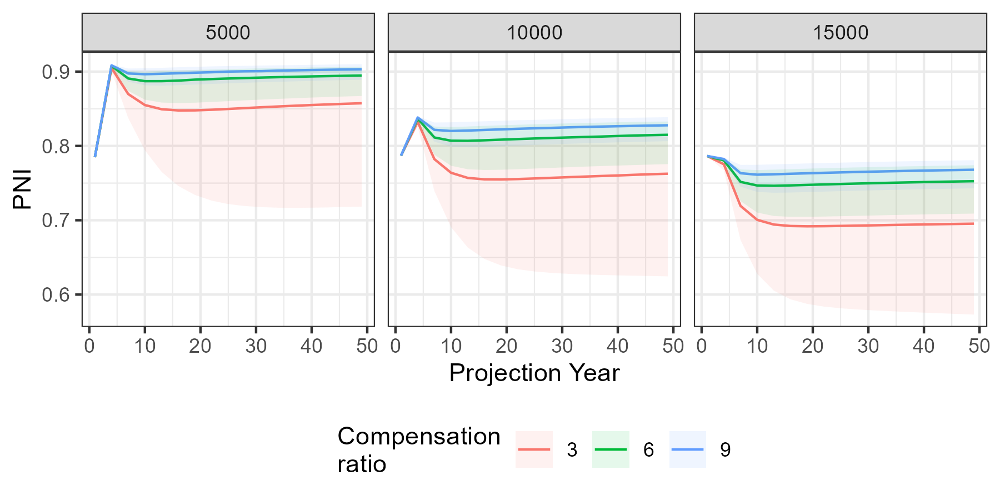
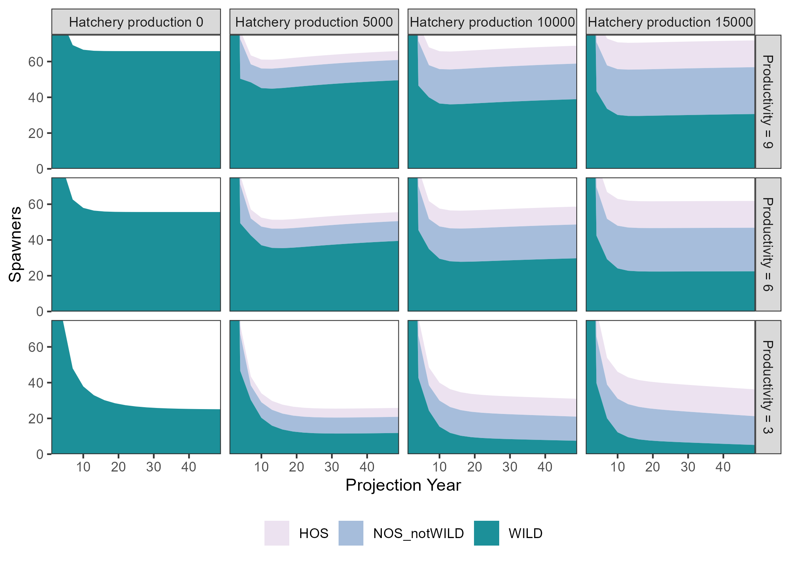
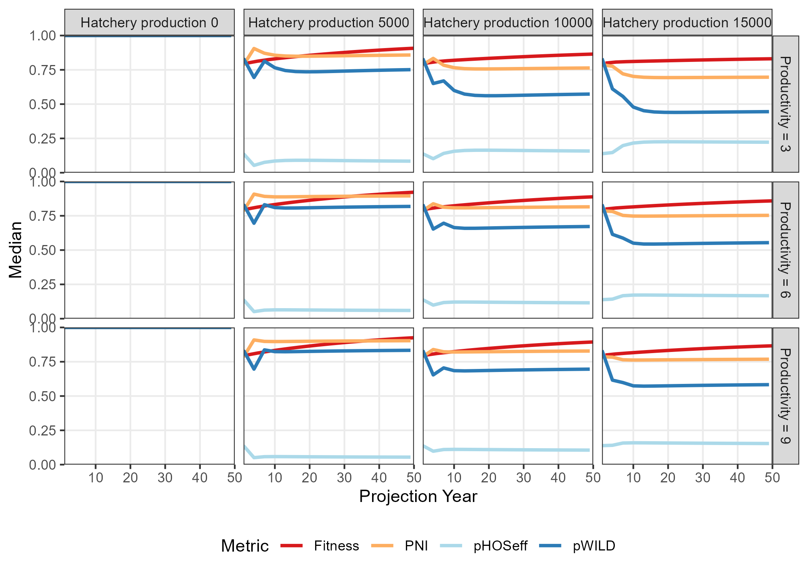

```{r, include = FALSE}
knitr::opts_chunk$set(
  collapse = TRUE,
  comment = "#>"
)
```


The performance of alternative management actions, conditional on various states of nature, can be summarized in a decision table.

This article provides an example of how a decision table can be created in salmonMSE.
Decision tables and supporting visualizations require multiple model runs to compare management actions and states of nature.
We extend the [simple example](../articles/example.html) of a salmon operating model that has a single brood year recruitment where all fish mature at age 3.

A motivating research question for this analysis would be: What amount of hatchery production ensures catch opportunities while minimizing the hatchery influence of the natural spawning population? And how robust is this choice to uncertainty in the productivity of the natural population?

We will explore the effect of four hatchery production options with zero, 5000, 10000, or 15000 annual releases. In the integrated hatchery, we also assume non-selective broodtake, i.e., the mark rate is zero and hatchery/natural origin fish cannot be distinguished, and the maximum brood/escapement ratio is 0.5.
The carrying capacity of the freshwater environment is 17,250 smolts.

These four options are evaluated across three states of nature with respective to productivity: a mean value of either 3, 6, or 9 recruits/spawner. We sample productivity over 100 simulations with a lognormal standard deviation of 0.4.

A fixed harvest rate is applied at 0.50 in all scenarios, and no freshwater specific life stages are modeled (habitat features not used). The decision-making context here assumes that the harvest rate is fixed.

Below is the code for performing such a simulation. We specify the various simulation conditions (natural productivity and hatchery production) in a data frame and write a wrapper function that loops over each row of the data frame.
The simulations initialize at 1000 natural and hatchery spawners each, and project forward 50 years to obtain the system dynamics in the long-term equilibrium (the generation time is 3 years).

```{r, echo = TRUE, eval = FALSE}
library(salmonMSE)
library(tidyverse)

# Data frame of the factorial combinations of productivity (kappa)
# and hatchery production
Design <- expand.grid(
  kappa = c(3, 6, 9),
  hatch = c(0, 5, 10, 15) * 1000
)

# Wrapper function that runs a salmonMSE projection for each row of
# parameters in the data frame
wrapper <- function(x, Design) {

  SAR <- 0.01
  nsim <- 100

  set.seed(100)
  kappa_mean <- Design$kappa[x]
  kappa_sd <- 0.3
  kappa <- rlnorm(nsim, log(kappa_mean) - 0.5 * kappa_sd^2, kappa_sd)

  Bio <- new(
    "Bio",
    maxage = 3,
    p_mature = c(0, 0, 1),
    SRrel = "BH",
    capacity = 17250,
    kappa = kappa,
    Mjuv_NOS = c(0, -log(SAR), 0),
    fec = c(0, 0, 5040),
    p_female = 0.49,
    s_enroute = 1
  )
  
  Hatchery <- new(
    "Hatchery",
    n_yearling = Design$hatch[x],
    n_subyearling = 0,
    s_prespawn = 1,
    s_egg_smolt = 0.92,
    s_egg_subyearling = 1,
    Mjuv_HOS = Bio@Mjuv_NOS,
    gamma = 0.8,
    m = 0,
    pmax_esc = 0.50,
    pmax_NOB = 1,
    ptarget_NOB = 0.75,
    phatchery = 0.8,
    premove_HOS = 0,
    theta = c(100, 80),
    rel_loss = c(0.5, 0.4, 0.1),
    fec_brood = c(0, 0, 5040),
    fitness_type = c("Ford", "none"),
    zbar_start = c(93.1, 92),
    fitness_variance = 100,
    phenotype_variance = 10,
    heritability = 0.5,
    fitness_floor = 0.5
  )

  Habitat <- new(
    "Habitat",
    use_habitat = FALSE
  )

  Harvest <- new(
    "Harvest",
    u_preterminal = 0,             # No pre-terminal fishery
    u_terminal = 0.5,              # Specify fixed harvest rate of mature fish
    MSF_PT = FALSE,                # No mark-selective fishing
    MSF_T = FALSE,                 # No mark-selective fishing
    release_mort = c(0.1, 0.1),
    vulPT = c(0, 0, 0),
    vulT = c(1, 1, 1)
  )
  
  Historical <- new(
    "Historical",
    HistSpawner_NOS = 1000,
    HistSpawner_HOS = 1000
  )

  # Stitched salmon operating model
  SOM <- new("SOM",
             Bio, Habitat, Hatchery, Harvest, Historical,
             nsim = nsim, nyears = 2, proyears = 50)
  
  # Run projection
  SMSE <- salmonMSE(SOM)

  return(SMSE)
}

# Run simulation with parallel processing (one core per set of parameters)
library(snowfall)
sfInit(parallel = TRUE, cpus = min(0.5 * parallel::detectCores(), nrow(Design)))
sfLibrary(salmonMSE)
sfExport("Design")

SMSE_list <- sfLapply(1:nrow(Design), wrapper, Design = Design)
# SMSE_list <- lapply(1:nrow(Design), wrapper, Design = Design) # Non-parallel version
```

We now have a list of SMSE objects.

Next, we need to define performance metrics that describe the outcomes of the various 

We will look a biological metric (PNI_80, the probability that proportionate natural influence is at least 0.80) and a fishery metric, the average catch and the probability that the catches exceeds 60, at the end of the projection.

```{r, echo = TRUE, eval = FALSE}
pm_fn <- function(x, SMSE_list, Design) {
  out <- Design[x, ]
  out$PNI <- mean(SMSE_list[[x]]@PNI[, 1, 49])
  out$PNI_80 <- PNI80(SMSE_list[[x]], Yrs = c(49, 49))

  KNOS <- SMSE_list[[x]]@KT_NOS[, 1, 49] # Catch of natural fish
  KHOS <- SMSE_list[[x]]@KT_HOS[, 1, 49] # Catch of hatchery fish

  out$Catch <- mean(KNOS + KHOS)
  out$Catch60 <- mean((KNOS + KHOS) >= 60)
  out$`S/SMSY` <- SMSY85(SMSE_list[[x]], Yrs = c(49, 49))
  return(out)
}

pm <- do.call(rbind, lapply(1:nrow(Design), pm_fn, SMSE_list, Design = Design))
```

Decision tables can be created with `plot_decision_table()`. Here is the table for PNI_80:

```{r, echo = TRUE, eval = FALSE}
g <- plot_decision_table(
  pm$hatch, pm$kappa, pm$PNI_80, 
  title = "Probability PNI > 0.80",
  xlab =  "Hatchery releases", 
  ylab = "Productivity"
)
g
```

```{r, echo = FALSE, eval = TRUE}

```

This table indicates that the ability to exceed PNI > 0.8 is likely only possible with the 5000 hatchery production option across the states of nature considered.

Here is the decision table for the probability the terminal catch exceeds 60 (Catch60):

```{r, echo = TRUE, eval = FALSE}
g <- plot_decision_table(
  pm$hatch, pm$kappa, pm$Catch60, 
  title = "Probability Catch > 60",
  xlab =  "Hatchery releases", 
  ylab = "Productivity"
)
g
```

```{r, echo = FALSE, eval = TRUE}

```

With high hatchery production (10 thousand or more), catches are mostly likely above 60 in the long run, as there is sufficient return with the specified harvest rate. On the other hand, 5,000 hatchery releases are still too low to reach this catch threshold. 
The low probabilities in the zero hatchery production scenario tells us the system is likely dependent on hatchery production to sustain such levels of catch while maintaining the specified harvest rate.

At the intermediate hatchery production level (5 thousand), the ability to achieve catches of 40 is very likely with medium and high productivity. At low productivity, there is insufficient return to meet the catch threshold. 


## Tradeoff figure

A trade off plot compares two performance metrics across the suite of management actions. A tradeoff between the metrics may appear where a management action, in this case hatchery production (denoted by shapes in the below figure) has good properties with respect to one metric at the cost/reduction in another. A strong tradeoff occurs when the set of management actions are aligned along the top-left to bottom-right diagonal. 

We can use `plot_tradeoff()` to visualize the tradeoff in mean PNI and mean catch in the long term.

Increasing hatchery production increases catch but also reduces the proportion of natural spawners for every level of productivity (denoted by colours), although PNI drops faster at low productivity.

Typically, science advice is presented relative to objectives. If primary objectives such as ensuring high PNI are used to filter out unsuitable options, e.g., hatchery production of 15 thousand, then the properties and tradeoffs of the remaining management options are characterized.


```{r, echo = TRUE, eval = FALSE}
g <- plot_tradeoff(
  pm$PNI, pm$Catch,
  x1 = factor(pm$kappa), x2 = factor(pm$hatch), 
  xlab = "Mean PNI", ylab = "Mean Catch",
  x1lab = "Compensation\nratio", x2lab = "Hatchery\nreleases"
) +
  geom_vline(xintercept = c(0.5, 0.8), linetype = 2) +
  scale_shape_manual(values = c(1, 2, 4, 16))
g
```

```{r, echo = FALSE, eval = TRUE}

```

### With confidence intervals

Tradeoff figures can be created with intervals by passing a matrix to `plot_tradeoff()`. 
For each metric, provide a three column matrix where the columns correspond to the lower bound, central tendency (e.g., median), and upper bound of values from the simulations.

For example:

```{r, echo = TRUE, eval = FALSE}
# Make tradeoff figure with median and confidence intervals

# First calculate the median and bounds for PNI for each scenario
PNI_fn <- function(x, SMSE_list, Design) {
  out <- Design[x, ]

  val <- quantile(SMSE_list[[x]]@PNI[, 1, 49], c(0.025, 0.5, 0.975))

  out$lower <- val[1]
  out$median <- val[2]
  out$upper <- val[3]
  return(out)
}
PNI <- lapply(1:nrow(Design), PNI_fn, SMSE_list, Design = Design) %>%
  bind_rows()

# Next calculate the median and bounds for catch for each scenario
Catch_fn <- function(x, SMSE_list, Design) {
  out <- Design[x, ]

  KNOS <- SMSE_list[[x]]@KT_NOS[, 1, 49] # Catch of natural fish
  KHOS <- SMSE_list[[x]]@KT_HOS[, 1, 49] # Catch of hatchery fish
  val <- quantile(KNOS + KHOS, c(0.025, 0.5, 0.975))

  out$lower <- val[1]
  out$median <- val[2]
  out$upper <- val[3]
  return(out)
}
Catch <- lapply(1:nrow(Design), Catch_fn, SMSE_list, Design = Design) %>%
  bind_rows()

# Provide the matrix of PNI and Catch to plot_tradeoff()
g <- plot_tradeoff(as.matrix(PNI[, 3:5]), as.matrix(Catch[, 3:5]),
                   factor(PNI$kappa), factor(PNI$hatch), "PNI", "Catch",
                   x1lab = "Productivity", x2lab = "Hatchery\nreleases") +
  geom_vline(xintercept = c(0.5, 0.8), linetype = 2) +
  scale_shape_manual(values = c(1, 2, 4, 16))
```

```{r, echo = FALSE, eval = TRUE}

```

## Time series figures

Here's the time series of the median PNI (solid lines) and the 95 percent prediction interval (shaded region) during the projection. It appears that the simulations have stabilized from the starting conditions to the point that we can make conclusions about the behavior of the system dynamics.

```{r, echo = TRUE, eval = FALSE}
library(reshape2)

PNI_ts <- lapply(1:nrow(Design), function(x) {
  plot_statevar_ts(SMSE_list[[x]], "PNI", quant = TRUE, figure = FALSE) %>%
    reshape2::melt() %>%
    mutate(kappa = Design$kappa[x], hatch = Design$hatch[x])
}) %>%
  bind_rows() %>%
  rename(Year = Var2) %>%
  dplyr::filter(!is.na(value)) %>%
  tidyr::pivot_wider(names_from = Var1) %>%
  mutate(hatch = paste("Hatchery production", hatch) %>% factor(levels = paste("Hatchery production", c(0, 5, 10, 15) * 1000)))

g <- ggplot(PNI_ts, aes(Year)) +
  geom_line(aes(y = `50%`, colour = factor(kappa))) +
  geom_ribbon(linetype = 3, alpha = 0.1, aes(ymin = `2.5%`, ymax = `97.5%`, fill = factor(kappa))) +
  facet_wrap(vars(hatch)) +
  labs(x = "Projection Year", y = "PNI", colour = "Compensation\nratio", fill = "Compensation\nratio") +
  theme(legend.position = "bottom")
g
```

```{r, echo = FALSE, eval = TRUE}

```

Several comparison figures are available to plot the natural production (i.e., number of spawners) and the fitness metrics related to hatchery production:

```{r, echo = TRUE, eval = FALSE}
Design_txt <- Design
Design_txt[, 1] <- factor(paste("Productivity =", Design[, 1]),
                          levels = paste("Productivity =", c(9, 6, 3)))
Design_txt[, 2] <- factor(paste("Hatchery production", Design[, 2]),
                          levels = paste("Hatchery production", c(0, 5000, 10000, 15000)))

compare_spawners(SMSE_list, Design_txt) +
  coord_cartesian(ylim = c(0, 75), expand = FALSE)

compare_fitness(SMSE_list, Design_txt)
```

```{r, echo = FALSE, eval = TRUE}

```

```{r, echo = FALSE, eval = TRUE}

```

