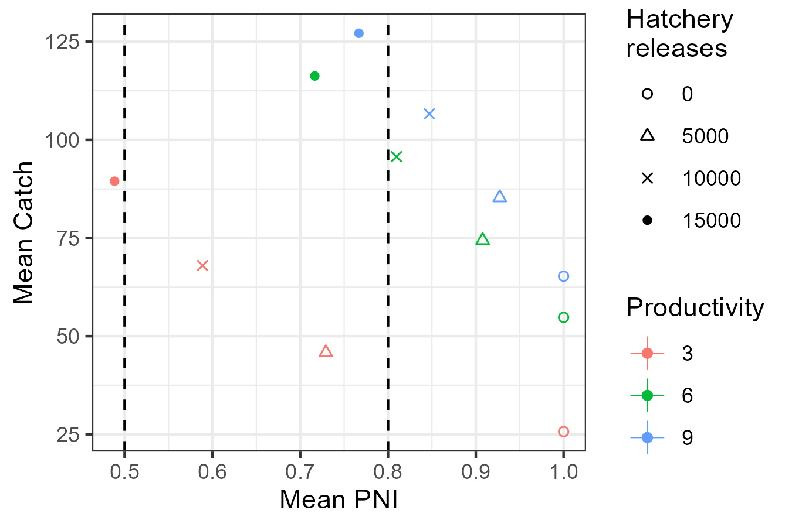

```{r, include = FALSE}
knitr::opts_chunk$set(
  collapse = TRUE,
  comment = "#>"
)
```


The performance of alternative management actions, conditional on various states of nature, can be summarized in a decision table.

This article provides an example of how a decision table can be created in salmonMSE.
Decision tables and supporting visualizations require multiple model runs to compare management actions and states of nature.
We extend the [simple example](../articles/example.html) of a salmon operating model that has a single brood year recruitment where all fish mature at age 3.

We will explore the effect of four hatchery production options with zero, 5000, 10000, or 15000 annual releases.

These three options are evaluated across three states of nature with respective to productivity: a mean compensation ratio of either 3, 6, or 9. We sample the compensation ratio (kappa) over 100 simulation with a lognormal standard deviation of 0.4.

There is no habitat enhancement, and a fixed harvest rate is applied at 0.203 in all scenarios. The carrying capacity of the freshwater environment is 17,250 smolts.

Below is the code for performing such a simulation, following the simple example with a wrapper function that loops over each hatchery option and state of nature.

```{r, echo = TRUE, eval = FALSE}
library(salmonMSE)
library(tidyverse)

# Data frame of the factorial combinations of compensation ratio (kappa)
# and hatchery production
Design <- expand.grid(
  kappa = c(3, 6, 9),
  hatch = c(0, 5, 10, 15) * 1000
)

# Wrapper function that runs a salmonMSE projection for each row of
# parameters in the data frame
wrapper <- function(x, Design) {

  SAR <- 0.01
  nsim <- 100

  set.seed(100)
  kappa_mean <- Design$kappa[x]
  kappa_sd <- 0.3
  kappa <- rlnorm(nsim, log(kappa_mean) - 0.5 * kappa_sd^2, kappa_sd)

  Bio <- new(
    "Bio",
    nsim = nsim,
    maxage = 3,
    p_mature = c(0, 0, 1),
    SRrel = "BH",
    capacity_smolt = 17250,
    kappa = kappa,
    Mjuv_NOS = c(0, -log(SAR), 0),
    fec = c(0, 0, 5040),
    p_female = 0.49,
    s_enroute = 1
  )

  Hatchery <- new(
    "Hatchery",
    n_yearling = Design$hatch[x],
    n_subyearling = 0,
    s_prespawn = 1,
    s_egg_smolt = 0.92,
    s_egg_subyearling = 1,
    Mjuv_HOS = Bio@Mjuv_NOS,
    gamma = 0.8,
    m = 0,
    pmax_esc = 1,
    pmax_NOB = 0.7,
    ptarget_NOB = 0.51,
    phatchery = 0.8,
    premove_HOS = 0,
    theta = c(100, 80),
    rel_loss = c(0.5, 0.4, 0.1),
    fec_brood = c(0, 0, 5040),
    fitness_type = c("Ford", "none"),
    zbar_start = c(93.1, 92),
    fitness_variance = 10,
    selection_strength = 3,
    heritability = 0.5,
    fitness_floor = 0.5
  )

  Habitat <- new(
    "Habitat",
    capacity_smolt_improve = 1,
    kappa_improve = 1
  )

  Harvest <- new(
    "Harvest",
    u_preterminal = 0,             # No pre-terminal fishery
    u_terminal = 0.203,            # Specify fixed harvest rate of mature fish
    MSF = FALSE,                   # No mark-selective fishing
    release_mort = c(0.1, 0.1),
    vulPT = c(0, 0, 0),
    vulT = c(1, 1, 1)
  )

  # Return of 1000 natural and hatchery fish each for the first generation
  nyears <- 2
  HistN <- array(0, c(Bio@nsim, Bio@maxage, nyears+1, 2))
  HistN[, 1, 1, ] <- HistN[, 2, 2, ] <- 1000/SAR

  Historical <- new(
    "Historical",
    HistN = HistN
  )

  # Stitched salmon operating model
  SOM <- new("SOM",
             nyears = 2,
             proyears = 50,
             Bio, Habitat, Hatchery, Harvest, Historical)
  
  # Run projection
  SMSE <- salmonMSE(SOM)

  return(SMSE)
}

# Run simulation with parallel processing (one core per set of parameters)
library(snowfall)
sfInit(parallel = TRUE, cpus = min(0.5 * parallel::detectCores(), nrow(Design)))
sfLibrary(salmonMSE)
sfExport("Design")

SMSE_list <- sfLapply(1:nrow(Design), wrapper, Design = Design)
# SMSE_list <- lapply(1:nrow(Design), wrapper, Design = Design) # Non-parallel version
```

We now have a list of SMSE objects.

Next, we need to define performance metrics that describe the outcomes of the various 

We will look a biological metric (PNI_75, the probability that PNI is at least 0.75 at the end of the projection) and a fishery metric, the average catch and the probability that the catches exeeds 40, also at the end of the projection.

```{r, echo = TRUE, eval = FALSE}
pm_fn <- function(x, SMSE_list, Design) {
  out <- Design[x, ]
  out$PNI <- mean(SMSE_list[[x]]@PNI[, 1, 49])
  out$PNI_75 <- PNI75(SMSE_list[[x]], Yrs = c(49, 49))

  KNOS <- SMSE_list[[x]]@KT_NOS[, 1, 49] # Catch of natural fish
  KHOS <- SMSE_list[[x]]@KT_HOS[, 1, 49] # Catch of hatchery fish

  out$Catch <- mean(KNOS + KHOS)
  out$Catch40 <- mean((KNOS + KHOS) >= 40)
  out$`S/SMSY` <- SMSY85(SMSE_list[[x]], Yrs = c(49, 49))
  return(out)
}

pm <- do.call(rbind, lapply(1:nrow(Design), pm_fn, SMSE_list, Design = Design))
```

Decision tables can be created with `plot_decision_table()`. Here is the table for PNI_75:

```{r, echo = TRUE, eval = FALSE}
g <- plot_decision_table(
  pm$hatch, pm$kappa, pm$PNI_75, 
  title = "Probability PNI > 0.75",
  xlab =  "Hatchery releases", 
  ylab = "Compensation ratio (productivity)"
)
g
```

```{r, echo = FALSE, eval = TRUE}
knitr::include_graphics("../man/figures/decision_table_PNI75.png")
```

At high productivity (kappa of 6 or 9), PNI_75 remains high, i.e., at least 50 percent, for the hatchery production options considered.
However, 10,000 annual releases would be robust to low productivity scenario (kappa = 3) so that PNI_75 > 0.50.

Here is the decision table for the probability the terminal catch exceeds 40 (Catch40):

```{r, echo = TRUE, eval = FALSE}
g <- plot_decision_table(
  pm$hatch, pm$kappa, pm$Catch40, 
  title = "Probability Catch > 40",
  xlab =  "Hatchery releases", 
  ylab = "Compensation ratio (productivity)"
)
g
```

```{r, echo = FALSE, eval = TRUE}
knitr::include_graphics("../man/figures/decision_table_catch40.png")
```

With high hatchery production, catches are mostly likely above 40 in the long run, as there is sufficient return with the specified harvest rate. On the other hand, 5,000 hatchery releases are still too low to reach this catch threshold. 
The zero probability in the zero hatchery production scenario also tells us the system is dependent on hatchery production to sustain such levels of catch while maintaining the 20.3 percent harvest rate.

At the intermediate hatchery production level, the ability to achieve catches of 40 is very likely with medium and high productivity. At low productivity, there is presumably insufficient return of natural origin fish in order to meet the catch threshold. 


## Additional figures

A trade off plot compares two performance metrics across the suite of management actions. A tradeoff between the metrics may appear where a management action, in this case hatchery production (denoted by shapes in the below figure) has good properties with respect to one metric at the cost/reduction in another. A strong tradeoff occurs when the management actions are aligned along the top-left to bottom-right diagonal. 

We can use `plot_tradeoff()` to visualize the tradeoff in PNI_75 and Catch40 in the long term:

```{r, echo = TRUE, eval = FALSE}
g <- plot_tradeoff(
  pm$PNI_75, pm$Catch40,
  x1 = factor(pm$kappa), x2 = factor(pm$hatch), 
  xlab = "PNI_75", ylab = "Catch40",
  x1lab = "Compensation\nratio", x2lab = "Hatchery\nreleases"
) +
  scale_shape_manual(values = c(1, 2, 4, 16))
g
```

```{r, echo = FALSE, eval = TRUE}
knitr::include_graphics("../man/figures/tradeoff_plot_pm.png")
```

In this figure, we see a tradeoff between PNI_74 and Catch40. Increasing hatchery production increases catch but also reduces the proportion of natural spawners, especially at low productivity (red). At medium and high productivity levels, the tradeoff occurs at medium to high hatchery production. There is increasing catch with little reduction in PNI until the hatchery production of 15000 thousand.

The tradeoff is more obvious when we plot the average PNI vs. catch:

```{r, echo = TRUE, eval = FALSE}
g <- plot_tradeoff(
  pm$PNI, pm$Catch,
  x1 = factor(pm$kappa), x2 = factor(pm$hatch), 
  xlab = "PNI", ylab = "Mean catch",
  x1lab = "Compensation\nratio", x2lab = "Hatchery\nreleases"
) +
  scale_shape_manual(values = c(1, 2, 4, 16))
g
```

```{r, echo = FALSE, eval = TRUE}

```


Here's the time series of the median PNI (solid lines) and the 95 percent prediction interval (shaded region) during the projection. It appears that the simulations have stabilized from the starting conditions to the point that we can make conclusions about the behavior of the system dynamics.

```{r, echo = TRUE, eval = FALSE}
library(reshape2)

PNI_ts <- lapply(1:nrow(Design), function(x) {
  plot_statevar_ts(SMSE_list[[x]], "PNI", quant = TRUE, figure = FALSE) %>%
    reshape2::melt() %>%
    mutate(kappa = Design$kappa[x], hatch = Design$hatch[x])
}) %>%
  bind_rows() %>%
  rename(Year = Var2) %>%
  dplyr::filter(!is.na(value)) %>%
  tidyr::pivot_wider(names_from = Var1) %>%
  mutate(hatch = paste("Hatchery production", hatch) %>% factor(levels = paste("Hatchery production", c(0, 5, 10, 15) * 1000)))

g <- ggplot(PNI_ts, aes(Year)) +
  geom_line(aes(y = `50%`, colour = factor(kappa))) +
  geom_ribbon(linetype = 3, alpha = 0.1, aes(ymin = `2.5%`, ymax = `97.5%`, fill = factor(kappa))) +
  facet_wrap(vars(hatch)) +
  labs(x = "Projection Year", y = "PNI", colour = "Compensation\nratio", fill = "Compensation\nratio") +
  theme(legend.position = "bottom")
g
```

```{r, echo = FALSE, eval = TRUE}
knitr::include_graphics("../man/figures/PNI_ts.png")
```

Several comparison figures are available to plot the natural production (i.e., number of spawners) and the fitness metrics related to hatchery production:

```{r, echo = TRUE, eval = FALSE}
Design_txt <- Design
Design_txt[, 1] <- paste("Productivity =", Design[, 1])
Design_txt[, 2] <- factor(paste("Hatchery production", Design[, 2]),
                          levels = paste("Hatchery production", c(0, 5000, 10000, 15000)))

compare_spawners(SMSE_list, Design_txt) +
  coord_cartesian(ylim = c(0, 150), expand = FALSE)

compare_fitness(SMSE_list, Design_txt)
```

```{r, echo = FALSE, eval = TRUE}
knitr::include_graphics("../man/figures/compare_spawners.png")
```

```{r, echo = FALSE, eval = TRUE}
knitr::include_graphics("../man/figures/compare_fitness.png")
```

