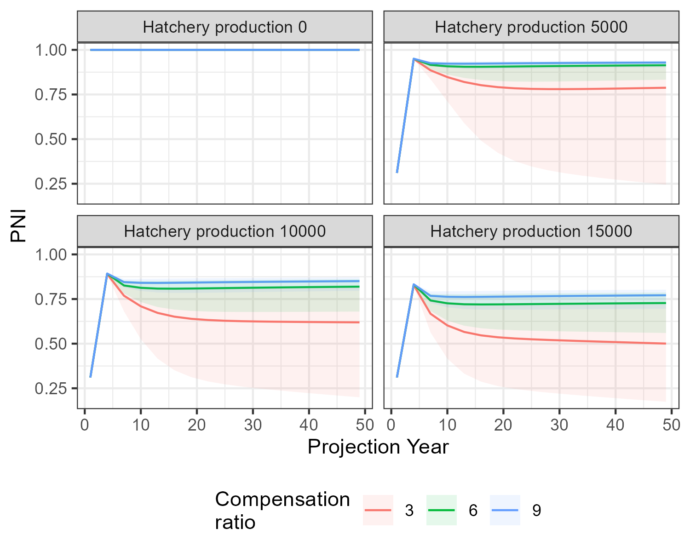

```{r, include = FALSE}
knitr::opts_chunk$set(
  collapse = TRUE,
  comment = "#>"
)
```


The performance of alternative management actions, conditional on various states of nature, can be summarized in a decision table.

This article provides an example of how a decision table can be created in salmonMSE.
We extend the [simple example](../articles/example.html) of a salmon operating model that has a single brood year recruitment where all fish mature at age 3.

We will explore the effect of three hatchery production options with 5000, 10000, or 15000 annual releases.

These three options are evaluated across three states of nature with respective to productivity: a mean compensation ratio of either 3, 6, or 9. We sample the compensation ratio (kappa) over 100 simulation with a lognormal standard deviation of 0.4.

There is no habitat enhancement, and a fixed harvest rate is applied at 0.203 in all scenarios. The carrying capacity of the freshwater environment is 17,250 smolts.

Below is the code for performing such a simulation, following the simple example with a wrapper function that loops over each hatchery option and state of nature.

```{r, echo = TRUE, eval = FALSE}
library(salmonMSE)

# Data frame of the factorial combinations of compensation ratio (kappa)
# and hatchery production
df <- expand.grid(
  kappa = c(3, 6, 9),
  hatch = c(5, 10, 15) * 1000
)

# Wrapper function that runs a salmonMSE projection for each row of
# parameters in the data frame
wrapper <- function(x, df) {

  SAR <- 0.01
  nsim <- 100

  set.seed(100)
  kappa_mean <- df$kappa[x]
  kappa_sd <- 0.3
  kappa <- rlnorm(nsim, log(kappa_mean) - 0.5 * kappa_sd^2, kappa_sd)

  Bio <- new(
    "Bio",
    nsim = nsim,
    maxage = 3,
    p_mature = c(0, 0, 1),
    SRrel = "BH",
    capacity_smolt = 17250,
    kappa = kappa,
    Mjuv_NOS = c(0, -log(SAR), 0),
    fec = c(0, 0, 5040),
    p_female = 0.49
  )

  Hatchery <- new(
    "Hatchery",
    n_yearling = df$hatch[x],
    n_subyearling = 0,
    s_prespawn = 1,
    s_egg_smolt = 0.92,
    s_egg_subyearling = 1,
    Mjuv_HOS = Bio@Mjuv_NOS,
    gamma = 0.8,
    pmax_NOB = 0.7,
    ptarget_NOB = 0.51,
    phatchery = 0.8,
    premove_HOS = 0,
    theta = c(100, 80),
    rel_loss = c(0.5, 0.4, 0.1),
    fec_brood = c(0, 0, 5040),
    fitness_type = c("Ford", "none"),
    zbar_start = c(93.1, 92),
    fitness_variance = 10,
    selection_strength = 3,
    heritability = 0.5,
    fitness_floor = 0.5
  )

  Habitat <- new(
    "Habitat",
    capacity_smolt_improve = 1,
    kappa_improve = 1
  )

  Harvest <- new(
    "Harvest",
    u_preterminal = 0,             # No pre-terminal fishery
    u_terminal = 0.203,            # Specify fixed harvest rate of mature fish
    m = 0,
    release_mort = c(0.1, 0.1),
    vulPT = c(0, 0, 0),
    vulT = c(1, 1, 1)
  )

  # Return of 1000 natural and hatchery fish each for the first generation
  nyears <- 2
  HistN <- array(0, c(Bio@nsim, Bio@maxage, nyears, 2))
  HistN[, 1, 1, ] <- HistN[, 2, 2, ] <- 1000/SAR

  Historical <- new(
    "Historical",
    HistN = HistN
  )

  # Stitched salmon operating model
  SOM <- new("SOM",
             nyears = 2,
             proyears = 50,
             Bio, Habitat, Hatchery, Harvest, Historical)
  
  # Run projection
  SMSE <- salmonMSE(SOM)

  return(SMSE)
}

# Run simulation with parallel processing (one core per set of parameters)
library(snowfall)
sfInit(parallel = TRUE, cpus = nrow(df))
sfLibrary(salmonMSE)
sfExport("df")

SMSE_list <- sfLapply(1:nrow(df), wrapper, df = df)
# SMSE_list <- lapply(1:nrow(df), wrapper, df = df) # Non-parallel version
```

We now have a list of SMSE objects.

Next, we need to define performance metrics that describe the outcomes of the various 

We will look a biological metric (PNI_75, the probability that PNI is at least 0.75 at the end of the projection) and a fishery metric, the average catch, also at the end of the projection.

```{r, echo = TRUE, eval = FALSE}
pm_fn <- function(x, SMSE_list, df) {
  out <- df[x, ]
  out$PNI_75 <- mean(SMSE_list[[x]]@PNI[, 1, 49] >= 0.75)
  out$Catch <- mean(SMSE_list[[x]]@KT_NOS[, 1, 49] + SMSE_list[[x]]@KT_NOS[, 1, 49])
  return(out)
}

pm <- do.call(rbind, lapply(1:nrow(df), pm_fn, SMSE_list, df = df))
```


The decision table can be created with `plot_decision_table()`. Here is the table for PNI_75:

```{r, echo = TRUE, eval = FALSE}
g <- plot_decision_table(
  pm$hatch, pm$kappa, pm$PNI_75, 
  title = "Probability PNI > 0.75",
  xlab =  "Hatchery releases", 
  ylab = "Compensation ratio (productivity)"
)
g
```

```{r, echo = FALSE, eval = TRUE}
knitr::include_graphics("../man/figures/decision_table_PNI_75.png")
```

At high productivity (kappa of 6 or 9), PNI_75 remains high, i.e., at least 50 percent, for the hatchery production options considered.
However, 10,000 annual releases would be robust to low productivity scenario (kappa = 3) so that PNI_75 > 0.50.

## Additional figures

A trade off plot compares two performance metrics across the suite of management actions. A tradeoff between the metrics may appear where a management action has good properties with respect to one metric at the cost/reduction in another.

We can use `plot_tradeoff()` to generate this figure:

```{r, echo = TRUE, eval = FALSE}
g <- plot_tradeoff(
  pm$PNI_75, pm$Catch,
  x1 = factor(pm$kappa), x2 = factor(pm$hatch), 
  xlab = "PNI_75", ylab = "Mean catch",
  x1lab = "Compensation\nratio", x2lab = "Hatchery\nreleases"
) +
  scale_shape_manual(values = c(1, 4, 16))
g
```

```{r, echo = FALSE, eval = TRUE}
knitr::include_graphics("../man/figures/tradeoff_plot.png")
```

In this figure, we see that the state of nature, i.e., compensation ratio, indicated by colours, strongly determines catch levels.
The level of hatchery production determines the composition hatchery and natural spawners (inferred by PNI_75), but does not substantially affect catch (consider the various shapes within each band of colours).

Finally, here's the time series of the median PNI (solid lines) and the 95 percent prediction interval (shaded region) during the projection. It appears that the simulations have stabilized from the starting conditions to the point that we can make conclusions about the behavior of the system dynamics.

```{r, echo = TRUE, eval = FALSE}
library(tidyverse)
library(reshape2)

PNI_ts <- lapply(1:nrow(df), function(x) {
  plot_statevar_ts(SMSE_list[[x]], "PNI", quant = TRUE, figure = FALSE) %>%
    reshape2::melt() %>%
    mutate(kappa = df$kappa[x], hatch = df$hatch[x])
}) %>%
  bind_rows() %>%
  rename(Year = Var2) %>%
  dplyr::filter(!is.na(value)) %>%
  tidyr::pivot_wider(names_from = Var1) %>%
  mutate(hatch = paste("Hatchery production", hatch) %>% factor(levels = paste("Hatchery production", c(5, 10, 15) * 1000)))

g <- ggplot(PNI_ts, aes(Year)) +
  geom_line(aes(y = `50%`, colour = factor(kappa))) +
  geom_ribbon(linetype = 3, alpha = 0.1, aes(ymin = `2.5%`, ymax = `97.5%`, fill = factor(kappa))) +
  facet_wrap(vars(hatch)) +
  labs(x = "Projection Year", y = "PNI", colour = "Compensation\nratio", fill = "Compensation\nratio") +
  theme(legend.position = "bottom")
g
```

```{r, echo = FALSE, eval = TRUE}

```
