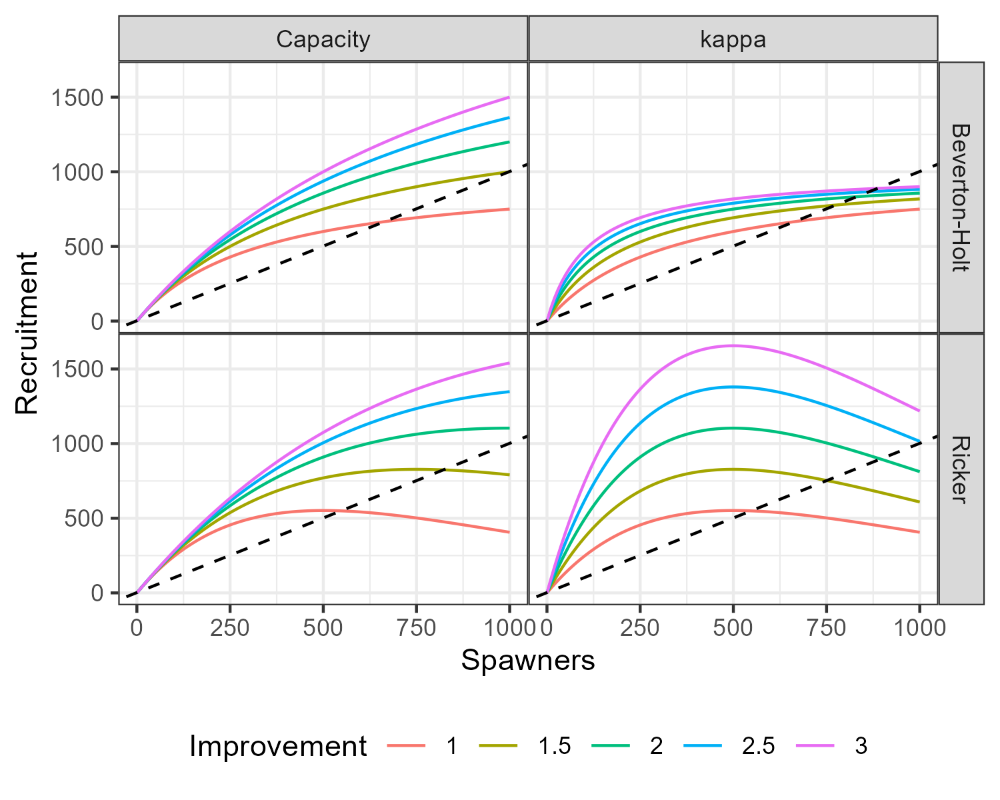

```{r, include = FALSE}
knitr::opts_chunk$set(
  collapse = TRUE,
  comment = "#>"
)
library(dplyr)
```

salmonMSE utilizes an age-structured model. The population is tracked by age and year but various dynamics correspond to the salmon life stages as described below.

# Definitions

*Definition of variable names and the corresponding slots in either the input (SOM) or output (SMSE) objects in salmonMSE.*

```{r param, echo = FALSE}
param <- read.csv("tables/glossary.csv") %>%
  mutate(Name = paste0("$", Name, "$"))
knitr::kable(param)
```

# Natural production

First, we consider natural production in the absence of fitness effects from the hatchery improvement.

## Fry

From the spawners (NOS and HOS) of age $a$ in year $y$, the corresponding fry production of the subsequent generation is calculated as:

\begin{align}
\textrm{Fry}^\textrm{NOS}_y &= \sum_a\textrm{NOS}_{y,a} \times p^\textrm{female} \times \textrm{Fec}_a\\
\textrm{Fry}^\textrm{HOS}_y &= \sum_a\textrm{HOS}_{\textrm{eff}y,a} \times p^\textrm{female} \times \textrm{Fec}_a
\end{align}

where $\textrm{HOS}_{\textrm{eff}} = \gamma \times \textrm{HOS}$ and the superscript denotes the parentage of the progeny.

## Smolts

Survival to the smolt stage is density-dependent. With the Beverton-Holt stock-recruit relationship, smolt production is

\begin{align}
\textrm{Smolt}^\textrm{NOS}_{y+1} &= \frac{\alpha \times 
\textrm{Fry}^\textrm{NOS}_y}{1 + \beta(\textrm{Fry}^\textrm{NOS}_y + \textrm{Fry}^\textrm{HOS}_y)}\\
\textrm{Smolt}^\textrm{HOS}_{y+1} &= \frac{\alpha \times 
\textrm{Fry}^\textrm{HOS}_y}{1 + \beta(\textrm{Fry}^\textrm{NOS}_y + \textrm{Fry}^\textrm{HOS}_y)}
\end{align}

where $\alpha = \kappa/\phi$ and $\beta = \alpha/{C_\textrm{smolt}}$.

With the Ricker stock-recruit relationship, smolt production is

\begin{align}
\textrm{Smolt}^\textrm{NOS}_{y+1} &= \alpha \times 
\textrm{Fry}^\textrm{NOS}_y\times\exp(-\beta[\textrm{Fry}^\textrm{NOS}_y + \textrm{Fry}^\textrm{HOS}_y])\\
\textrm{Smolt}^\textrm{HOS}_{y+1} &= \alpha \times 
\textrm{Fry}^\textrm{HOS}_y\times\exp(-\beta[\textrm{Fry}^\textrm{NOS}_y + \textrm{Fry}^\textrm{HOS}_y])
\end{align}

where $\alpha = \kappa/\phi$ and $\beta = 1/{S_\textrm{max}}$, and the unfished egg per smolt $\phi = \sum_a\left(\prod_{i=1}^{a-1}\exp(-M^\textrm{NOS}_i)(1-r_i)\right)\times r_a \times p^\textrm{female} \times \textrm{Fec}_a$, with $r_a$ as the maturity at age.

If there is knife-edge maturity, i.e., all fish mature at the same age, then the equation simplifies to $\phi = \textrm{SAR} \times p^\textrm{female} \times \textrm{Fec}$, with $\textrm{SAR}$ as the marine survival.

# Habitat improvement

Habitat improvement can improve either the productivity parameter, capacity parameter, or both. 

Base terms $\alpha$ and $\beta$ are used in the historical period of the model, e.g., conditioning from data.
In the projection, the stock recruit parameters $\alpha^\prime$ and $\beta^\prime$ are updated with the improvement parameters, $I_\kappa$ or $I_C$, as specified in the operating model.

The corresponding parameters in the projection is:

\begin{align}
\alpha^\prime &= \dfrac{\kappa}{\phi}\times I_\kappa\\
\beta^\prime &= 
\begin{cases}
\dfrac{\alpha^\prime}{C_\textrm{smolt} \times I_C} & \textrm{Beverton-Holt}\\
\dfrac{1}{S_\textrm{max} \times I_C} & \textrm{Ricker}\\
\end{cases}
\end{align}


```{r SRR, echo = FALSE}

```

*Comparison of the change in two density-dependent stock-recruit functions if the improvement parameter is applied to either the compensation ratio (kappa) or capacity parameter. The base value of kappa is 3, Beverton-Holt capacity is 1000, and Ricker Smax is 500. The dotted line is the one-to-one unfished replacement line (corresponding to $1/\phi$).*

# Hatchery production

## Broodtake

The annual target egg production for the hatchery is calculated from the target releases as

$$
\textrm{Egg}_\textrm{broodtake} = \dfrac{n^\textrm{yearling}}{s^\textrm{yearling}} + \dfrac{n^\textrm{subyearling}}{s^\textrm{subyearling}}
$$

where $s$ is the corresponding survival term from the egg life stage.

Given the escapement in year $y$, the proportion of the escapement is taken as broodtake $p^\textrm{broodtake}$:

\begin{align}
\textrm{NOB}_{y,a} &= p^\textrm{broodtake,NOB}_y \times \textrm{NOR}^\textrm{escapement}_{y,a}\\
\textrm{HOB}_{y,a} &= p^\textrm{broodtake,HOB}_y \times p^\textrm{hatchery} \times \textrm{HOR}^\textrm{escapement}_{y,a}
\end{align}

The proportion of the available hatchery fish for broodtake is controlled by $p^\textrm{hatchery}$, which can include fish swimming back to the hatchery or removed from spawning grounds.

The realized hatchery egg production in year $y$ is

\begin{align}
\textrm{Egg}_\textrm{y}^\textrm{NOB} &= \sum_a \textrm{NOB}_{y,a} \times s^\textrm{prespawn} \times p^\textrm{female} \times \textrm{Fec}^\textrm{brood}_a\\
\textrm{Egg}_\textrm{y}^\textrm{HOB} &= \sum_a \textrm{HOB}_{y,a} \times s^\textrm{prespawn} \times p^\textrm{female} \times \textrm{Fec}^\textrm{brood}_a
\end{align}

The proportion taken as broodtake is solved annually to satisfy the following conditions:

$\dfrac{\sum_a\textrm{NOB}_{y,a}}{\sum_a\textrm{NOB}_{y,a} + \sum_a\textrm{HOB}_{y,a}} = p^\textrm{NOB}_\textrm{target}$

$0 < p^\textrm{broodtake,HOB} < 1$

$0 < p^\textrm{broodtake,NOB} < p^\textrm{NOB}_\textrm{max}$

$\textrm{Egg}_\textrm{y}^\textrm{NOB} + \textrm{Egg}_\textrm{y}^\textrm{HOB} = \textrm{Egg}_\textrm{broodtake}$

The NOB target ratio $p^\textrm{NOB}_\textrm{target}$ ensures that there is a sufficiently high proportion of natural origin fish in the broodtake, while the maximum removal rate of natural origin fish $p^\textrm{NOB}_\textrm{max}$ ensures that there remains sufficiently high abundance of natural origin spawners. 

Egg production is subject to a survival term $s^\textrm{prespawn}$.

The total egg production in a given year can fail to reach the target because there is insufficient natural origin escapement. 
In this case, the NOB take is set to the maximum removal rate ($p^\textrm{broodtake,NOB} = p^\textrm{NOB}_\textrm{max}$), and the remaining deficit in egg production is met using HOB.

## Smolt releases

From the total broodtake, the smolt releases is calculated as

$$
\textrm{Smolt}^\textrm{Rel}_{y+1} = (\textrm{Egg}_\textrm{y}^\textrm{NOB} + \textrm{Egg}_\textrm{y}^\textrm{HOB}) s^\textrm{hatchery}
$$

where the survival of hatchery from egg to smolt is a weighted average from the proportion of yearling and subyearling releases:

$s^\textrm{hatchery} = s^\textrm{subyearling} (1 - p^\textrm{yearling}) + s^\textrm{yearling} p^\textrm{yearling}$

$p^\textrm{yearling} = n^\textrm{yearling}/(n^\textrm{subyearling} + n^\textrm{yearling})$

# Pre-terminal fishery

Let $N^\textrm{juv}_{y,a}$ be the juvenile abundance in the population and $N^\textrm{juv,NOS}_{y,a=1} = \textrm{Smolt}^\textrm{NOS}_y + \textrm{Smolt}^\textrm{HOS}_y$ and $N^\textrm{juv,HOS}_{y,a=1} = \textrm{Smolt}^\textrm{Rel}$. The superscript for the smolt variable corresponds to the parentage while the superscript for $N$ denotes the origin of the current cohort.

Harvest $u^\textrm{PT}$ in the pre-terminal ($\textrm{PT}$) fishery, assuming no mark-selective fishing, is modeled as a seasonal process. The kept catch $K$ is

\begin{align}
K^\textrm{NOS,PT}_{y,a} &= \left(1 - \exp(-v^\textrm{PT}_a F^\textrm{PT}_y)\right)N^\textrm{juv,NOS}_{y,a}\\
K^\textrm{HOS,PT}_{y,a} &= \left(1 - \exp(-v^\textrm{PT}_a F^\textrm{PT}_y)\right)N^\textrm{juv,HOS}_{y,a}\\
\end{align}

The instantaneous fishing mortality is solved to meet the following condition

$$
u^\textrm{PT} = \dfrac{\sum_a K^\textrm{NOS,PT}_{y,a} + \sum_a K^\textrm{HOS,PT}_{y,a}}{\sum_a N^\textrm{juv,NOS}_{y,a} + \sum_a N^\textrm{juv,HOS}_{y,a}}
$$

# Recruitment and maturity

The recruitment is calculated from the survival of juvenile fish after pre-terminal harvest and maturation:

\begin{align}
\textrm{NOR}_{y,a} &= N^\textrm{juv,NOS}_{y,a}\exp(-v_aF^\textrm{PT}_y)r_{y,a}\\
\textrm{HOR}_{y,a} &= N^\textrm{juv,HOS}_{y,a}\exp(-v_aF^\textrm{PT}_y)r_{y,a}
\end{align}

The juvenile abundance in the following year consists of fish that did not mature and subsequently survived ocean mortality $M$:

\begin{align}
N^\textrm{juv,NOS}_{y+1,a+1} &= N^\textrm{juv,NOS}_{y,a}\exp\left(-[v_aF^\textrm{PT}_y + M^\textrm{NOS}_{y,a}]\right)(1 - r_{y,a})\\
N^\textrm{juv,HOS}_{y+1,a+1} &= N^\textrm{juv,HOS}_{y,a}\exp\left(-[v_aF^\textrm{PT}_y + M^\textrm{HOS}_{y,a}]\right)(1 - r_{y,a})
\end{align}

## Terminal fishery

Assuming no mark-selective fishing, the retained catch of the terminal ($\textrm{T}$) fishery is calculated from the harvest rate similarly as with the pre-terminal fishery:

\begin{align}
K^\textrm{NOS,T}_{y,a} &= \left(1 - \exp(-v^\textrm{T}_a F^\textrm{T}_y)\right)\textrm{NOR}_{y,a}\\
K^\textrm{HOS,T}_{y,a} &= \left(1 - \exp(-v^\textrm{T}_a F^\textrm{T}_y)\right)\textrm{HOR}_{y,a}\\
\end{align}

subject to

$$
u^\textrm{T} = \dfrac{\sum_a K^\textrm{NOS,T}_{y,a} + \sum_a K^\textrm{HOS,T}_{y,a}}{\sum_a \textrm{NOR}_{y,a} + \sum_a \textrm{HOR}_{y,a}}
$$

# Escapement and spawners

The escapement consists of the survivors of the terminal fishery:

\begin{align}
\textrm{NOR}^\textrm{escapement}_{y,a} &= \textrm{NOR}_{y,a}\exp(-v_aF^\textrm{T}_y)\\
\textrm{HOR}^\textrm{escapement}_{y,a} &= \textrm{HOR}_{y,a}\exp(-v_aF^\textrm{T}_y)
\end{align}

The abundance of natural origin spawners consists of the escapement reduced by the broodtake. 

$$
\textrm{NOS}_{y,a} = (1 - p^\textrm{broodtake,NOB}_y) \textrm{NOR}^\textrm{escapement}_{y,a}
$$

The hatchery origin spawners is the escapement, reduced by the proportion $p^\textrm{hatchery}$ returning to the hatchery, either by swim-in facilities or direct removal. A second removal term $p^\textrm{HOS}_\textrm{removal}$ removes fish from the spawning grounds, these animals are not available for broodtake.

$$
\textrm{HOS}_{y,a} = \textrm{HOR}^\textrm{escapement}_{y,a} (1 - p^\textrm{hatchery}) (1 - p^\textrm{HOS}_\textrm{removal})
$$


# Fitness effects on survival

Reproductive success of first generation hatchery fish has been observed to be lower than their natural counterparts, and is accounted for in the $\gamma$ parameter (see review in [Withler et al. 2018](https://www.dfo-mpo.gc.ca/csas-sccs/Publications/ResDocs-DocRech/2018/2018_019-eng.html)).

Through genetic and epigenetic factors, survival of hatchery juveniles in the hatchery environment selects for fish with a phenotype best adapted for that environment, and likewise for juveniles spawned in the natural environment. 
Since these traits are heritable, the fitness of the natural population can shift away from the optimum for the natural environment towards that of the hatchery environment on an evolutionary time scale, i.e., over a number of generations, when hatchery fish are allowed to spawn.

As described in [Ford 2002](https://doi.org/10.1046/j.1523-1739.2002.00257.x) and derived in [Lande 1976](https://doi.org/10.1111/j.1558-5646.1976.tb00911.x), the fitness loss function $W$ for an individual with phenotypic trait value $z$ in a given environment is

$$
W(z) = \exp\left(\dfrac{-(z-\theta)^2}{2\omega^2}\right)
$$

where $\theta$ is the optimum for that environment and $\omega^2$ is the fitness variance.

If the phenotypic trait value $z$ in the population is a random normal variable with mean $\bar{z}$ and variance $\sigma^2$, then the mean fitness of the population in generation $g$ is $\bar{W}(z) = \int W(z) f(z) dz$, where $f(z)$ is the Gaussian probability density function. The solution is proportional to

$$
\bar{W}(z) \propto \exp\left(\dfrac{-(\bar{z}-\theta)^2}{2(\omega+\sigma)^2}\right)
$$

We follow the mean fitness of generation $g$ for the natural environment:

$$
\bar{W}^\textrm{natural}_g = \exp\left(\dfrac{-(\bar{z}^\textrm{natural}_g-\theta^\textrm{natural})^2}{2(\omega+\sigma)^2}\right)
$$

The mean phenotype $\bar{z}$ is calculated iteratively, where the change from generation $g-1$ to $g$ is

\begin{align}
\Delta\bar{z} &= \bar{z}_g - \bar{z}_{g-1} = (\bar{z}^\prime_{g-1} - \bar{z}_{g-1})h^2\\
\bar{z}_g &= \bar{z}_{g-1} + (\bar{z}^\prime_{g-1} - \bar{z}_{g-1})h^2\\
\end{align}

where $h^2$ is the heritability of $z$ and $\bar{z}^\prime_{g-1}$ is the trait value after applying the fitness function, defined as:

\begin{align}
\bar{z}^\prime_{g-1} &= \dfrac{1}{\bar{W}_{g-1}}\int W_{g-1}(z)\times zf(z)dz\\
&= \left(\dfrac{\bar{z}_{g-1}\omega^2 + \theta \sigma^2}{\omega^2 + \sigma^2} - \bar{z}_{g-1}\right)h^2
\end{align}

With a hatchery program, the mean trait value of the progeny in the natural environment is a weighted average between the mean trait value of natural origin spawners in the natural environment (with optimum value $\theta^\textrm{natural}$) and that of hatchery origin spawners in the hatchery environment (with optimum value $\theta^\textrm{hatchery}$):

$$
\bar{z}^\textrm{natural}_g = (1 - p^\textrm{HOSeff}_{g-1}) \times \bar{z}^{\prime\textrm{natural}}_{g-1} + p^\textrm{HOSeff}_{g-1} \times \bar{z}^{\prime\textrm{hatchery}}_{g-1}
$$

where $p^\textrm{HOSeff} = \gamma\times\textrm{HOS}/(\textrm{NOS} + \gamma\times\textrm{HOS})$. 

Similarly, the mean trait value in the hatchery environment $\bar{z}^\textrm{hatchery}_g$ is a weighted average of the mean trait value of the natural origin broodtake in the natural environment and that of the hatchery origin broodtake in the hatchery environment:

$$
\bar{z}^\textrm{hatchery}_g = p^\textrm{NOB}_{g-1} \times \bar{z}^{\prime\textrm{natural}}_{g-1} + (1 - p^\textrm{NOB}_{g-1}) \times \bar{z}^{\prime\textrm{hatchery}}_{g-1}
$$

where $p^\textrm{NOB} = \textrm{NOB}/(\textrm{NOB} + \textrm{HOB})$.

The fitness variance $\omega^2$ and phenotype variance $\sigma^2$ are assumed constant between the two environments. The fitness variance is parameterized relative to the variance of the phenotype, i.e., $\omega = \Omega \sigma$ where $\Omega$ is the "selection strength".

## Mixed brood-year return

If a mixed-brood year return in year $y$ across several ages $a$ produces the smolt cohort in year $y+1$, then the mean trait value in that cohort is calculated from a weighted average by brood year and age class fecundity:

\begin{align}
\bar{z}^\textrm{natural}_{y+1} &= \sum_a p^\textrm{NOS}_{y,a} \times \bar{z}^{\prime\textrm{natural}}_{y-a} + \sum_a p^\textrm{HOSeff}_{y,a} \times  \bar{z}^{\prime\textrm{hatchery}}_{y-a}\\
\bar{z}^\textrm{hatchery}_{y+1} &= \sum_a p^\textrm{NOB}_{y,a} \times \bar{z}^{\prime\textrm{natural}}_{y-a} + \sum_a p^\textrm{HOB}_{y,a} \times  \bar{z}^{\prime\textrm{hatchery}}_{y-a}
\end{align}

where

$p^\textrm{NOS}_{y,a} = \dfrac{\textrm{Fec}_a \times \textrm{NOS}_{y,a}}{\sum_a\textrm{Fec}_a(\textrm{NOS}_{y,a} + \gamma \times \textrm{HOS}_{y,a})}$

$p^\textrm{HOSeff}_{y,a} = \dfrac{\textrm{Fec}_a \times \gamma \times \textrm{HOS}_{y,a}}{\sum_a\textrm{Fec}_a(\textrm{NOS}_{y,a} + \gamma \times \textrm{HOS}_{y,a})}$

$p^\textrm{NOB}_{y,a} = \dfrac{\textrm{Fec}^\textrm{brood}_a \times \textrm{NOB}_{y,a}}{\sum_a\textrm{Fec}^\textrm{brood}_a(\textrm{NOB}_{y,a} + \textrm{HOB}_{y,a})}$

$p^\textrm{HOB}_{y,a} = \dfrac{\textrm{Fec}^\textrm{brood}_a \times \textrm{HOB}_{y,a}}{\sum_a\textrm{Fec}^\textrm{brood}_a(\textrm{NOB}_{y,a} + \textrm{HOB}_{y,a})}$

## Fitness loss

Fitness can reduce survival in the egg, fry, and smolt life stages:

\begin{align}
\textrm{Fry}^\textrm{NOS}_y &= \sum_a\textrm{NOS}_{y,a} \times p^\textrm{female} \times \textrm{Fec}_a \times (W^\textrm{nat.}_{y+1})^{\ell_\textrm{egg}}\\
\textrm{Fry}^\textrm{HOS}_y &= \sum_a\textrm{HOS}_{\textrm{eff}y,a} \times p^\textrm{female} \times \textrm{Fec}_a \times (W^\textrm{nat.}_{y+1})^{\ell_\textrm{egg}}
\end{align}

\begin{align}
\textrm{Smolt}^\textrm{NOS}_{y+1} &= \frac{\alpha^\prime (W^\textrm{nat.}_{y+1})^{\ell_\textrm{fry}} \times 
\textrm{Fry}^\textrm{NOS}_y}{1 + \beta^\prime(\textrm{Fry}^\textrm{NOS}_y + \textrm{Fry}^\textrm{HOS}_y)}\\
\textrm{Smolt}^\textrm{HOS}_{y+1} &= \frac{\alpha^\prime (W^\textrm{nat.}_{y+1})^{\ell_\textrm{fry}} \times 
\textrm{Fry}^\textrm{HOS}_y}{1 + \beta^\prime(\textrm{Fry}^\textrm{NOS}_y + \textrm{Fry}^\textrm{HOS}_y)}
\end{align}

$$
M^\textrm{SAR,NOS}_g = -\log(\textrm{SAR}^\textrm{NOS} \times (W^\textrm{nat.}_g)^{\ell_\textrm{smolt}})
$$

where $\ell_i$ is the proportion of the fitness loss apportioned among the three life stages, $\sum_i \ell_i = 1$.

## PNI

PNI (proportionate natural influence) is an approximation of the rate of gene flow from the hatchery to the natural environment, calculated for the progeny in year $y+1$ from the parental composition of year $y$:

$$
\textrm{PNI}_{y+1} = \dfrac{\sum_a p^{\textrm{NOB}}_{y,a}}{\sum_a p^{\textrm{NOB}}_{y,a} + \sum_a p^{\textrm{HOSeff}}_{y,a}}
$$

Generally, a combination of minimizing hatchery releases, increasing natural broodtake, and reducing the number hatchery origin spawners maintains high PNI, i.e., low rate of gene flow from the hatchery to natural environment.

## Wild salmon

With single brood-year returns, the proportion of wild salmon, natural origin spawners whose parents were also natural spawners, can be calculated as

$$
p^\textrm{WILD}_g = (1 - p^\textrm{HOScensus}_g) \times
\dfrac{(1 - p^\textrm{HOScensus}_{g-1})^2}
{(1 - p^\textrm{HOScensus}_{g-1})^2 + 2 \gamma \times p^\textrm{HOScensus}_{g-1}(1 - p^\textrm{HOScensus}_{g-1}) +
\gamma^2 (p^\textrm{HOScensus}_{g-1})^2}
$$

where $p^\textrm{HOScensus} = \textrm{HOS}/(\textrm{HOS} + \textrm{NOS})$. 

The first term is the proportion of natural spawners in the current generation $g$. 

The ratio comprising the second term discounts the proportion of the current generation to include natural spawners whose parents were both natural spawners.
Assuming non-assortative mating, the three terms in the denominator gives the composition of generation $g$  whose parents who are both natural origin, mixed origin (one parent in natural origin and the other is hatchery origin), and both hatchery origin.

To generalize for mixed-brood year return, we calculate the probability weighted across brood-years and age class fecundity:

$$
p^\textrm{WILD}_y = \sum_a \dfrac{\textrm{NOS}_{y,a}}{\sum_{a'}(\textrm{NOS}_{y,a'} + \textrm{HOS}_{y,a'})} \times \dfrac{(\sum_{a'} p^\textrm{NOScensus}_{y-a,a'})^2}
{(\sum_{a'} p^\textrm{NOScensus}_{y-a,a'})^2 + 2 \gamma \times (\sum_{a'}p^\textrm{NOScensus}_{y-a,a'})(\sum_{a'}p^\textrm{HOScensus}_{y-a,a'}) +
\gamma^2 (\sum_{a'}p^\textrm{HOScensus}_{y-a,a'})^2}
$$

where 

$p^\textrm{NOScensus}_{y,a} = \dfrac{\textrm{Fec}_a \times \textrm{NOS}_{y,a}}{\sum_a{\textrm{Fec}_a (\textrm{NOS}_{y,a}} + \textrm{HOS}_{y,a})}$

$p^\textrm{HOScensus}_{y,a} = \dfrac{\textrm{Fec}_a \times \textrm{HOS}_{y,a}}{\sum_a{\textrm{Fec}_a (\textrm{NOS}_{y,a}} + \textrm{HOS}_{y,a})}$

The probability of finding a wild salmon in year $y$ is the sum of probabilities of finding a wild salmon over all ages. 
For each age $a$, the first ratio is the probability of finding a natural spawner in year $y$. 
The second ratio is the probability of mating success from two parental natural spawners in year $y-a$ using a Punnett square, assuming non-assortative mating across age and origin.
The summation across dummy age variable $a'$ calculates the total proportion of spawners in a given year.

# Mark-selective fishing

If the mark rate $m$ of hatchery fish is greater than zero, then mark-selective fishing is implemented for both the pre-terminal and terminal fisheries. 
The mark rate is a proxy for retention and the harvest rate $u^\textrm{harvest}$ corresponds to the ratio of the kept catch and abundance.
The exploitation rate $u^\textrm{exploit}$ is calculated from kept catch and dead releases. 
Exploitation rates differ between hatchery and natural origin fish because there is no retention of the latter.

Let the instantaneous fishing mortality for kept catch and released catch be 

\begin{align}
F^\textrm{kept} &= mE\\
F^\textrm{rel.} &= (1 - m)\delta E
\end{align}

where $\delta$ is the proportion of released fish that die. 

$E$ is an index of fishing effort, also referred to as the encounter rate by the fishery, that links together $F^\textrm{kept}$ and $F^\textrm{rel.}$.
Intuitively, fishing effort can increase in a mark-selective fishery compared to a non-selective fishery.
For example, if the mark rate is 20 percent, then the fishing effort could be 500 percent higher than in a non-selective fishery in order to attain the kept quota or bag limit.
Additional catch and release mortality then occurs for un-marked fish, according to $\delta$.

In the pre-terminal ($\textrm{PT}$) fishery, $E$ is solved to satisfy the following equation for hatchery fish:

$$
u^\textrm{harvest,HOS,PT} = \dfrac{\sum_aK^\textrm{HOS,PT}_{y,a}}{\sum_a N^\textrm{juv,HOS}_{y,a}}
$$

where the kept catch $K$ is

$K^\textrm{HOS,PT}_{y,a} = \dfrac{F^\textrm{kept,PT}_y}{F^\textrm{kept,PT}_y + F^\textrm{rel,PT}_y}\left(1 - \exp(-v^\textrm{PT}_a[F^\textrm{kept,PT} + F^\textrm{rel,PT}])\right)N^\textrm{juv,HOS}_{y,a}$.

The exploitation rate for natural origin fish is calculated from dead discards. The exploitation rate for hatchery origin fish is calculated from kept catch and dead discards:

\begin{align}
u^\textrm{exploit,NOS,PT}_y &= \dfrac{\sum_a (1 - \exp(-v_a F^\textrm{rel.,PT}_y))N^\textrm{juv,NOS}_{y,a}}{\sum_a N^\textrm{juv,NOS}_{y,a}}\\
u^\textrm{exploit,HOS,PT}_y &= \dfrac{\sum_a (1 - \exp(-v_a[F^\textrm{kept,PT}_y + F^\textrm{rel.,PT}_y]))N^\textrm{juv,HOS}_{y,a}}{\sum_a N^\textrm{juv,HOS}_{y,a}}
\end{align}

Similarly, in the terminal fishery, the fishing effort satisfies the equation

$$
u^\textrm{harvest,HOS,T} = \dfrac{\sum_aK^\textrm{HOS,T}_{y,a}}{\sum_a \textrm{HOR}_{y,a}}
$$

with the corresponding exploitation rates:

\begin{align}
u^\textrm{exploit,HOS,T}_y &= \dfrac{\sum_a (1 - \exp(-v_a[F^\textrm{kept,T}_y + F^\textrm{rel.,T}_y]))\textrm{HOR}_{y,a}}{\sum_a \textrm{HOR}_{y,a}}\\
u^\textrm{exploit,NOS,T}_y &= \dfrac{\sum_a (1 - \exp(-v_a F^\textrm{rel,T}_y))^\textrm{NOR}_{y,a}}{\sum_a \textrm{NOR}_{y,a}}
\end{align}
