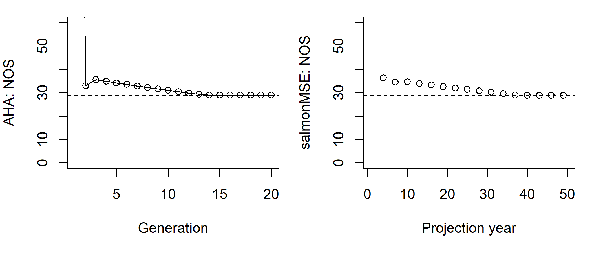

```{r, include = FALSE}
knitr::opts_chunk$set(
  collapse = TRUE,
  comment = "#>"
)
```

Here, we show a simple example of a salmon operating model where all fish mature at age 3 and follows the structure of an analysis done in AHA.
The historical spool-up is not informed by an estimation model. The model is used to project the proposed management levers to determine the equilibrium properties of the system.

We create several S4 objects, the `Bio` object contains the natural biological dynamics, including the maturity ogive `p_mature`, fecundity, as well as the density-dependent survival of smolts through the capacity and compensation ratio parameters (`capacity_smolt` and `kappa`, respectively).

To accommodate the life stage within the age structured model, we model ocean survival as an equivalent instantaneous rate `Mocean_NOS` where all mortality occurs in the age class prior to maturation, i.e., age 2.

```{r, eval = FALSE}
library(salmonMSE)

class?SOM # Definition of inputs

SAR <- 0.01
Bio <- new(
  "Bio",
  nsim = 3,
  maxage = 3,
  p_mature = c(0, 0, 1),
  SRrel = "BH",
  capacity_smolt = 17250,           # Beverton-Holt asymptote. Not unfished capacity!
  kappa = 3,                        # Productivity in recruits per spawner
  Mocean_NOS = c(0, -log(SAR), 0),
  fec = c(0, 0, 5040),              # Spawning fecundity of NOS and HOS
  p_female = 0.49
)
```

The next three objects control the management of the conservation unit through habitat, hatchery, and harvest options.

Let's leave the habitat unchanged from the `Bio` object:

```{r, eval = FALSE}
Habitat <- new(
  "Habitat",
  capacity_smolt_improve = 1,    # Keep carrying capacity unchanged
  kappa_improve = 1              # Keep productivity unchanged
)
```

The hatchery dynamics are the most complex. 
We have a management target to release 2 million subyearlings. 

After specifying the survival of broodtake (`s_prespawn`) and the eggs in the hatchery, the model calculates the required number of eggs annually for the target releases.
The natural broodtake (NOB) and hatchery broodtake (HOB) are taken to reach the target egg production and maintain `NOB/(NOB + HOB) = ptarget_NOB`.
The proportion of NOB to the natural origin escapement cannot exceed `pmax_NOB`. 
If the target egg production cannot be reached, then the NOB is taken in accordance with `pmax_NOB` and HOB is taken (up to the total hatchery origin escapement returned to the hatchery) to meet the target egg production.

We also need to specify the relative fecundity of HOS compared to NOS, and the fitness dynamics.

```{r, eval = FALSE}
Hatchery <- new(
  "Hatchery",
  n_yearling = 0,                   # Management lever. No hatchery if both this line and next line are zero
  n_subyearling = 2e6,              # Management lever. No hatchery if both this line and previous line are zero
  s_prespawn = 1,                   # Survival prior to spawning
  s_egg_smolt = 1e-6,               # Survival of eggs in hatchery to yearling
  s_egg_subyearling = 0.92,         # Survival of eggs in hatchery to subyearling
  Mocean_HOS = Bio@Mocean_NOS,
  gamma = 0.8,
  pmax_NOB = 0.7,
  ptarget_NOB = 0.51,
  phatchery = 0.8,
  premove_HOS = 0,
  theta = c(100, 80),
  rel_loss = c(0.5, 0.4, 0.1),
  fec_brood = c(0, 0, 5040),
  fitness_type = "Ford",
  pbar_start = c(93.1, 92),
  fitness_variance = 10,
  selection_strength = 3,
  heritability = 0.5,
  fitness_floor = 0.5
)
```

We specify a harvest rate of 0.203 for the terminal fishery (mature component). No hatchery fish are marked.

```{r, eval = FALSE}
Harvest <- new(
  "Harvest",
  u_preterminal = 0,             # No pre-terminal fishery
  u_terminal = 0.203,            # Specify fixed harvest rate of mature fish
  m = 0,                         # Mark rate of hatchery releases
  release_mort = c(0.1, 0.1),
  vulPT = c(0, 0, 0),
  vulT = c(1, 1, 1)
)
```

To start the projection, we specify the conditions for the spool-up with the Historical object. We will have a two-year spool-up with an escapement of 1000 natural origin fish and 1000 hatchery origin fish each in the first generation (for all simulations). This is accomplished by setting a spool-up period of 2 years (`nyears`) and specify the immature abundance of age 1 fish at the beginning of year 1 and age 2 fish at the start of year 2. Since we model ocean survival during age 2, abundance of the cohort doesn't change.

```{r, eval = FALSE}
# Return of 1000 natural and hatchery fish each for the first generation
nyears <- 2
HistN <- array(0, c(Bio@nsim, Bio@maxage, nyears, 2))
HistN[, 1, 1, ] <- HistN[, 2, 2, ] <- 1000/SAR

Historical <- new(
  "Historical",
  HistN = HistN
)
```

Now let's stitch together the operating model and run the simulation for 50 projection years (`proyears`).

```{r, eval = FALSE}
SOM <- new(
  "SOM",
  nyears = 2,
  proyears = 50,
  Bio, Habitat, Hatchery, Harvest, Historical
)
SMSE <- salmonMSE(SOM)
```

With a simple salmon model, we can run AHA and compare the trajectory of the population. 
As we can see, the number of NOS in both models stabilizes to the equilibrium value after approximately 15 generations.

```{r, eval = FALSE}
SAHA <- AHA(SOM, ngen = 20)

# Compare NOS
SAHA$NOS
SMSE@NOS[, 1, ]
```

```{r, eval = TRUE, echo = FALSE}

```
