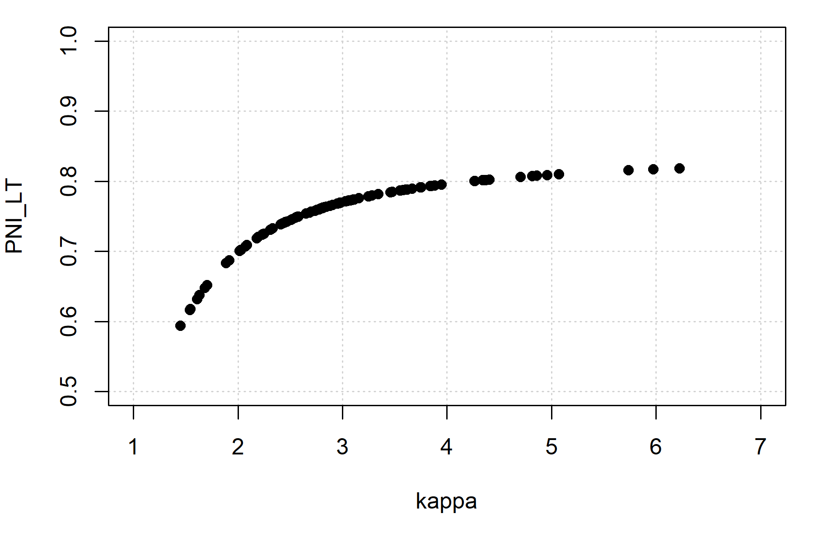

```{r, include = FALSE}
knitr::opts_chunk$set(
  collapse = TRUE,
  comment = "#>"
)
```

Here, we show a simple example of a salmon operating model where all fish mature at age 3 and follows the structure of an analysis done in AHA.
The model is used to project the proposed management levers to determine the equilibrium properties of the system.

# Biological parameters

We create several S4 objects, the `Bio` object contains parameters controlling natural biological dynamics, including juvenile ocean mortality, proportion mature by age class `p_mature`, fecundity (egg production per female), as well as the density-dependent egg-smolt survival relationship through the capacity and productivity parameters (`capacity_smolt` and `kappa`, respectively).

The first example will be deterministic. With salmonMSE, we must run at minimum 2 simulation replicates, but we will run 3 simulations where the biological parameters, as well as the results, are identical among simulations.

We model ocean survival through an equivalent instantaneous mortality rate `Mjuv_NOS` where all mortality occurs in the age class prior to maturation, i.e., age 2.

```{r, eval = FALSE}
library(salmonMSE)

class?SOM # Definition of inputs

SAR <- 0.01 # Marine survival
nsim <- 3 # Number of simulations
Bio <- new(
  "Bio",
  maxage = 3,
  p_mature = c(0, 0, 1),
  SRrel = "BH",
  capacity = 17250,                 # Beverton-Holt asymptote. Not unfished capacity!
  kappa = 3,                        # Productivity in recruits per spawner
  Mjuv_NOS = c(0, -log(SAR)),       # Convert marine survival to an instantaneous mortality rate
  fec = c(0, 0, 5040),              # Spawning fecundity of NOS and HOS
  p_female = 0.49,
  s_enroute = 1
)
```

# Management levers

The next three objects control the management of the population through habitat, hatchery, and harvest options.

## Habitat and freshwater survival parameters

Habitat parameters may represent different scenarios regarding freshwater restoration and environmental factors that impact survival in freshwater life stages, including pre-spawn mortality, egg survival, and fry survival. The survival at each life stage can be either be density-independent or density-dependent.

These features are not used in this example. Instead, the capacity and productivity parameters in the previous section control the egg-juvenile survival.

```{r, eval = FALSE}
Habitat <- new(
  "Habitat",
  use_habitat = FALSE
)
```

## Hatchery dynamics

### Hatchery production

Next, we work on the hatchery dynamics.

Below, we have a management target to release 10,000 yearlings annually. 
In comparison, the carrying capacity of the natural environment is 17,250 smolts.
Users also specify the brood survival (`s_prespawn`), egg survival in the hatchery (`s_egg_smolt` and `s_egg_subyearling`) to determine the hatchery egg production needed to support the release strategy.

We place some additional constraints are placed which may prevent us from realizing the target releases.
The realized number of brood is controlled by several parameters, including the maximum proportion of the in-river return (escapement from marine fisheries) to be used as brood (`pmax_esc`), the maximum proportion of natural spawners to be used as broodtake (`pmax_NOB`). 
The proportion of NOB to the natural origin escapement cannot exceed `pmax_NOB`.

The realized brood origin can be controlled by the target proportion of natural spawners in the broodtake (`ptarget_NOB`).
The target proportion can be realized when the mark rate `m` = 1 as the origin of all brood can be identified.
The natural broodtake (NOB) and hatchery broodtake (HOB) are removed from the escapement to reach the target egg production and maintain `NOB/(NOB + HOB) = ptarget_NOB`.
If the target egg production cannot be reached, then the NOB is taken in accordance with `pmax_NOB` and HOB is taken to meet the target egg production. The realized `pNOB` is then lower than the target.

If the mark rate is less than 1, then `ptarget_NOB` is interpreted as the ratio of unmarked fish in the broodstock. This is a second method for how the realized `pNOB` can also be lower than the target.

### Other parameters

Additional parameters can control removal of hatchery-origin and natural-origin fish from the spawning grounds, ostensibly as part of an in-rivery fishery for pHOS management.

Finally, we also need to specify the relative spawning success of HOS (`gamma`), and various parameters that describe the fitness of hatchery-origin fish, in the natural environment.

```{r, eval = FALSE}
Hatchery <- new(
  "Hatchery",
  n_yearling = 10000,             # Management lever. No hatchery if both this line and next line are zero
  n_subyearling = 0,              # Management lever. No hatchery if both this line and previous line are zero
  s_prespawn = 1,                 # Survival prior to spawning
  s_egg_smolt = 0.92,             # Survival of eggs in hatchery
  s_egg_subyearling = 1,
  Mjuv_HOS = Bio@Mjuv_NOS,
  gamma = 0.8,
  m = 1,                          # Mark rate of hatchery releases
  pmax_esc = 1,                   # Maximum proportion of escapement (after en route mortality) that could be used as broodtake
  pmax_NOB = 0.7,                 
  ptarget_NOB = 0.51,
  phatchery = 0.8,
  premove_HOS = 0,
  theta = c(100, 80),
  rel_loss = c(0.5, 0.4, 0.1),
  fec_brood = c(0, 0, 5040),
  fitness_type = c("Ford", "none"),
  zbar_start = c(93.1, 92),
  fitness_variance = 100,
  phenotype_variance = 10,
  heritability = 0.5,
  fitness_floor = 0.5
)
```


## Harvest

We specify a harvest rate of 0.203 for the terminal marine fishery. Hatchery-origin fish are marked but mark-selective fishing is not evaluated here.

```{r, eval = FALSE}
Harvest <- new(
  "Harvest",
  u_preterminal = 0,             # No pre-terminal fishery
  u_terminal = 0.203,            # Specify fixed harvest rate of mature fish
  MSF_PT = FALSE,                # No mark-selective fishing
  MSF_T = FALSE,                 # No mark-selective fishing
  release_mort = c(0.1, 0.1),
  vulPT = c(0, 0, 0),
  vulT = c(1, 1, 1)
)
```

# Simulation and results

To start the projection, we can specify the number of spawners at the beginning of the projection in the Historical object. 
Here, we specify 
1000 natural-origin fish and 1000 hatchery-origin fish each in the first generation (for all simulations):

```{r, eval = FALSE}
Historical <- new(
  "Historical",
  InitNOS = 1000,
  InitHOS = 1000
)
```

Now let's stitch together the operating model and run the simulation for 50 projection years (`proyears`).

```{r, eval = FALSE}
SOM <- new(
  "SOM",
  Bio, Habitat, Hatchery, Harvest, Historical,
  nsim = nsim, proyears = 50
)
SMSE <- salmonMSE(SOM)
```

With a simple salmon model, we can run AHA and compare the trajectory of the population. 
As we can see, the number of NOS in both models is slowly equilibriating to approximately 70.

```{r, eval = FALSE}
SAHA <- AHA(SOM, ngen = 20)

# Compare NOS
SAHA$NOS[, 1, ]
apply(SMSE@NOS[, 1, , ], c(1, 3), sum) # sum across ages
```

```{r, eval = TRUE, echo = FALSE}
knitr::include_graphics("../man/figures/example-NOS.png")
```

*Comparison of the abundance of NOS between AHA (by generation) and salmonMSE (by year) given identical biological parameters, hatchery releases, and terminal fishery harvest rate in the simple example.*

# Stochastic simulations

Let's repeat the simple example with stochasticity on the productivity parameter ("kappa", units of recruits/spawner).
To do this, we sample productivity from a distribution and we run 100 simulations.
This incorporates our uncertainty in understanding of natural productivity in the evaluation of the management strategy.

```{r, eval = TRUE, echo = FALSE}
knitr::include_graphics("../man/figures/example-kappa.png")
```

*Histogram of the productivity (kappa) values sampled for our stochastic operating model.*

```{r, eval = FALSE, echo = TRUE}
SAR <- 0.01

nsim_stochastic <- 100

# Sample productivity
set.seed(100)
kappa_mean <- 3
kappa_sd <- 0.3
kappa <- rlnorm(nsim_stochastic, log(kappa_mean) - 0.5 * kappa_sd^2, kappa_sd)

Bio_stochastic <- new(
  "Bio",
  maxage = 3,
  p_mature = c(0, 0, 1),
  SRrel = "BH",
  capacity = 17250,
  kappa = kappa,
  Mjuv_NOS = c(0, -log(SAR)),
  fec = c(0, 0, 5040),
  p_female = 0.49,
  s_enroute = 1
)

Historical <- new(
  "Historical",
  InitNOS = 1000,
  InitHOS = 1000
)

SOM_stochastic <- new(
  "SOM",
  Bio_stochastic, Habitat, Hatchery, Harvest, Historical,
  nsim = nsim_stochastic, proyears = 50
)

SMSE_stochastic <- salmonMSE(SOM_stochastic)
```

We expect a distribution in the state variables during the projection. 
Let's take a look at PNI, where we can plot the median and 95 percent range in values annually from the projection:

```{r, eval = FALSE, echo = TRUE}
plot_statevar_ts(SMSE_stochastic, "PNI", quant = TRUE)
```

```{r, eval = TRUE, echo = FALSE}

```

Here is the distribution of PNI in the last generation (note that we model single brood year returns so PNI is only defined once every 3 years):

```{r, eval = FALSE, echo = TRUE}
plot_statevar_hist(SMSE_stochastic, "PNI", y = 48)
```

```{r, eval = TRUE, echo = FALSE}
knitr::include_graphics("../man/figures/example-PNI-hist.png")
```

From such models, we can develop performance metrics that make probabilistic statements about the system dynamics for each set of management actions. 
For example, we calculate the long-term probability that PNI is at least 0.80:

```{r, eval = FALSE, echo = TRUE}
PNI_LT <- SMSE_stochastic@PNI[, 1, 48]
mean(PNI_LT >= 0.8)
```

```{r, eval = TRUE, echo = FALSE}
print(0.13)
```

The quantiles can also be calculated for our performance metric from the stochastic replicates:

```{r, eval = FALSE, echo = TRUE}
quantile(PNI_LT, c(0.025, 0.5, 0.975))
```

```{r, eval = TRUE, echo = FALSE}
print(c("2.5%" = 0.6351725, "50%" = 0.7655319, "97.5%" = 0.8140553))
```

Here is the relationship between the performance metrics and productivity:

```{r, eval = TRUE, echo = FALSE}

```

A summary Markdown report can be generated with the `report()` function:

```{r, eval = FALSE, echo = TRUE}
report(SMSE_stochastic)
```
