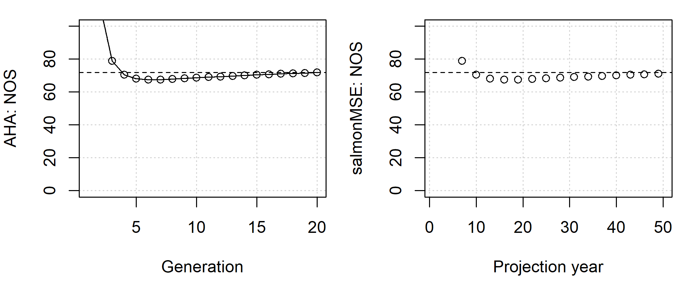

```{r, include = FALSE}
knitr::opts_chunk$set(
  collapse = TRUE,
  comment = "#>"
)
```

Here, we show a simple example of a salmon operating model where all fish mature at age 3 and follows the structure of an analysis done in AHA.
The historical spool-up is not informed by an estimation model. The model is used to project the proposed management levers to determine the equilibrium properties of the system.

We create several S4 objects, the `Bio` object contains the natural biological dynamics, including the maturity ogive `p_mature`, fecundity, as well as the density-dependent survival of smolts through the capacity and compensation ratio parameters (`capacity_smolt` and `kappa`, respectively).

The first example will be deterministic. With salmonMSE, we must run at minimum 2 simulation replicates, but we will run 3 simulations where the biological parameters, as well as the results, are identical among simulations.

To accommodate the life stage within the age structured model, we model ocean survival as an equivalent instantaneous rate `Mocean_NOS` where all mortality occurs in the age class prior to maturation, i.e., age 2.

```{r, eval = FALSE}
library(salmonMSE)

class?SOM # Definition of inputs

SAR <- 0.01
Bio <- new(
  "Bio",
  nsim = 3,
  maxage = 3,
  p_mature = c(0, 0, 1),
  SRrel = "BH",
  capacity_smolt = 17250,           # Beverton-Holt asymptote. Not unfished capacity!
  kappa = 3,                        # Productivity in recruits per spawner
  Mocean_NOS = c(0, -log(SAR), 0),
  fec = c(0, 0, 5040),              # Spawning fecundity of NOS and HOS
  p_female = 0.49
)
```

The next three objects control the management of the conservation unit through habitat, hatchery, and harvest options.

Let's leave the habitat unchanged from the `Bio` object:

```{r, eval = FALSE}
Habitat <- new(
  "Habitat",
  capacity_smolt_improve = 1,    # Keep carrying capacity unchanged
  kappa_improve = 1              # Keep productivity unchanged
)
```

Next, we work on the hatchery dynamics.

Below, we have a management target to release 10,000 yearlings annually. 
In comparsion, the carrying capacity of the natural environment is 17,250 smolts.

However, we place some additional constraints are placed which may prevent us from realizing the target releases. 
Users also specify the survival of broodtake (`s_prespawn`), eggs in the hatchery (`s_egg_smolt` and `s_egg_subyearling`), the target proportion of natural spawners in the broodtake (`ptarget_NOB`), and the maximum proportion of natural spawners to be used as broodtake (`pmax_NOB`).

In each time step of the projection, the model calculates the required number of eggs annually for the target releases. The natural broodtake (NOB) and hatchery broodtake (HOB) are removed from the escapement to reach the target egg production and maintain `NOB/(NOB + HOB) = ptarget_NOB`.
The proportion of NOB to the natural origin escapement cannot exceed `pmax_NOB`. 
If the target egg production cannot be reached, then the NOB is taken in accordance with `pmax_NOB` and HOB is taken (up to the total hatchery origin escapement returned to the hatchery) to meet the target egg production.

We also need to specify the relative spawning success of HOS, and various parameters that control fitness of hatchery fish in the natural environment.

```{r, eval = FALSE}
Hatchery <- new(
  "Hatchery",
  n_yearling = 10000,             # Management lever. No hatchery if both this line and next line are zero
  n_subyearling = 0,              # Management lever. No hatchery if both this line and previous line are zero
  s_prespawn = 1,                 # Survival prior to spawning
  s_egg_smolt = 0.92,             # Survival of eggs in hatchery
  s_egg_subyearling = 1,
  Mocean_HOS = Bio@Mocean_NOS,
  gamma = 0.8,
  pmax_NOB = 0.7,
  ptarget_NOB = 0.51,
  phatchery = 0.8,
  premove_HOS = 0,
  theta = c(100, 80),
  rel_loss = c(0.5, 0.4, 0.1),
  fec_brood = c(0, 0, 5040),
  fitness_type = c("Ford", "none"),
  zbar_start = c(93.1, 92),
  fitness_variance = 10,
  selection_strength = 3,
  heritability = 0.5,
  fitness_floor = 0.5
)
```

We specify a harvest rate of 0.203 for the terminal fishery (mature component). No hatchery fish are marked.

```{r, eval = FALSE}
Harvest <- new(
  "Harvest",
  u_preterminal = 0,             # No pre-terminal fishery
  u_terminal = 0.203,            # Specify fixed harvest rate of mature fish
  m = 0,                         # Mark rate of hatchery releases
  release_mort = c(0.1, 0.1),
  vulPT = c(0, 0, 0),
  vulT = c(1, 1, 1)
)
```

To start the projection, we specify the conditions for the spool-up with the Historical object. We will have a two-year spool-up with an escapement of 1000 natural origin fish and 1000 hatchery origin fish each in the first generation (for all simulations). This is accomplished by setting a spool-up period of 2 years (`nyears`) and specify the immature abundance of age 1 fish at the beginning of year 1 and age 2 fish at the start of year 2. Since we model ocean survival during age 2, abundance of the cohort doesn't change.

```{r, eval = FALSE}
# Return of 1000 natural and hatchery fish each for the first generation
nyears <- 2
HistN <- array(0, c(Bio@nsim, Bio@maxage, nyears, 2))
HistN[, 1, 1, ] <- HistN[, 2, 2, ] <- 1000/SAR

Historical <- new(
  "Historical",
  HistN = HistN
)
```

Now let's stitch together the operating model and run the simulation for 50 projection years (`proyears`).

```{r, eval = FALSE}
SOM <- new(
  "SOM",
  nyears = 2,
  proyears = 50,
  Bio, Habitat, Hatchery, Harvest, Historical
)
SMSE <- salmonMSE(SOM)
```

With a simple salmon model, we can run AHA and compare the trajectory of the population. 
As we can see, the number of NOS in both models is slowly equilibriating to approximately 70.

```{r, eval = FALSE}
SAHA <- AHA(SOM, ngen = 20)

# Compare NOS
SAHA$NOS
SMSE@NOS[, 1, ]
```

```{r, eval = TRUE, echo = FALSE}

```

*Comparison of the abundance of NOS between AHA (by generation) and salmonMSE (by year) given identical biological parameters, hatchery releases, and terminal fishery harvest rate in the simple example.*

## Stochastic simulations

Let's repeat the simple example with stochasticity on the compensation ratio.
To do this, we sample the compensation ratio parameter from a distribution and we run 100 simulations.
This incorporates our uncertainty in our understanding of the productivity of the natural environment.

```{r, eval = TRUE, echo = FALSE}

```

*Histogram of the compensation ratio (kappa) values sampled for our stochastic operating model.*

```{r, eval = FALSE, echo = TRUE}
SAR <- 0.01

nsim <- 100

# Sample the compensation ratio
set.seed(100)
kappa_mean <- 3
kappa_sd <- 0.3
kappa <- rlnorm(nsim, log(kappa_mean) - 0.5 * kappa_sd^2, kappa_sd)

Bio_stochastic <- new(
  "Bio",
  nsim = nsim,
  maxage = 3,
  p_mature = c(0, 0, 1),
  SRrel = "BH",
  capacity_smolt = 17250,
  kappa = kappa,
  Mocean_NOS = c(0, -log(SAR), 0),
  fec = c(0, 0, 5040),
  p_female = 0.49
)

SOM_stochastic <- new(
  "SOM",
  nyears = 2, proyears = 50,
  Bio_stochastic, Habitat, Hatchery, Harvest, Historical
)

SMSE_stochastic <- salmonMSE(SOM_stochastic)
```

We expect a distribution in the state variables during the projection. 
Let's take a look at PNI, where we can plot the median and 95 percent range in values annually from the projection:

```{r, eval = FALSE, echo = TRUE}
plot_statevar_ts(SMSE_stochastic. "PNI", quant = TRUE)
```

```{r, eval = TRUE, echo = FALSE}
knitr::include_graphics("../man/figures/example-PNI-ts.png")
```

Here is the distribution of PNI in the last projection year:

```{r, eval = FALSE, echo = TRUE}
plot_statevar_hist(SMSE_stochastic, "PNI", y = 49)
```

```{r, eval = TRUE, echo = FALSE}
knitr::include_graphics("../man/figures/example-PNI-hist.png")
```

From such models, we can develop performance metrics that make probabilistic statements about the system dynamics for each set of management actions. 
For example, we calculate the long-term probability that PNI is at least 0.75:

```{r, eval = FALSE, echo = TRUE}
mean(SMSE_stochastic@PNI[, 1, 49] >= 0.75)
```

```{r, eval = TRUE, echo = FALSE}
0.63
```

