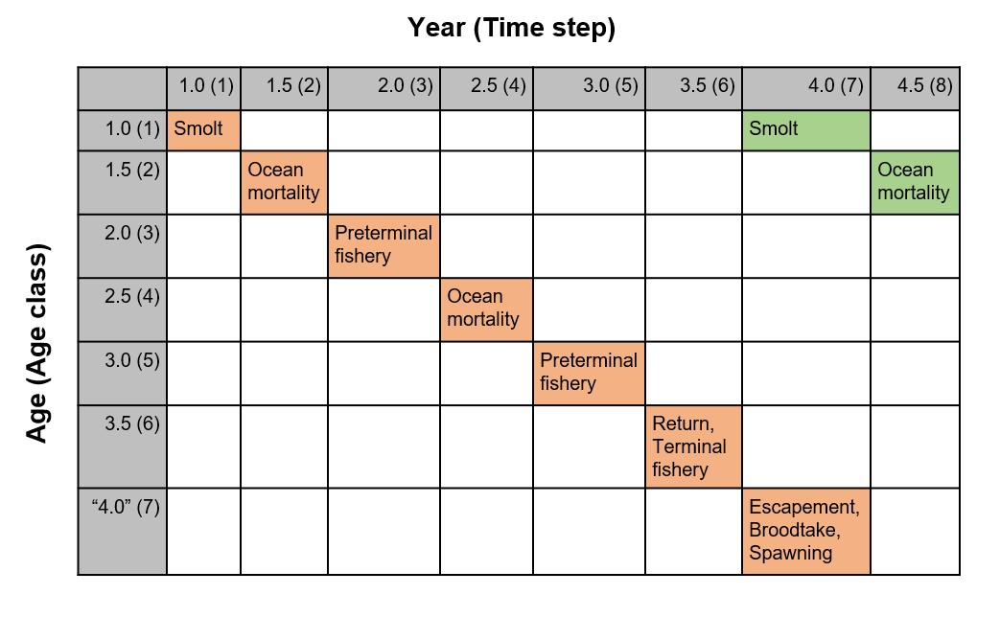

```{r, include = FALSE}
knitr::opts_chunk$set(
  collapse = TRUE,
  comment = "#>"
)
```

This article documents the implementation of a salmon operating model in openMSE and is intended for readers familiar with the internal structure of the MSEtool package, e.g., developers and advanced users.

# multiMSE

salmonMSE takes advantage of the functionality of the [multiMSE](https://openmse.com/features-multimse/) function in MSEtool.
`multiMSE` is intended for multi-population, multi-fleet modeling where the "population" unit can be envisioned to be any combination of a sex-specific single species model, multi-species model, or multi-stock model.
Features include:

1. Two-sex models where the spawning output to predict recruitment for a population is a linear combination of the spawning output of the set of populations in the model

2. Hermaphroditism in the sex dynamics such that either females or males switch sexes and mechanistically, the abundance moves from one population to another at the beginning of the time step based on an ogive

3. Inter-population and intra-population dynamics where the biological parameter for one population is updated by the abundance or biomass of a set through a custom written function ("MICE" modeling)

4. Multi-fleet model that can be used to allocate catches among populations and fleets


Salmon dynamics can be represented mechanistically using the same functionality:

5. Multi-population models are used to model salmon life stages. For each salmon conservation unit (CU), three populations are modeled to represent the immature, mature (recruitment), and escapement life stage. Natural and hatchery fish are also separately modeled, thus, there are 6 population units if there is hatchery for the CU and 3 population units if there is no hatchery. 

6. Fish progress through the populations, i.e., life stages, based on maturity status. Movement of fish from the recruitment to the escapement life stage occurs in the year after maturity. While the cohorts will advance to the next age class, the life cycle 'catches up' such that the generation time remains true to the real dynamics. More about this in the next section.

7. Total natural smolt production (immature natural fish) is predicted by the spawning output of the natural and hatchery spawners (two population units) by a function written in salmonMSE and passed to openMSE. This function also implements the fitness dynamics the reduces productivity based on the ratio of hatchery spawners and the ratio of natural broodtake.

8. This same function also implements the hatchery dynamics by removing natural and hatchery broodtake from the respective escapement and specifies the hatchery smolt releases as immature hatchery fish.

9. Another custom function specifies the reduction in marine survival due to fitness loss

10. A multi-fleet model specifies the harvest rate of the immature and mature component of the CU separately


```{r life-cycle, eval = TRUE, echo = FALSE}
knitr::include_graphics("../man/figures/model-life-cycle.png")
```

*Representation of the life cycle stages (blue) modeled in openMSE.*


# Salmon considerations

openMSE models fish populations through an age-structured array. There are some additional complexities in the age structure that needs to be adjusted for salmon.

1. In openMSE, the life stage resulting from juvenile density-dependent survival occurs in the time step when spawning occurs. However, smolt production occurs in the year after spawning. Therefore, we advance the age structure of the escapement one extra year in openMSE in order to ensure smolt production occurs in the correct time step. In the reporting array, the escapement, abundance of spawners, broodtake, and the spawning output (fry production) are adjusted back to the correct year.

2. Marine survival can take place over the course of several years if the marine life stage is longer than one year. The marine survival term is applied in the age and year prior to maturity (currently, all fish must mature at the same age). The fitness loss in marine survival is also applied to this age class. In the future, the marine survival can be accounted for in each year of the marine life stage of the age structured model. For example, if marine survival is one percent over two years, then the survival can be ten percent during each of those two years.

3. In the absence of a hatchery, the escapement is the number of spawners. The spawning output and the smolt production can be calculated entirely within openMSE. With a hatchery, the escapement is subject to broodtake and removal of hatchery fish from the spawning grounds. openMSE sees none of the hatchery dynamics. Instead, a MICE function created by salmonMSE will read in the natural and hatchery escapement from openMSE, calculate the broodtake, removal of hatchery fish from spawning grounds, calculate fitness, adjust the stock-recruit parameters, apply fitness to the fry and smolt production, and return the natural smolt production as a "recruitment deviation" to openMSE. This is a multiplicative term that adjusts the natural smolt production that would have been created if there were no hatchery (note 'recruitment' is used to refer to the life stage after density-dependent survival, as commonly used in a marine fisheries context, and not the salmon return). This function will also calculate the smolt releases as an absolute number for openMSE.

```{r state-var, eval = TRUE, echo = FALSE}
knitr::include_graphics("../man/figures/model-state-var.png")
```

*Summary of the state variables stored in either openMSE or salmonMSE. The intermediary section consists of functions to calculate state variables pertaining to hatchery and habitat management levers.*

# Age-structured representation

The following figure illustrates the age structure of a salmon that matures at age 3. In a matrix the abundance of age zero and age 1 represent the abundance of fry and smolts, respectively. At age 2, the abundance may represent juvenile fish in the marine life stage (although it may occur over the course of ages 1 and 2). With maturity at age 3, the abundance at the beginning of the time step can be the return. Later in the year, the escapement and the number of spawners is also calculated.

```{r age-structure, eval = TRUE, echo = FALSE}
knitr::include_graphics("../man/figures/model-age-structure.png")
```

*Age-structured representation of a salmon life cycle where all fish mature at age 3. The colors represent three generations of fish.*

Two constraints in openMSE prevent implementation of this figure in the model. First, there aren't enough state variables within a single time step to calculate the escapement and implement the hatchery broodtake between the return and the spawning. Second, the density-dependent survival must occur within the same time step as the spawning. As a result, we must advance the age class with an additional placeholder age class after maturity into the following year that spawning actually occurs. However, we can then calculate the necessary hatchery and spawning dynamics, including fry production, in salmonMSE and merely pass the smolt production back to openMSE. The result is that the age structure 'catches up' with the generational life cycle, as shown below.

```{r age-structure2, eval = TRUE, echo = FALSE}

```

*Salmon age-structure as implemented in openMSE. Missing state variables are stored in a data frame in salmonMSE during the simulation.*
