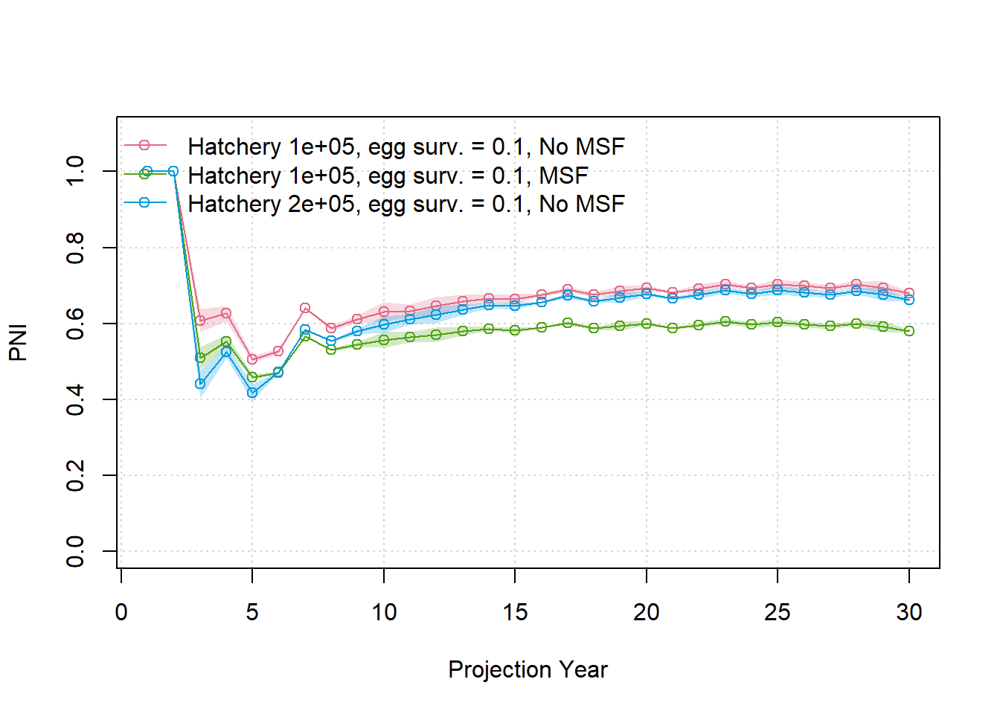
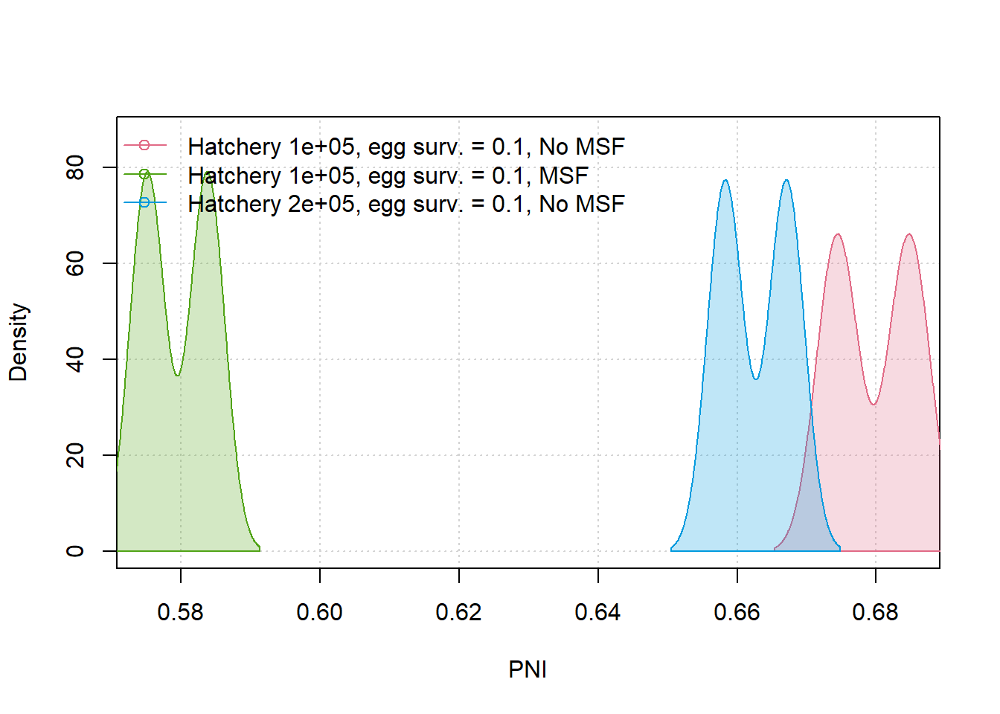
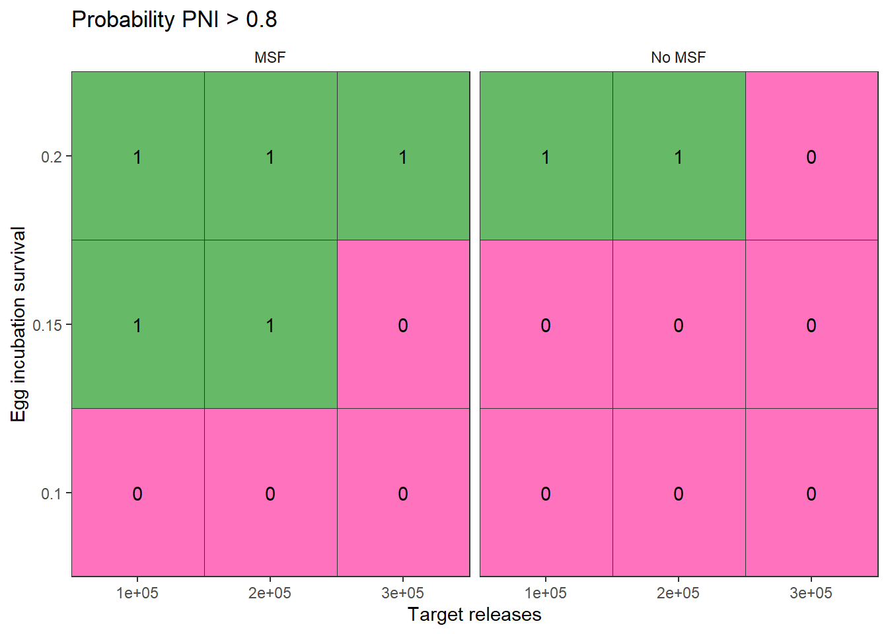
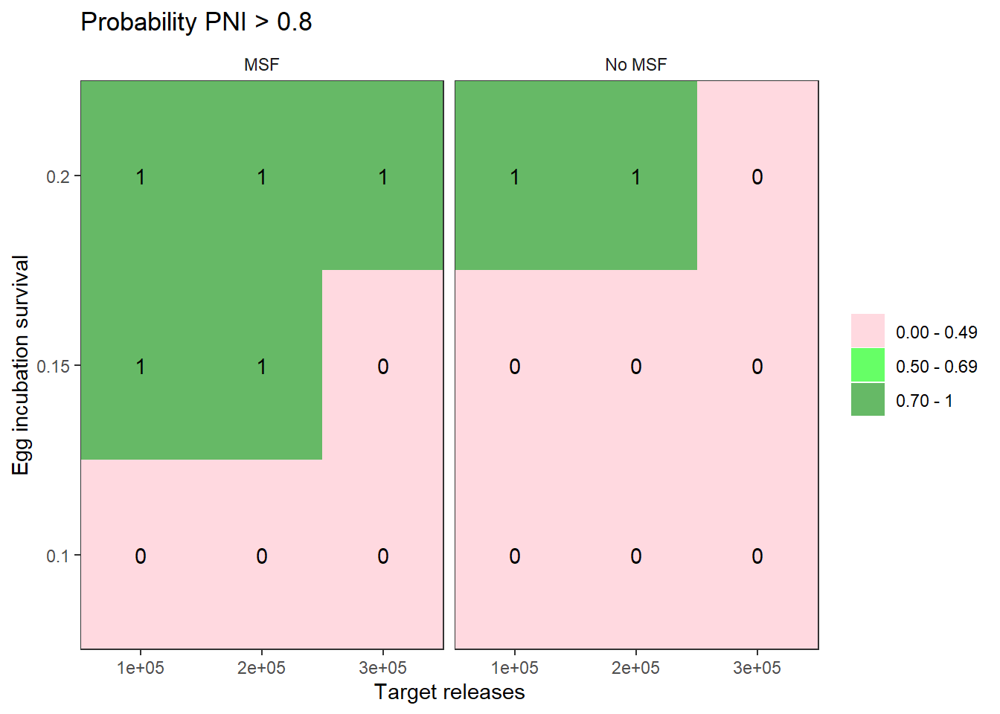
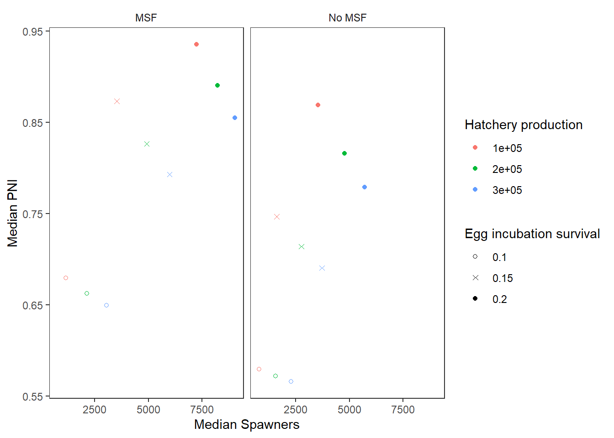

---
title: "C2. Running multiple scenarios (hatchery programs and more)"
output: html_document
---

```{r include=FALSE}
knitr::opts_chunk$set(
  echo = TRUE,
  eval = TRUE
)
library(salmonMSE)
```

# Multiple model runs

Here, we demonstrate how to organize an analysis that evaluates alternative management strategies across uncertain biological parameters. 

In Tutorial 3, we evaluated management options that varied in fishery terminal exploitation rates.

In Tutorial 4, the management levers we want to evaluate are:

1. Hatchery production level (the target number of releases)
2. Egg incubation survival (for example, if we can improve early life stage survival by reducing fine sedimentation in river beds)
3. Mark-selective fishing (either mark-selective or not) in the terminal fishery

An uncertain parameter for which we want to evaluate robustness is age-1 marine survival, incorporated stochastically within each operating model.
Egg-fry survival is also stochastic during the projection (with a constant mean).

Each operating model is a unique description of the system dynamics. Thus, we need a separate operating model for each combination of our management levers.

The recommended simulation approach is as follows:

1. Write the R code that executes a single model run
2. Place that code in a wrapper function that will be used to repeat the simulation for various combination of parameters
3. Create a grid that identifies all parameter values that will adjusted in the full simulation
4. Repeat the simulation over all parameter values. Take advantage of the parallel processing capabilities and vectorization capabilities of R, e.g., the `lapply()` function.

Once we have completed the simulation, we will have to aggregate the results to compare the outcomes in the grid.

# Step 1: Single model run

Below is a single code chunk for a single model projection, using a similar population model as in [Tutorial 2](tutorial-2.html):

```{r single-run}
library(salmonMSE)

nsim <- 20
proyears <- 30
maxage <- 3

set.seed(234)

surv1 <- 0.01
surv2 <- 0.8

Bio <- new(
  Class = "Bio",
  maxage = maxage,
  p_mature = c(0, 0.3, 1),
  #SRrel = "Ricker",
  #kappa = c(3, 4, 6),
  #Smax = 1000,
  #phi = 1,
  #tau = 1,
  Mjuv_NOS = c(-log(surv1), -log(surv2)),
  fec = c(0, 2000, 5000),
  p_female = 0.5,
  s_enroute = 0.95
)

Harvest <- new(
  "Harvest",
  u_preterminal = 0.4,
  u_terminal = 0.2,
  vulPT = c(0, 0.4, 1),
  vulT = c(0, 0.4, 1),
  MSF_PT = FALSE,
  MSF_T = FALSE
)

Hatchery <- new(
  "Hatchery",
  n_r = 1,
  n_subyearling = 100000,
  s_prespawn = 0.95,
  s_egg_subyearling = 0.7,
  Mjuv_HOS = Bio@Mjuv_NOS,
  p_mature_HOS = Bio@p_mature,
  gamma = 0.8,
  m = 1,
  pmax_esc = 1,
  pmax_NOB = 0.8,
  ptarget_NOB = 0.75,
  phatchery = NA,
  fec_brood = Bio@fec,
  fitness_type = c("none", "none")
)

sdev_sd <- 0.1

set.seed(84)
fry_sdev <- EnvStats::rnormTrunc(nsim * proyears, 1, sdev_sd, min = 0, max = 1/0.7) |> 
  matrix(nsim, proyears)

Habitat <- new(
  "Habitat",
  use_habitat = TRUE,
  egg_rel = "BH",
  egg_prod = 0.21,
  egg_capacity = 1000 * 5000,
  fry_rel = "BH",
  fry_prod = 0.7,
  fry_capacity = Inf,
  fry_sdev = fry_sdev
)

# Set number of juveniles at beginning of simulation
# Start with 1,000 natural-origin juveniles in each age class
# No hatchery-origin juveniles, i.e., starting a hatchery program
Historical <- new(
  "Historical",
  InitNjuv_NOS = array(1000, c(nsim, Bio@maxage, 1)),
  InitNjuv_HOS = array(0, c(nsim, Bio@maxage, 1))
)

SOM <- new(
  "SOM",
  nsim = nsim,
  proyears = proyears,
  Bio = Bio,
  Habitat,
  Hatchery,
  Harvest,
  Historical
)
```


# Step 2: Wrapper function

Now let's put the above code chunk into a function. We'll call it `wrapper()`.

This function has three arguments:

- `MSF_vector` a logical vector that turns on or off mark-selective fishing
- `hatchery_vector` a numeric vector that adjusts the hatchery production target
- `egg_vector` a numeric vector that adjusts egg survival
- `i` an integer that indexes the three previous vectors. When `wrapper()` is called, we supply `i` and the function will grab the `i`-th entry of each vector for running the projection.

The rest of the function should be the same as the previous chunk.
The wrapper function re-creates the same operating model each time the function is called, except for the three management levers, runs the projection, and returns the output to the user:

```{r wrapper}
wrapper <- function(i, MSF_vector, hatchery_vector, egg_vector) {

  library(salmonMSE)
  
  nsim <- 20
  proyears <- 30
  maxage <- 3
  
  # Identify management levers
  MSF <- MSF_vector[i]
  hatchery_production <- hatchery_vector[i]
  egg_survival <- egg_vector[i]
  
  # Identify stochastic parameters
  set.seed(234)
  surv1 <- runif(nsim, 0.005, 0.015) # Age 1 marine survival
  surv2 <- 0.8 # Age 2 marine survival is fixed
  
  # Egg-fry survival
  sfry_mean <- 0.7
  sdev_sd <- 0.1
  sdev <- EnvStats::rnormTrunc(nsim * proyears, 1, sdev_sd, min = 0, max = 1/sfry_mean) |> 
    matrix(nsim, proyears)
  
  Mjuv_NOS <- array(, c(nsim, maxage-1, proyears, 1))
  Mjuv_NOS[, 1, , ] <- -log(surv1)
  Mjuv_NOS[, 2, , ] <- -log(surv2)
  Bio <- new(
    Class = "Bio",
    maxage = maxage,
    p_mature = c(0, 0.3, 1),
    #SRrel = "Ricker",
    #kappa = c(3, 4, 6),
    #Smax = 1000,
    #phi = 1,
    #tau = 1,
    Mjuv_NOS = Mjuv_NOS,
    fec = c(0, 2000, 5000),
    p_female = 0.5,
    s_enroute = 0.95
  )
  
  Harvest <- new(
    "Harvest",
    u_preterminal = 0.4,
    u_terminal = 0.2,
    vulPT = c(0, 0.4, 1),
    vulT = c(0, 0.4, 1),
    MSF_PT = FALSE,
    MSF_T = MSF,
    release_mort = c(0.05, 0.05)
  )
  
  Hatchery <- new(
    "Hatchery",
    n_r = 1,
    n_subyearling = hatchery_production,
    s_prespawn = 0.95,
    s_egg_subyearling = 0.7,
    Mjuv_HOS = Bio@Mjuv_NOS,
    p_mature_HOS = Bio@p_mature,
    gamma = 0.8,
    m = 1,
    pmax_esc = 1,
    pmax_NOB = 0.8,
    ptarget_NOB = 0.75,
    phatchery = NA,
    fec_brood = Bio@fec,
    fitness_type = c("none", "none")
  )
  
  Habitat <- new(
    "Habitat",
    use_habitat = TRUE,
    egg_rel = "BH",
    egg_prod = egg_survival,
    egg_capacity = 1000 * 5000,
    fry_rel = "BH",
    fry_prod = sfry_mean,
    fry_capacity = Inf,
    fry_sdev = sdev
  )
  
  # Set number of juveniles at beginning of simulation
  # Start with 1,000 natural-origin juveniles in each age class
  # No hatchery-origin juveniles, i.e., starting a hatchery program
  Historical <- new(
    "Historical",
    InitNjuv_NOS = array(1000, c(nsim, Bio@maxage, 1)),
    InitNjuv_HOS = array(0, c(nsim, Bio@maxage, 1))
  )
  
  SOM <- new(
    "SOM",
    nsim = nsim,
    proyears = proyears,
    Bio = Bio,
    Habitat,
    Hatchery,
    Harvest,
    Historical
  )
  
  SMSE <- salmonMSE(SOM)

  return(SMSE)
}
```

# Step 3: Create parameter grid

Before we can use the wrapper function, we create the simulation design, i.e., which combinations of management levers we will evaluate.

The `expand.grid()` function creates every combination of management options that we supply in the arguments.
Each row identifies a unique set of values in the grid:

```{r}
simulation_design <- expand.grid(
  MSF_vector = c(TRUE, FALSE),
  hatchery_vector = c(1, 2, 3) * 100000,
  egg_vector = c(0.1, 0.15, 0.2)
)
```

# Step 3: Repeat simulation

Once we have our wrapper function and simulation design, we can now run the simulation.

There's various ways to run the projections depending on our computation capabilities, e.g., old laptop, new desktop, computing cluster, etc.

## Non-parallel computation

We can run a loop over each row of our `simulation_design` data frame:

```{r, eval=FALSE}
# Not intended to run, run in parallel instead?
SMSE_list <- list()
for (i in 1:nrow(simulation_design)) {
  SMSE_list[[i]] <- wrapper(
    i, 
    MSF_vector = simulation_design$MSF_vector,
    hatchery_vector = simulation_design$hatchery_vector,
    egg_vector = simulation_design$egg_vector
  )
}
```

The `lapply()` function has a similar functionality that repeats calculations down the rows of the simulation grid:

```{r, eval=FALSE}
# Not intended to run, run in parallel instead?
SMSE_list <- lapply(
  1:nrow(simulation_design), 
  wrapper, 
  MSF_vector = simulation_design$MSF_vector,
  hatchery_vector = simulation_design$hatchery_vector,
  egg_vector = simulation_design$egg_vector
)
```

## Parallel computation

Loops are computationally slower compared to parallel processing. We use the `parallel` package to run simulations over 10 CPUs, then save the results:

```{r run-sim-list, eval=FALSE}
library(parallel)
cpus <- 10

cl <- makeCluster(cpus)

SMSE_list <- parLapply(
  cl,
  X = 1:nrow(simulation_design), 
  wrapper,
  MSF_vector = simulation_design$MSF_vector,
  hatchery_vector = simulation_design$hatchery_vector,
  egg_vector = simulation_design$egg_vector
)

stopCluster(cl)
```

>It is also possible to run parallel simulations within a single operating model, for example, with `SMSE <- salmonMSE(SOM, ncores = 10)`. This feature is probably best suited for individual model runs with many simulation replicates.

# Results

Now we have a list of `SMSE` objects in `SMSE_list`. 

## Compare time series

In Tutorials 1 & 2, we saw that `report()` generates a Markdown report from a single model run.
Here, we want to compare several model runs simultaneously in a figure.

We have the `compare()` function which generates another markdown report that plots state variables from separate model runs. 

We have 18 scenarios, so we may not be able to neatly all into individual figures. 
Here's how to compare just the first 3 model runs:

```{r, eval=FALSE}
# Create names for each model run by pasting the SAR and ER values
SMSE_names <- paste0("Hatchery ", simulation_design$hatchery_vector, ", egg surv. = ", simulation_design$egg_vector, 
                     ifelse(simulation_design$MSF_vector, ", No MSF", ", MSF"))

compare(SMSE_list = SMSE_list[1:3], names = SMSE_names[1:3])
```

`compare_statevar_ts()` generates a time series figure with base graphics. While the default settings generate a line plot for each stochastic simulation, it can quickly get messy.

Let's directly proceed to quantile figures and look at PNI, a measure between 0-1 of hatchery influence on the population (higher values indicate lower hatchery influence):

```{r, eval=FALSE}
compare_statevar_ts(SMSE_list[1:3], var = "PNI", quant = TRUE, names = SMSE_names[1:3])
```

```{r, echo=FALSE}

```

We can visualize the distribution of outcomes within scenarios with `compare_statevar_hist()`, which has choices to plot with either the `density()` or `hist()` functions:

```{r, eval=FALSE}
compare_statevar_hist(SMSE_list[1:3], var = "PNI", names = SMSE_names[1:3], type = "density")
```

```{r, echo=FALSE}

```

```{r, eval=FALSE}
compare_statevar_hist(SMSE_list[1:3], var = "PNI", names = SMSE_names[1:3], type = "hist")
```

```{r, echo=FALSE}

```

## Performance measures and decision tables

Risk evaluation typically entails calculating a summary metric that describes the frequency that an objective was met in the simulation. 

For example, we can calculate the probability that PNI exceeded 0.8 (system has high natural influence).
We have a function `PNI80()` that does the calculation for us:

Using the vectorization capabilities in R, we use `sapply()` to call `PNI80()` for each of the objects in `SMSE_list`. We add an extra argument `Yrs = c(30, 30)` that specify the year range (the probability is calculated at the end of the projection in year 30):

```{r, eval=FALSE}
sim_results <- simulation_design
sim_results$PNI_objective <- sapply(SMSE_list, PNI80, Yrs = c(30, 30))
```

We want to explore the decision space: what combinations of levers help us get high PNI and which levers are more influential than others?

`plot_decision_table()` helps us plot a grid of values using ggplot.
The colour scheme maps 0-1 with red to green (0.5 is white).

We see a clear delineation where we don't meet our high PNI objective when egg survival is too low. Marginally, high hatchery production hurts us as well. 
On the other hand, mark-selective fishing helps with PNI management.

```{r, eval=FALSE}
sim_results$MSF_label <- ifelse(sim_results$MSF_vector, "MSF", "No MSF")
plot_decision_table(
  x = sim_results$hatchery_vector,
  y = sim_results$egg_vector,
  z = sim_results$PNI_objective,
  xlab = "Target releases",
  ylab = "Egg incubation survival",
  title = "Probability PNI > 0.8",
  scenario = sim_results$MSF_label
)
```

```{r, echo=FALSE}

```

Alternatively, `plot_decision_table2()` gives us more flexibility in the colour scheme by binning the summary metric into separate colour bins. 
With the same layout as the previous figure, we refine the decision table based on the outcomes:

```{r, eval=FALSE}
plot_decision_table2(
  x = sim_results$hatchery_vector,
  y = sim_results$egg_vector,
  z = sim_results$PNI_objective,
  xlab = "Target releases",
  ylab = "Egg incubation survival",
  title = "Probability PNI > 0.8",
  scenario = sim_results$MSF_label,
  bin = c(0, 0.5, 0.7),
  bin_labels = c("0.00 - 0.49", "0.50 - 0.69", "0.70 - 1"),
  bin_col = c("pink", "green", "green4"),
  add_values = TRUE
)
```

```{r, echo=FALSE}

```

We can envision running a larger grid to map out the full decision space, or even adding an additional management lever to our analysis. `plot_decision_table()` can readily handle up to four levers: we have the x and y axes of a table (two levers), as well as panels of tables in row and columns (two more levers).

If our decision making context is solely on PNI management, then these figures can be the primary result from a simulation analysis. 

>Of course, other factors can come into play as to whether we can move the needle to increase egg survival, implement mark-selective fishing or not. This is an artifical example, but there are usually motivating reasons to guide the direction of a simulation analysis. We also will likely know what is possible and unlikely on the management side.

## Tradeoffs

Frequently, objectives are conflicting. 
For example, higher hatchery production should increase the number of spawners in the natural environment at the cost of PNI. 
Tradeoff figures allow us to compare two summary metrics simultaneously.

Let's compare median PNI and median natural spawners (sum of natural-origin and hatchery-origin spawners, excluding brood) in the long-term (end of the projection).

First, let's calculate our second metric, average catch, with a custom function:

```{r, eval=FALSE}
PNI_fn <- function(SMSE) median(SMSE@PNI[, 1, 30])
Spawner_fn <- function(SMSE) {
  Spawner <- SMSE@NOS + SMSE@HOS
  Spawner_total <- rowSums(Spawner[, 1, , 30])
  median(Spawner_total)
}
sim_results$PNI <- sapply(SMSE_list, PNI_fn)
sim_results$Spawners <- sapply(SMSE_list, Spawner_fn)
```

Next, we can use `plot_tradeoff()` to plot the two metrics (PNI and spawners) against each other.

We see a clear frontier lines where increasing hatchery production (red to green to blue) decreases PNI and increases spawners.
The frontier line also moves upward and to the right (better outcomes for both PNI and spawners) with improved egg survival in the natural environment and with mark-selective fishing.

Between the decision tables and tradeoff figure, which gives the clearer take-home message?

```{r, eval=FALSE}
library(ggplot2)
plot_tradeoff(
  pm1 = sim_results$Spawners,
  pm2 = sim_results$PNI,
  x1 = factor(sim_results$hatchery_vector),
  x2 = sim_results$egg_vector,
  xlab = "Median Spawners",
  ylab = "Median PNI",
  x1lab = "Hatchery production",
  x2lab = "Egg incubation survival",
  scenario = sim_results$MSF_label
) +
  scale_shape_manual(values = c(1, 4, 16))
```

```{r, echo=FALSE}

```
